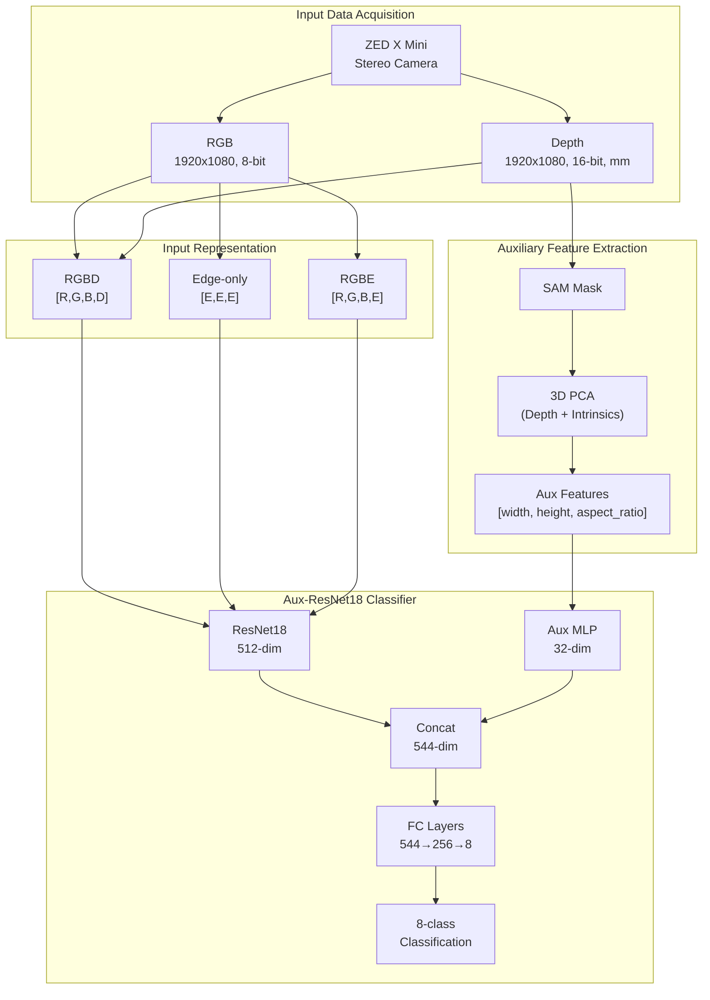
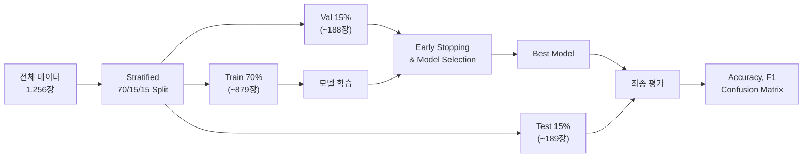

# 굴착기 부품 분류를 위한 RGB-Edge 하이브리드 입력 표현의 텍스처 변형 강건성 비교 연구

## Comparative Study on Texture Variation Robustness of RGB-Edge Hybrid Input Representation for Excavator Part Classification

<!-- ============================================================ -->
<!-- [저자 정보 작성 필요]                                          -->
<!-- 예시:                                                         -->
<!-- 홍길동* · 김철수** · 이영희***                                  -->
<!-- * 한국건설기계연구원 스마트건설장비연구실 (교신저자, email)       -->
<!-- ** 소속 및 직위                                                -->
<!-- *** 소속 및 직위                                               -->
<!-- ============================================================ -->

---

**초록**

본 연구는 굴착기 제조 공정에서 도어 부품 8종을 자동 분류하기 위한 딥러닝 모델의 입력 표현(input representation) 전략을 비교 분석한다. 기존 RGBD(RGB + Depth) 4채널 기반 분류 모델이 표면 텍스처 변형에 취약한 문제를 해결하기 위해, RGB와 Canny Edge를 결합한 RGBE(RGB + Edge) 하이브리드 입력 표현을 제안한다. ResNet18 백본과 Depth 기반 물리 치수 보조 피처를 공유하는 동일 아키텍처 위에서, Baseline RGBD, Texture 불변 증강 RGBD, Edge-only, RGBE Hybrid의 4종 입력 표현을 체계적으로 비교하였다. ZED X Mini 스테레오 카메라로 촬영한 굴착기 도어 8종 실물 데이터(1,256장)를 대상으로, 5회 반복 실험(5-seed)과 Train/Val/Test 70/15/15 분할을 통해 통계적으로 신뢰할 수 있는 평가를 수행하였다. 448×448 해상도 실험 결과, Texture 불변 증강 RGBD가 평균 하락폭 −7.08%p로 가장 강건하였으며, RGBE Hybrid(−9.63%p)가 Baseline RGBD(−10.11%p)보다 약간 우수한 2위를 기록하였다. 반면 Edge-only(−24.55%p)는 가장 취약하였다. Baseline RGBD, Texture 불변 증강 RGBD, RGBE Hybrid 간에는 통계적으로 유의미한 차이가 없었으나(p > 0.05), 이 세 모델 모두 Edge-only 대비 유의하게 우수하였다(p < 0.05). 다만, 본 연구의 결과는 동일 개체 기반 데이터에서의 오프라인 증강 조건에 한정되며, 실제 제조 현장의 다양한 환경 변화에 대한 일반화는 향후 연구가 필요하다.

**키워드**: 굴착기 부품 분류, RGBE 하이브리드, 텍스처 강건성, Canny Edge, 딥러닝, 전이학습

---

**Abstract**

This study compares input representation strategies for deep learning models to automatically classify eight types of excavator door parts in manufacturing processes. To address the vulnerability of conventional RGBD (RGB + Depth) 4-channel classification models to surface texture variations, we propose an RGBE (RGB + Edge) hybrid input representation combining RGB with Canny Edge. Under a shared architecture using a ResNet18 backbone and depth-based physical dimension auxiliary features, we systematically compared four input representations: Baseline RGBD, Texture-Invariant Augmented RGBD, Edge-only, and RGBE Hybrid. Using 1,256 real images of eight excavator door types captured with a ZED X Mini stereo camera, we conducted statistically reliable evaluation through 5-seed repeated experiments with Train/Val/Test 70/15/15 stratified splitting. At 448×448 resolution, Texture-Invariant Augmented RGBD showed the smallest average accuracy drop (−7.08%p), followed by RGBE Hybrid (−9.63%p), which slightly outperformed Baseline RGBD (−10.11%p). Edge-only was the most vulnerable (−24.55%p). No statistically significant differences were found among Baseline RGBD, Texture-Invariant Augmented RGBD, and RGBE Hybrid (p > 0.05), though all three significantly outperformed Edge-only (p < 0.05). However, these findings are limited to offline augmentation conditions on same-instance data, and generalization to diverse real-world manufacturing environments requires further investigation.

**Keywords**: Excavator part classification, RGBE hybrid, Texture robustness, Canny Edge, Deep learning, Transfer learning

---

## 1. 서론

### 1.1 연구 배경

굴착기 제조 공정에서 부품의 정확한 식별은 조립 품질과 생산성에 직결된다. 소형 굴착기(E25, E30, E38 등)의 도어(Door) 부품은 기종별로 외형이 유사하나 크기가 수십 밀리미터 수준에서 차이나는 특성이 있어, 작업자의 육안 검수에 의존하는 현행 방식은 오장착 위험이 존재한다. 이에 카메라 기반 AI 자동 인식 시스템의 도입이 요구되고 있다.

RGB-D(깊이) 카메라를 활용한 다채널 딥러닝 분류 기법은 부품의 외관과 3차원 형상 정보를 동시에 활용하여 높은 분류 정확도를 달성할 수 있다[1-3]. 특히 ResNet 계열 모델에 Depth 채널을 추가한 4채널 입력 방식은 산업 부품 인식 분야에서 효과적인 것으로 알려져 있다[4,5].

그러나 학습 데이터와 동일한 조건의 테스트에서 높은 정확도를 달성하더라도, 텍스처 변형(texture variation)에 대한 강건성이 부족할 경우 실무 적용에 한계가 있다. 선행 연구들은 CNN 모델의 텍스처 편향(texture bias) 문제를 보고하고 있으며[6,7], 이를 완화하기 위한 다양한 입력 표현 전략이 연구되고 있다.

### 1.2 문제 정의

본 연구에서 사전 구축한 RGBD 기반 Baseline 모델은 굴착기 도어 8종 분류에서 높은 테스트 정확도를 달성하였으나, 색상·밝기·노이즈 등의 텍스처 변형을 적용한 증강 데이터셋에서는 유의미한 정확도 하락이 관측되었다. 이는 모델이 부품의 구조적 형상(shape)보다 촬영 환경에 종속적인 표면 텍스처(RGB texture)에 과도하게 의존하고 있음을 시사한다.

### 1.3 연구 목적

본 연구의 목적은 다음과 같다.

첫째, RGB와 Canny Edge 검출 결과를 결합한 RGBE(RGB + Edge) 하이브리드 입력 표현을 제안하고, 기존 RGBD 및 다른 입력 표현 전략과의 텍스처 변형 강건성을 동일 개체 데이터에서 체계적으로 비교한다.

둘째, Baseline RGBD, Texture 불변 증강 RGBD, Edge-only, RGBE Hybrid의 4종 입력 표현을 동일 아키텍처 위에서, 5회 반복 실험과 적절한 데이터 분할(Train/Val/Test)을 통해 통계적으로 유의미한 비교를 수행한다.

셋째, 입력 해상도(448×448 vs 224×224)가 각 입력 표현의 강건성에 미치는 영향을 분석하여, 실용적 지침을 제시한다.

### 1.4 논문 구성

본 논문의 나머지 부분은 다음과 같이 구성된다. 2장에서는 다채널 입력 기반 분류 및 텍스처 강건성 관련 선행 연구를 검토한다. 3장에서는 제안하는 RGBE 하이브리드 입력 표현과 4종 모델의 상세 구성을 기술한다. 4장에서는 데이터셋, 평가 프로토콜 등 실험 환경을 설명하고, 5장에서 실험 결과를 분석한다. 6장에서 결과에 대한 고찰을, 7장에서 결론 및 향후 연구 방향을 제시한다.

---

## 2. 관련 연구

<!-- ============================================================ -->
<!-- [저자 작성 필요] 선행 연구 조사                                -->
<!--                                                               -->
<!-- 아래 4개 소절의 구조와 방향성을 제시합니다.                     -->
<!-- 각 소절에 최소 3~5편의 참고문헌을 추가하고,                    -->
<!-- 본 연구와의 차별점을 명확히 서술해 주세요.                     -->
<!-- ============================================================ -->

### 2.1 다채널(RGB-D) 입력 기반 객체 인식

RGB 이미지에 Depth(깊이) 정보를 추가한 다채널 입력 방식은 객체 인식 분야에서 널리 연구되어 왔다.

<!-- [작성 필요] 주요 선행 연구 3~5편 소개 -->

### 2.2 텍스처 불변 학습 및 형상 기반 인식

CNN 모델이 텍스처에 과도하게 의존하는 문제(texture bias)는 여러 연구에서 보고되었다.

<!-- [작성 필요] 주요 선행 연구 3~5편 소개 -->

### 2.3 에지(Edge) 특징 활용 분류 기법

에지 검출 결과를 딥러닝의 입력 또는 보조 피처로 활용하는 연구가 수행되어 왔다.

<!-- [작성 필요] 주요 선행 연구 3~5편 소개 -->

### 2.4 합성 데이터 및 도메인 적응

실물 데이터 부족을 극복하기 위한 합성(synthetic) 데이터 기반 학습과 도메인 적응(domain adaptation) 기법이 활발히 연구되고 있다.

<!-- [작성 필요] 주요 선행 연구 3~5편 소개 -->

---

## 3. 제안 방법

### 3.1 시스템 개요

본 연구에서 제안하는 굴착기 부품 분류 시스템의 전체 구조를 Fig. 1에 나타내었다. 시스템은 (1) ZED X Mini 스테레오 카메라를 통한 RGB + Depth 동시 획득, (2) SAM(Segment Anything Model) 기반 전경 마스크 생성 및 Depth 기반 물리 치수 추출, (3) 입력 표현별 전처리(RGBD/RGBE/Edge-only), (4) Aux-ResNet18 모델을 통한 분류의 4단계로 구성된다.

> **Fig. 1.** 제안 시스템의 전체 구조 (Mermaid 다이어그램)

<!-- [Fig. 1 삽입 필요: 시스템 전체 구조도 - 위 Mermaid를 렌더링하여 이미지로 변환하거나, 별도 도식 작성] -->

### 3.2 공통 아키텍처: Aux-ResNet18

4종 모델 간의 공정한 비교를 위해, 모든 모델은 동일한 2-branch 아키텍처를 공유한다. 이미지 분기(image branch)는 ImageNet 사전학습된 ResNet18 백본으로 512차원 특징 벡터를 추출하고, 보조 피처 분기(auxiliary branch)는 3개의 물리 치수 값을 32차원으로 임베딩하는 단층 MLP로 구성된다. 두 분기의 출력을 연결(concatenate)하여 544차원 벡터를 형성하고, Dropout(0.3) → Linear(544→256) → ReLU → Dropout(0.2) → Linear(256→8) 구조의 분류기를 통해 최종 8클래스 분류를 수행한다. 전체 모델 파라미터 수는 약 1,132만 개이다.

### 3.3 물리 치수 보조 피처

유사 형상 도어 간의 크기 차이(최소 41mm, 약 5%)를 포착하기 위해, Depth 맵과 SAM 전경 마스크를 활용한 3D 기반 물리 치수 보조 피처를 설계하였다. 추출 과정은 다음과 같다.

(1) SAM 마스크로 전경 영역의 유효 픽셀을 추출한다.

(2) 카메라 내부 파라미터(K 행렬)와 Depth 값을 이용하여 유효 픽셀을 3D 포인트 클라우드로 역투영한다.

(3) 3D 포인트 클라우드에 대해 PCA(주성분 분석)를 수행하여 3개 주축의 extent(범위)를 계산한다.

(4) 최종 보조 피처 벡터 **a** = [physical_width_mm, physical_height_mm, aspect_ratio]를 구성한다.

이 피처는 이미지의 해상도나 촬영 거리에 무관하게 부품의 실제 물리적 크기를 반영하며, 모든 입력 표현에서 동일하게 Depth 맵으로부터 계산된다.

### 3.4 입력 표현별 모델 구성

4종 모델의 입력 채널 구성과 설계 의도를 Table 1에 정리하였다. 모든 모델은 3.2절의 Aux-ResNet18 구조를 공유하며, 입력 표현과 학습 시 증강 전략만 다르다.

> **Table 1.** 4종 모델의 입력 채널 구성

| 모델 | 채널 수 | 채널 구성 | ImageNet 가중치 활용 | 설계 의도 |
|------|:------:|----------|:------------------:|----------|
| Baseline RGBD | 4 | R, G, B, D | RGB 3ch 전이, D는 RGB 평균 초기화 | 외관 + 깊이 정보 결합 (기준 모델) |
| Texture Aug RGBD | 4 | R, G, B, D | 동일 | RGBD + 학습 시 텍스처 파괴 증강 |
| Edge-only | 3 | E, E, E | 3ch 그대로 전이 | 텍스처 완전 제거, 순수 형상 학습 |
| RGBE Hybrid | 4 | R, G, B, E | RGB 3ch 전이, E는 RGB 평균 초기화 | 텍스처 + 형상 상호 보완 |

#### 3.4.1 Baseline RGBD

RGB 3채널에 정규화된 Depth 1채널을 추가한 4채널 입력이다. ResNet18의 첫 번째 합성곱 레이어(conv1)를 3채널에서 4채널로 확장하고, 추가된 Depth 채널의 가중치는 기존 RGB 3채널 가중치의 평균값으로 초기화하여 학습 안정성을 확보하였다.

#### 3.4.2 Texture 불변 증강 RGBD

Baseline RGBD와 동일한 입력 채널을 사용하되, 학습 시 텍스처를 적극적으로 파괴하는 증강을 추가하였다. 구체적으로, 50% 확률의 RandomGrayscale(RGB → 명도 → RGB 복원)과 30% 확률의 GaussianBlur(σ = 0.5~2.0)를 기존 온라인 증강 위에 적용한다.

#### 3.4.3 Edge-only

RGB 텍스처 의존을 근본적으로 차단하기 위해, 입력을 Canny Edge 검출 결과로 대체한다. 원본 RGB를 그레이스케일로 변환 후 Canny Edge를 적용하고, 결과를 [0, 1]로 정규화한 뒤 3채널로 복제하여 (E, E, E) 형태로 입력한다.

#### 3.4.4 RGBE Hybrid (제안 방법)

RGB 3채널의 풍부한 시각 정보와 Canny Edge의 구조적 형상 정보를 동시에 활용하는 하이브리드 입력 표현이다. Depth 채널 대신 Canny Edge 채널을 4번째 채널로 사용한다.

핵심 설계 원리는 다음과 같다.

(1) **보완적 정보 결합**: RGB 채널은 색상·질감 기반의 세밀한 구분을, Edge 채널은 형상·윤곽 기반의 구조적 구분을 담당한다.

(2) **증강 일관성**: Edge 채널은 증강이 적용된 RGB에서 실시간으로 계산되므로, RGB 증강과 Edge가 자동으로 공간적 일관성을 유지한다.

(3) **Depth 활용 보존**: Depth는 모델 입력에는 사용되지 않지만, 물리 치수 보조 피처 계산에는 여전히 활용된다.

### 3.5 전처리 파이프라인

모든 모델에 공통으로 Letterbox 방식의 리사이즈를 적용한다. 원본 이미지(1920×1080)의 장변을 기준으로 목표 해상도(448 또는 224)로 축소하고, 단변 방향에 검정 패딩을 추가하여 정사각형을 완성한다.

RGB 채널은 ImageNet 통계값(mean = [0.485, 0.456, 0.406], std = [0.229, 0.224, 0.225])으로 정규화하고, Depth 채널은 5m 기준 클리핑 후 (x − 0.5) / 0.25로 표준화한다.

---

## 4. 실험 환경

### 4.1 데이터셋

#### 4.1.1 실물 데이터

ZED X Mini 스테레오 카메라(Neural Depth 모드, HD1080, 30fps)로 굴착기 도어 8종을 촬영하였다. Flask 기반 웹 UI를 통해 비디오 스트리밍 중 N 프레임 간격으로 RGB + Depth 쌍을 자동 추출하고, Laplacian Variance 기반 블러 필터링(임계값 100)으로 흐릿한 프레임을 제거하였다.

> **Table 2.** 실물 데이터셋 구성 (8클래스)

| 클래스 | 설명 | 도어 폭(mm) | 전체 |
|--------|------|:----------:|:----:|
| E25_door_LH_FRT | 2.5톤 좌측 전면 | 828 | 158 |
| E25_door_LH_RR | 2.5톤 좌측 후면 | 1,141 | 155 |
| E25_door_RH | 2.5톤 우측 | 990 | 155 |
| E30_E38_door_RH | 3.0/3.8톤 우측 (통합) | 1,191 | 154 |
| E30_door_LH_FRT | 3.0톤 좌측 전면 | 869 | 161 |
| E30_door_LH_RR | 3.0톤 좌측 후면 | 1,262 | 159 |
| E38_door_LH_FRT | 3.8톤 좌측 전면 | 916 | 154 |
| E38_door_LH_RR | 3.8톤 좌측 후면 | 1,456 | 160 |
| **합계** | | | **1,256** |

<!-- [Fig. 2 삽입 필요: 8종 도어 대표 RGB 이미지 (4×2 그리드), 각 이미지 하단에 클래스명과 도어 폭(mm) 표기] -->

#### 4.1.2 평가용 텍스처 변형 데이터셋

모델의 텍스처 변형 강건성을 평가하기 위해, 오프라인 증강 데이터셋 2종을 생성하였다. 증강은 전체 1,256장에 대해 적용하되, 평가 시에는 각 seed의 Test 분할에 해당하는 이미지만 사용하여 데이터 누출(data leakage)을 방지하였다.

> **Table 3.** 평가 데이터셋 구성

| 데이터셋 | 증강 범위 | 증강 기법 | 전체 이미지 수 |
|----------|----------|----------|:------------:|
| Test 원본 | 없음 | 없음 | 각 seed별 189장 |
| datasets_aug | 전경 영역만 (SAM 마스크 기반) | Brightness, Contrast, Noise, Blur 등 | 1,256 (Test만 평가) |
| datasets_aug2 | 이미지 전체 | Brightness, Contrast, Noise, Blur 등 | 1,256 (Test만 평가) |

### 4.2 실험 설계

#### 4.2.1 데이터 분할

기존 Train/Test 2-way 분할에서 발생하는 Test 데이터로 모델을 선택하는 data leakage 문제를 방지하기 위해, **Train/Val/Test 70/15/15 stratified split**을 적용하였다. Validation 셋은 early stopping과 모델 선택에만 사용하고, Test 셋은 최종 평가에만 사용한다.

#### 4.2.2 다중 시드 반복 실험

단일 분할의 우연성을 배제하기 위해, 5개의 서로 다른 랜덤 시드(42, 123, 456, 789, 1024)로 전체 실험을 반복하였다. 각 시드에서 데이터 분할, 모델 초기화, 학습 과정이 독립적으로 수행되며, 결과는 **mean ± std** 형태로 보고한다. 모델 간 성능 차이의 통계적 유의성은 paired t-test로 검정한다.

> **Fig. 3.** Train/Val/Test 3-way 분할 및 평가 프로토콜

### 4.3 학습 설정

> **Table 4.** 공통 학습 하이퍼파라미터

| 항목 | 설정값 |
|------|-------|
| 백본 | ResNet18 (ImageNet1K_V1 사전학습) |
| 입력 해상도 | 448×448 (주실험), 224×224 (비교실험) |
| 옵티마이저 | Adam (lr = 0.001) |
| 학습률 스케줄러 | ReduceLROnPlateau (patience=3, factor=0.5) |
| 배치 크기 | 64 (448) / 128 (224), RTX 5090 기준 |
| 최대 에포크 | 60 |
| 조기 종료 | **Validation accuracy** patience = 10 |
| 손실 함수 | CrossEntropyLoss (역빈도 클래스 가중치) |
| 데이터 분할 | **Train 70% / Val 15% / Test 15%**, Stratified |
| 반복 실험 | **5-seed** (42, 123, 456, 789, 1024) |
| Dropout | 0.3 (1층), 0.2 (2층) |

### 4.4 학습 환경

> **Table 5.** 하드웨어·소프트웨어 환경

| 항목 | 사양 |
|------|------|
| GPU | NVIDIA GeForce RTX 5090 (32GB VRAM) |
| OS | Ubuntu 24.04.4 LTS (Linux 6.17.0) |
| 프레임워크 | PyTorch 2.11.0 + CUDA 13.0 |
| Python | 3.13 (Miniconda) |
| 보조 라이브러리 | scikit-learn 1.8.0, OpenCV, torchvision 0.26.0 |

### 4.5 평가 지표

분류 성능 지표로 전체 정확도(Accuracy), 클래스별 Precision, Recall, F1-Score, 그리고 Macro F1-Score를 사용하였다. 텍스처 변형 강건성은 원본 Test 대비 증강 데이터에서의 **정확도 하락폭(Δ)**으로 정량화하였다. 모든 지표는 5회 반복 실험의 mean ± std로 보고하며, 모델 간 비교의 통계적 유의성은 paired t-test (α = 0.05)로 검정하였다.

---

## 5. 실험 결과

### 5.1 448×448 해상도 — 전체 정확도 비교

Table 6에 448×448 해상도에서 4종 모델의 전체 정확도를 제시한다. 원본 Test에서 Baseline RGBD(99.47%)와 RGBE Hybrid(98.94%)가 가장 높은 정확도를 보였으며, 텍스처 변형 데이터셋에서는 Texture Aug RGBD가 가장 안정적인 성능을 유지하였다.

> **Table 6.** 4종 모델의 전체 정확도 비교 (448×448, mean ± std, 5-seed)

| 모델 | Test 원본 | Aug (전경) | Aug (전체) |
|------|:---------:|:---------:|:---------:|
| Baseline RGBD | 99.47 ± 0.92 | 88.04 ± 6.18 | 90.69 ± 4.83 |
| Texture Aug RGBD | 97.78 ± 3.52 | 89.84 ± 5.04 | 91.53 ± 4.12 |
| Edge-only | 96.51 ± 2.47 | 70.79 ± 4.21 | 73.12 ± 5.54 |
| **RGBE Hybrid** | **98.94 ± 0.65** | **88.57 ± 3.23** | **90.05 ± 8.52** |

### 5.2 448×448 해상도 — Macro F1-Score 비교

> **Table 7.** 4종 모델의 Macro F1-Score 비교 (448×448, mean ± std, 5-seed)

| 모델 | Test 원본 | Aug (전경) | Aug (전체) |
|------|:---------:|:---------:|:---------:|
| Baseline RGBD | 99.45 ± 0.97 | 88.14 ± 5.76 | 90.83 ± 4.62 |
| Texture Aug RGBD | 97.70 ± 3.72 | 89.77 ± 5.35 | 91.57 ± 4.02 |
| Edge-only | 96.49 ± 2.51 | 70.25 ± 4.64 | 73.28 ± 5.76 |
| **RGBE Hybrid** | **98.93 ± 0.65** | **88.52 ± 3.40** | **90.05 ± 8.50** |

Macro F1-Score 역시 전체 정확도와 유사한 경향을 보였다. 클래스 불균형이 크지 않은 데이터셋(클래스당 154~161장) 특성상, Accuracy와 Macro F1 간의 차이는 미미하였다.

### 5.3 강건성 지표 — 정확도 하락폭(Δ)

Table 8은 각 모델의 원본 Test 대비 텍스처 변형 데이터셋에서의 정확도 하락폭(Δ)을 보여준다. 하락폭이 작을수록 텍스처 변형에 강건한 것을 의미한다.

> **Table 8.** 텍스처 변형 강건성 비교 (Test 원본 대비 하락폭, mean ± std, 448×448)

| 모델 | Δ(Aug 전경) | Δ(Aug 전체) | 평균 Δ | 강건성 순위 |
|------|:----------:|:----------:|:------:|:--------:|
| Baseline RGBD | −11.43 ± 6.54 | −8.78 ± 5.17 | −10.11 | 3 |
| **Texture Aug RGBD** | **−7.93 ± 2.01** | **−6.24 ± 4.13** | **−7.08** | **1** |
| Edge-only | −25.71 ± 3.30 | −23.38 ± 4.26 | −24.55 | 4 |
| RGBE Hybrid | −10.37 ± 3.75 | −8.89 ± 9.05 | −9.63 | 2 |

Texture 불변 증강 RGBD가 가장 작은 평균 하락폭(−7.08%p)을 기록하였고, RGBE Hybrid(−9.63%p)가 Baseline RGBD(−10.11%p)를 약간 상회하며 2위를 기록하였다. Edge-only는 −24.55%p로 압도적으로 가장 큰 하락을 보였다. 주목할 점은 Texture Aug RGBD의 하락폭 표준편차가 다른 모델 대비 가장 작아(±2.01, ±4.13), seed 간 안정성도 가장 높았다는 것이다.

### 5.4 통계적 유의성 검정

Table 9는 448×448 해상도에서 모델 쌍별 Macro F1 기반 paired t-test 결과를 보여준다. 증강 데이터셋에서의 성능 차이를 중심으로 분석한다.

> **Table 9.** 모델 쌍별 Paired t-test 결과 (Macro F1, 448×448)

| 모델 A | 모델 B | 데이터셋 | t-statistic | p-value | 유의 (α=0.05) |
|--------|--------|---------|:----------:|:------:|:------------:|
| Baseline RGBD | Texture Aug RGBD | Aug (전경) | −1.045 | 0.3552 | No |
| Baseline RGBD | Edge-only | Aug (전경) | 4.552 | 0.0104 | **Yes** |
| Baseline RGBD | RGBE Hybrid | Aug (전경) | −0.115 | 0.9143 | No |
| Texture Aug RGBD | Edge-only | Aug (전경) | 5.336 | 0.0059 | **Yes** |
| Texture Aug RGBD | RGBE Hybrid | Aug (전경) | 0.364 | 0.7341 | No |
| Edge-only | RGBE Hybrid | Aug (전경) | −5.940 | 0.0040 | **Yes** |
| Baseline RGBD | Texture Aug RGBD | Aug (전체) | −0.315 | 0.7683 | No |
| Baseline RGBD | Edge-only | Aug (전체) | 3.995 | 0.0162 | **Yes** |
| Baseline RGBD | RGBE Hybrid | Aug (전체) | 0.195 | 0.8550 | No |
| Texture Aug RGBD | Edge-only | Aug (전체) | 5.399 | 0.0057 | **Yes** |
| Texture Aug RGBD | RGBE Hybrid | Aug (전체) | 0.320 | 0.7650 | No |
| Edge-only | RGBE Hybrid | Aug (전체) | −3.138 | 0.0349 | **Yes** |

통계 검정 결과, Baseline RGBD · Texture Aug RGBD · RGBE Hybrid 3개 모델 간에는 유의미한 성능 차이가 없었다(p > 0.35). 반면, Edge-only는 나머지 3개 모델 모두와 유의한 차이를 보였다(p < 0.035). 이는 Edge-only의 텍스처 변형 취약성이 통계적으로도 명확함을 확인시킨다.

### 5.5 학습 수렴 특성

<!-- [Fig. 4 삽입 필요: 학습 곡선 (Val Accuracy vs Epoch) — class_estimation/door_paper/artifacts/summary/learning_curves_448.png 참조] -->

> **Table 10.** 4종 모델의 학습 수렴 비교 (448×448, mean ± std, 5-seed)

| 모델 | 최고 Val Accuracy | 조기 종료 에포크 | 학습 시간 |
|------|:--------:|:----------:|:-------:|
| Baseline RGBD | 99.36 ± 1.15% | 44.4 ± 3.3 | 64.5 ± 14.8분 |
| Texture Aug RGBD | 98.30 ± 3.52% | 40.0 ± 8.7 | 52.0 ± 11.2분 |
| Edge-only | 97.34 ± 1.68% | 42.4 ± 7.1 | 56.3 ± 9.5분 |
| RGBE Hybrid | 99.57 ± 0.45% | 47.2 ± 13.5 | 61.7 ± 17.7분 |

RGBE Hybrid는 가장 높은 Validation 정확도(99.57%)에 가장 작은 표준편차(±0.45)를 보여 학습 안정성이 높았다. 다만 가장 긴 학습 에포크(47.2 ± 13.5)가 소요되어, Edge 채널을 추가적으로 활용하는 데 더 많은 학습이 필요한 것으로 해석된다. Texture Aug RGBD는 텍스처 파괴 증강으로 인해 Validation 정확도 도달이 가장 빠르고(40.0 에포크), 학습 시간도 가장 짧았다(52.0분).

### 5.6 클래스별 상세 성능

<!-- [Fig. 5 삽입 필요: 4종 모델 혼동 행렬 (2×2 그리드) — class_estimation/door_paper/artifacts/ 각 모델별 대표 seed의 confusion_matrix_original.png 참조] -->

### 5.7 입력 해상도 비교 (448 vs 224)

Table 11은 448과 224 해상도에서의 정확도를 비교한다.

> **Table 11.** 해상도별 전체 정확도 비교 (mean ± std, 5-seed)

| 모델 | 해상도 | Test 원본 | Aug (전경) | Aug (전체) |
|------|:------:|:---------:|:-----------:|:------------:|
| Baseline RGBD | 448 | 99.47 ± 0.92 | 88.04 ± 6.18 | 90.69 ± 4.83 |
| | 224 | 99.05 ± 0.44 | 89.63 ± 4.09 | 89.84 ± 4.59 |
| Texture Aug RGBD | 448 | 97.78 ± 3.52 | 89.84 ± 5.04 | 91.53 ± 4.12 |
| | 224 | 98.83 ± 0.87 | 88.47 ± 3.69 | 92.59 ± 4.12 |
| Edge-only | 448 | 96.51 ± 2.47 | 70.79 ± 4.21 | 73.12 ± 5.54 |
| | 224 | 94.07 ± 3.80 | 74.71 ± 5.39 | 76.40 ± 4.97 |
| RGBE Hybrid | 448 | 98.94 ± 0.65 | 88.57 ± 3.23 | 90.05 ± 8.52 |
| | 224 | 99.15 ± 1.10 | 81.91 ± 3.89 | 85.71 ± 3.24 |

해상도 비교에서 주목할 만한 관찰은 다음과 같다. 첫째, RGBE Hybrid는 448 해상도에서는 강건성 2위(평균 Δ = −9.63%p)였으나, 224에서는 4위 중 3위(−15.34%p)로 크게 하락하였다. 이는 고해상도에서 Edge 채널의 풍부한 디테일이 RGB의 텍스처 의존성을 보완하는 효과가 저해상도에서는 약화됨을 시사한다. 둘째, Baseline RGBD와 Texture Aug RGBD는 해상도에 상대적으로 둔감하였다. 셋째, Edge-only는 224에서도 여전히 가장 큰 하락폭(−18.52%p)을 보였다.

<!-- [Fig. 6 삽입 필요: 해상도별 정확도 비교 막대 그래프 — class_estimation/door_paper/artifacts/summary/resolution_comparison.png 참조] -->

---

## 6. 고찰

### 6.1 Texture 불변 증강의 효과와 RGBE Hybrid의 위치

실험 결과, Texture 불변 증강 RGBD가 평균 Δ = −7.08%p로 가장 강건한 모델로 나타났다. 이는 학습 시 50% 확률의 그레이스케일 변환과 30% 확률의 가우시안 블러가 RGB 텍스처 의존도를 효과적으로 낮춘 결과로 해석된다. 또한 하락폭의 표준편차가 가장 작아(±2.01), seed 간 일관된 강건성을 보였다.

RGBE Hybrid(−9.63%p)는 Baseline RGBD(−10.11%p)보다 약간 우수한 2위를 기록하였다. 그러나 통계 검정 결과 이 세 모델(Baseline, Texture Aug, RGBE) 간에는 유의미한 차이가 관찰되지 않았다(모든 p > 0.35). 이는 Depth 채널을 Edge 채널로 대체하는 것만으로는 텍스처 강건성을 유의하게 개선하기 어려움을 시사하며, 학습 시 증강 전략(Texture Aug)과 입력 표현 변경(RGBE)이 상호 보완적으로 결합될 때 더 큰 효과가 기대된다.

### 6.2 Edge-only 접근의 한계

Edge-only 모델은 원본 Test에서 96.51%의 정확도로 순수 형상 정보만으로도 분류가 가능함을 확인하였으나, 텍스처 변형 데이터에서 −24.55%p의 가장 큰 하락을 보였다(p < 0.01). 이는 오프라인 증강(Noise, Blur 등)이 RGB에 적용된 후 Canny Edge가 재계산되면서, 노이즈에 의한 위양성 에지(false positive edge)와 블러에 의한 에지 소실이 동시에 발생하기 때문이다.

반면 RGBE Hybrid에서 동일한 Edge 채널이 4번째 보조 채널로 사용될 때는, RGB 3채널이 텍스처 변형에도 일부 유효한 정보를 유지하여 Edge 채널의 품질 저하를 보상한다. 이 결과는 에지 정보를 독립 입력으로 사용하는 것보다 RGB와 결합하여 **보조적 채널**로 활용하는 것이 효과적이라는 결론을 지지한다.

### 6.3 RGBE Hybrid의 상대적 강건성 메커니즘

RGBE Hybrid가 Baseline RGBD와 유사한 수준의 강건성을 보인 것은, RGB와 Edge 채널의 **상호 보완 효과**로 해석된다. 원본 이미지에서 RGB는 풍부한 텍스처 정보를, Edge는 선명한 윤곽 정보를 제공한다. 텍스처 변형 시 RGB 정보가 훼손되더라도, Edge 채널의 주요 윤곽선이 부분적으로 유지되어 분류 성능 하락을 억제한다.

다만, RGBE에서 Edge 채널은 변형된 RGB에서 재계산되므로 원본 Edge 대비 품질이 저하된다. 이러한 한계로 인해 RGBE가 Texture Aug보다 약간 낮은 강건성을 보인 것으로 추정된다. 향후 Edge 계산 시 노이즈 저항적인 에지 검출기(예: HED, Structured Edge)를 적용하면 RGBE의 강건성이 더욱 향상될 수 있다.

### 6.4 해상도-강건성 관계

448과 224 해상도 비교에서 흥미로운 해상도 의존성이 관찰되었다. RGBE Hybrid는 448에서 평균 Δ = −9.63%p(2위)였으나, 224에서는 −15.34%p(3위)로 크게 하락하였다. 이는 고해상도에서 Edge 채널의 풍부한 디테일이 RGB의 텍스처 의존성을 효과적으로 보완하는 핵심 메커니즘이, 저해상도에서는 Edge 디테일 감소로 약화됨을 시사한다.

반면 Baseline RGBD(448: −10.11, 224: −9.31)와 Texture Aug RGBD(448: −7.08, 224: −8.30)는 해상도 변화에 상대적으로 둔감하였다. 이는 Depth 채널과 증강 기반 전략이 해상도에 덜 의존적인 강건성 메커니즘을 제공함을 의미한다.

### 6.5 연구의 한계

본 연구의 한계점은 다음과 같으며, 결과 해석 시 이를 고려해야 한다.

**첫째**, 데이터셋 규모가 8클래스 1,256장으로 비교적 소규모이며, **동일 개체의 도어만을 대상**으로 하여 인스턴스 간 일반화 검증이 이루어지지 않았다. 따라서 본 연구의 결과는 동일 개체 기반 데이터에서 입력 표현 간의 **상대적 강건성 비교**로 해석되어야 하며, 실제 제조 현장의 다양한 환경(조명, 먼지, 마모, 개체 간 변이 등)에 대한 일반화를 주장하기에는 근거가 불충분하다.

**둘째**, 텍스처 변형 강건성을 **오프라인 증강 데이터**로만 평가하였으며, 실제 공장 현장에서의 다양한 환경 변화에 대한 실증은 수행하지 못하였다. 오프라인 증강은 실제 환경 변화의 일부 특성만을 모사하므로, 실제 강건성과 차이가 있을 수 있다.

**셋째**, ResNet18 단일 백본만을 사용하였으므로, 다른 아키텍처(EfficientNet, MobileNet 등)에서도 동일한 경향이 나타나는지는 추가 검증이 필요하다.

---

## 7. 결론

본 연구에서는 굴착기 도어 부품 8종 분류를 위한 RGBE(RGB + Canny Edge) 하이브리드 입력 표현을 제안하고, RGBD, Texture 불변 증강 RGBD, Edge-only와의 체계적 비교를 통해 텍스처 변형 조건에서의 상대적 강건성을 비교하였다. 5회 반복 실험(5-seed)과 Train/Val/Test 3-way 분할을 통해 통계적으로 신뢰할 수 있는 평가를 수행하였으며, 주요 결론은 다음과 같다.

(1) 448×448 해상도에서, Texture 불변 증강 RGBD가 평균 하락폭 −7.08%p로 가장 강건한 모델이었으며, RGBE Hybrid(−9.63%p)는 Baseline RGBD(−10.11%p)보다 약간 우수한 2위를 기록하였다. 다만 이 세 모델 간의 차이는 통계적으로 유의하지 않았다(p > 0.35).

(2) Edge-only 모델은 −24.55%p의 가장 큰 하락폭으로 나머지 3개 모델과 통계적으로 유의한 차이를 보였다(p < 0.035). 이는 순수 에지 기반 접근이 입력 품질 변화에 매우 민감하며, 에지 정보는 독립 입력보다 RGB와 결합한 보조 채널로 활용하는 것이 효과적임을 확인하였다.

(3) 입력 해상도에 따라 모델 간 강건성 순위가 달라지는 현상이 관찰되었다. RGBE Hybrid는 448에서 2위였으나 224에서는 3위로 하락하여, Edge 채널의 강건성 보완 효과가 해상도에 의존적임을 확인하였다.

(4) 학습 시 텍스처 파괴 증강(Texture Aug)이 입력 채널 변경(RGBE)보다 강건성 향상에 더 효과적이었으며, 두 전략의 결합이 향후 유망한 방향으로 제안된다.

다만, 본 연구는 동일 개체 기반 데이터에서의 오프라인 증강 조건에 한정된 비교이므로, 결과의 일반화에는 주의가 필요하다. 향후 연구로는 다른 개체의 도어를 추가 촬영한 인스턴스 간 일반화 검증, 실제 현장 환경에서의 실증, Texture Aug + RGBE 결합 전략 탐색, 그리고 NVIDIA Jetson Orin 환경에서의 실시간 추론 최적화를 계획하고 있다.

---

## 감사의 글

<!-- ============================================================ -->
<!-- [저자 작성 필요]                                              -->
<!-- 예시:                                                         -->
<!-- 본 연구는 [과제명/과제번호]의 지원을 받아 수행되었습니다.       -->
<!-- ============================================================ -->

---

## 참고문헌

<!-- ============================================================ -->
<!-- [저자 작성 필요] 실제 조사 후 정확한 서지 정보를 기입하고,     -->
<!-- 추가 문헌을 보충해 주세요.                                     -->
<!--                                                               -->
<!-- [1] RGB-D 객체 인식 관련                                      -->
<!-- [2] RGB-D 전이학습 기반 산업 부품 인식 관련                    -->
<!-- [3] RGB-D CNN for object recognition 관련                     -->
<!-- [4] 다채널 입력 산업 부품 분류 관련                            -->
<!-- [5] ResNet + Depth 확장 관련                                   -->
<!-- [6] 텍스처 편향 문제 (Geirhos et al., ICLR 2019)              -->
<!-- [7] CNN texture bias 관련                                     -->
<!-- ============================================================ -->

---

## 부록

### A. 증강 데이터셋 생성 파라미터

> **Table A-1.** 오프라인 증강 파라미터 (datasets_aug, datasets_aug2)

| 증강 기법 | 파라미터 | 적용 대상 |
|----------|---------|----------|
| Brightness 조정 | factor: 0.2~3.0 | RGB |
| Contrast 조정 | factor: 0.2~3.0 | RGB |
| Saturation 조정 | factor: 0.0~3.0 | RGB |
| Hue Shift | ±90° (HSV 공간) | RGB |
| Gaussian Noise | σ: 30~60 | RGB |
| Gaussian Blur | kernel: 7~15 | RGB |

### B. 모델별 온라인 증강 파라미터

> **Table B-1.** 4종 모델의 학습 시 온라인 증강 설정

| 증강 기법 | Baseline RGBD | Texture Aug | Edge-only | RGBE Hybrid |
|----------|:---:|:---:|:---:|:---:|
| HorizontalFlip (p=0.5) | O | O | - | O |
| Rotation (±15°) | O | O | O | O |
| Scale (90~110%, p=0.5) | O | O | O | O |
| Brightness (0.6~1.4) | O | O | - | O |
| Contrast (0.6~1.4) | O | O | - | O |
| Saturation (0.7~1.3) | O | O | - | O |
| Hue (±0.05) | O | O | - | O |
| Gaussian Noise (p=0.3) | O | O | - | O |
| Gaussian Blur (p=0.2) | O | O (σ=0.5~2.0) | - | O (k=3) |
| RandomGrayscale (p=0.5) | - | O | - | - |
| Canny Threshold Jitter | - | - | O | O |

<!-- ============================================================ -->
<!-- [그림 삽입 필요 목록]                                          -->
<!--                                                               -->
<!-- Fig. 1. 시스템 전체 구조도 (Mermaid 렌더링 또는 별도 작성)     -->
<!-- Fig. 2. 8종 도어 대표 RGB 이미지 (4×2 그리드)                  -->
<!-- Fig. 3. Train/Val/Test 분할 프로토콜 (Mermaid 렌더링)          -->
<!-- Fig. 4. 4종 모델 학습 곡선 (learning_curves_448.png)           -->
<!-- Fig. 5. 4종 모델 혼동 행렬 (각 모델별 대표 seed)               -->
<!-- Fig. 6. 해상도별 정확도 비교 (resolution_comparison.png)        -->
<!--                                                               -->
<!-- [선택적 그림]                                                  -->
<!-- Fig. 7. 강건성 비교 막대 그래프 (robustness_comparison_448.png) -->
<!-- Fig. 8. 입력 표현별 전처리 결과 비교 (동일 원본에서 시각화)     -->
<!-- Fig. 9. Grad-CAM 시각화 (RGBD vs RGBE 주목 영역 비교)          -->
<!-- Fig. 10. t-SNE 특징 공간 시각화 (입력 표현별 클래스 분리도)     -->
<!-- ============================================================ -->
