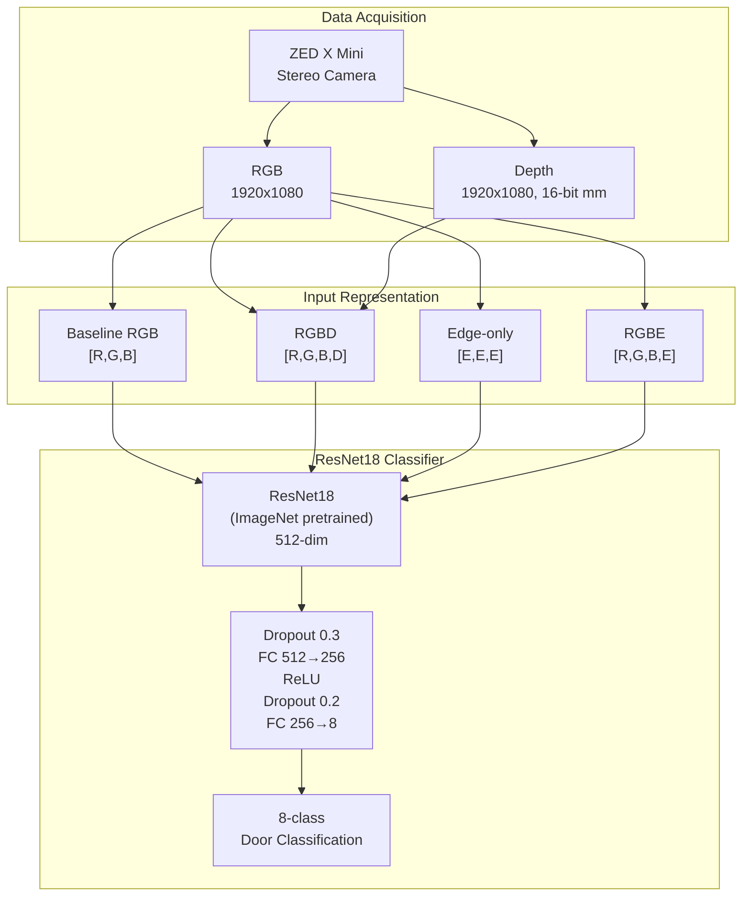
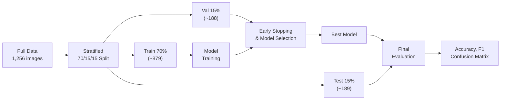

# 굴착기 부품 분류를 위한 RGB-Edge 하이브리드 입력 표현의 텍스처 변형 강건성 비교 연구

## A Comparative Study on Texture Variation Robustness of RGB-Edge Hybrid Input Representation for Excavator Part Classification

이민수1#

1 한국건설기계부품연구원 (Korea Construction Equipment Technology Institute)

# Corresponding Author / E-mail: minus.leer@koceti.re.kr, TEL: +82-44-589-3125

ORCID: 0009-0003-9012-9114

**KEYWORDS**: Excavator part classification (굴착기 부품 분류), RGBE hybrid (RGBE 하이브리드), Texture robustness (텍스처 강건성), Deep learning (딥러닝), Transfer learning (전이학습), Canny Edge (Canny Edge)

---

**초록**

본 연구는 굴착기 제조 공정에서 도어 부품 8종을 자동 분류하기 위한 딥러닝 모델의 입력 표현(input representation) 전략을 비교 분석한다. RGB와 Canny Edge를 결합한 RGBE(RGB + Edge) 하이브리드 입력 표현을 제안하고, 순수 RGB, RGBD(RGB + Depth), Edge-only와 함께 4종 입력 표현의 텍스처 변형 강건성을 체계적으로 비교하였다. ResNet18 백본 기반의 동일 아키텍처 위에서, ZED X Mini 스테레오 카메라로 촬영한 굴착기 도어 8종 실물 데이터(1,256장)를 대상으로 5회 반복 실험(5-seed)과 Train/Val/Test 70/15/15 분할을 통해 평가하였다. 448×448 해상도에서 RGBE Hybrid가 평균 정확도 하락폭 −7.25%p로 가장 작은 하락을 보였으며, RGBD(−8.15%p), Baseline RGB(−8.47%p) 순이었다. 반면 Edge-only(−27.30%p)는 가장 취약하였다. 그러나 Baseline RGB, RGBD, RGBE Hybrid 간에는 통계적으로 유의미한 차이가 관찰되지 않았으며(p > 0.05), Edge-only만이 나머지 세 모델 대비 유의하게 낮은 성능을 보였다(p < 0.003). 224×224 해상도에서는 RGBD(−8.30%p)가 가장 강건하고 RGBE Hybrid(−13.28%p)는 3위로 하락하여, Edge 채널의 강건성 기여가 해상도에 의존적일 수 있음을 확인하였다. 본 연구의 결과는 RGBE 하이브리드 입력이 고해상도 조건에서 텍스처 변형에 대해 보다 안정적인 분류 경향을 보일 수 있음을 시사하나, 동일 개체 기반 데이터에서의 오프라인 증강 조건에 한정된 비교이며, 실제 제조 현장에 대한 일반화는 향후 연구가 필요하다.

---

**Abstract**

This study compares input representation strategies for deep learning models to automatically classify eight types of excavator door parts in manufacturing processes. We propose an RGBE (RGB + Edge) hybrid input representation combining RGB with Canny Edge, and systematically compare four input representations: Baseline RGB, RGBD, Edge-only, and RGBE Hybrid under a shared ResNet18-based architecture. Using 1,256 real images of eight excavator door types captured with a ZED X Mini stereo camera, we conducted 5-seed repeated experiments with Train/Val/Test 70/15/15 stratified splitting. At 448×448 resolution, RGBE Hybrid showed the smallest average accuracy drop (−7.25%p), followed by RGBD (−8.15%p) and Baseline RGB (−8.47%p), while Edge-only was the most vulnerable (−27.30%p). However, no statistically significant differences were found among Baseline RGB, RGBD, and RGBE Hybrid (p > 0.05), with only Edge-only showing significantly lower performance (p < 0.003). At 224×224 resolution, RGBD (−8.30%p) became the most robust while RGBE Hybrid dropped to third (−13.28%p), suggesting that Edge channel contribution to robustness may be resolution-dependent. These findings suggest that RGBE hybrid input may provide a more stable classification tendency under texture variations at higher resolutions, though these conclusions are limited to offline augmentation conditions on same-instance data.

**Keywords**: Excavator part classification, RGBE hybrid, Texture robustness, Canny Edge, Deep learning, Transfer learning

---

## 1. 서론

굴착기 제조 공정에서 부품의 정확한 식별은 조립 품질과 생산성에 직결된다. 중대형/대형 굴착기(E25, E30, E38 등)의 도어(Door) 부품은 기종별로 외형은 유사하나 크기가 수십 밀리미터 수준에서 차이나는 특성이 있어, 자동화 공정을 구축함에 있어 분류가 쉽지 않다. 이에 카메라 기반 자동 인식 시스템의 도입이 요구되고 있다.

RGB 카메라 기반 딥러닝 분류 모델은 외관 정보를 활용하여 높은 정확도를 달성할 수 있으나, Geirhos et al.[5]이 입증한 바와 같이 ImageNet 학습 CNN은 형상(shape)보다 텍스처(texture)에 편향되어 있다. 이는 실제 제조 현장에서 조명 조건, 부품 표면 상태(오염, 마모 차이 등), 카메라의 노출 변화 등으로 인해 텍스처가 변형될 때 분류 성능이 저하될 수 있음을 시사한다.

RGB-D 비전은 RGB 영상이 제공하는 외관 정보와 depth 영상이 제공하는 기하 정보를 동시에 활용할 수 있어, 객체 인식 분야에서 꾸준하게 연구되어 왔다[1-3]. 특히 depth 정보는 물체의 형상 정보를 추가로 제공하여, RGB 대비 조명이나 색상 변화의 직접적인 영향을 상대적으로 덜 받는 장점이 있다[1]. 한편, ResNet 계열 모델의 첫 번째 합성곱 레이어를 확장하여 Depth 채널을 추가하는 4채널 단일 스트림 입력 방식은, 별도의 멀티모달 융합 네트워크 없이도 외관과 깊이 정보를 효율적으로 결합할 수 있어 산업 부품 인식에 적합한 접근으로 고려된다[1, 4].

그러나 텍스처 변형에 대한 강건성 관점에서, Depth 채널이 실질적으로 어느 정도 기여하는지는 명확하지 않다. Depth 채널은 텍스처 변형의 직접적인 영향을 받지 않지만, RGB 채널의 텍스처 의존성을 보상하는 데 충분한 정보를 제공하지 못할 수 있다. 이에 본 연구에서는 Depth 대신 Canny Edge를 4번째 채널로 활용하는 RGBE(RGB + Edge) 하이브리드 입력 표현을 대안으로 제안한다.

본 연구의 목적은 다음과 같다.

첫째, RGB와 Canny Edge 검출 결과를 결합한 RGBE 하이브리드 입력 표현을 제안하고, 순수 RGB 및 RGBD와의 텍스처 변형 강건성을 비교한다.

둘째, Baseline RGB, RGBD, Edge-only, RGBE Hybrid의 4종 입력 표현을 동일 아키텍처 위에서 체계적으로 비교하여, 각 전략의 강건성 특성과 한계를 분석한다.

셋째, 입력 해상도(448×448 vs 224×224)가 각 입력 표현의 강건성에 미치는 영향을 분석하여, 배포 환경에 따른 실용적 지침을 제시한다.

본 논문의 나머지 부분은 다음과 같이 구성된다. 2장에서는 다채널 입력 기반 분류 및 텍스처 강건성 관련 선행 연구를 검토한다. 3장에서는 제안하는 RGBE 하이브리드 입력 표현과 4종 모델의 상세 구성을 기술한다. 4장에서는 데이터셋, 평가 프로토콜 등 실험 환경을 설명하고, 5장에서는 실험 결과를 분석한다. 6장에서는 결과에 대한 고찰을, 7장에서는 결론 및 향후 연구 방향을 제시한다.

---

## 2. 관련 연구

### 2.1 다채널(RGB-D) 입력 기반 객체 인식

RGB 이미지에 깊이 정보를 추가한 다채널 입력 방식은 객체 인식 분야에서 널리 연구되어 왔다. Eitel et al.[1]은 RGB와 깊이 각각을 독립적인 CNN 스트림으로 처리한 후 late fusion으로 결합하는 2-stream 구조를 제안하였으며, Washington RGB-D Object Dataset에서 당시 최고 성능을 달성하였다. 이 연구는 깊이 이미지를 컬러맵으로 인코딩하여 ImageNet 사전 학습 가중치를 활용하는 방법론을 제시한 점에서 의의가 크다.

Loghmani et al.[2]는 사전학습된 ResNet의 다중 레이어에서 추출한 RGB 및 깊이 특징을 순환 신경망(RNN)으로 결합하는 RCFusion 구조를 제안하여, RGB-D Object Dataset과 JHUIT-50 벤치마크에서 기존 방법 대비 유의미한 성능 향상을 보고하였다. Bo et al.[8]은 RGB-D 센서 데이터로부터 depth kernel descriptors를 설계하여 깊이 정보의 효과적 표현 방법을 탐색하였다.

다채널 입력에 대한 포괄적 서베이로서, Gao et al.[3]은 멀티모달 CNN(MMCNN) 기반 RGB-D 객체 인식 방법론을 체계적으로 정리하며, 학습 데이터 부족 문제와 멀티모달 융합 전략을 핵심 과제로 제시하였다.

본 연구는 기존 RGB-D 2-stream 또는 별도 융합 네트워크를 사용하는 접근과 달리, 4채널 단일 스트림(single-stream) 구조를 채택하였다. 또한 depth 채널을 edge 채널로 대체하는 입력 표현 전략을 비교한다는 점에서 기존 RGB-D 연구와 차별화된다.

### 2.2 텍스처 편향과 형상 기반 인식

CNN 모델이 텍스처에 과도하게 의존하는 문제(texture bias)는 Geirhos et al.[5]에 의해 체계적으로 규명되었다. 이들은 texture-shape conflict 이미지를 이용한 실험을 통해, ImageNet 학습 CNN이 인간과 달리 형상(shape)보다 텍스처(texture)를 우선적으로 인식한다는 사실을 입증하였다. 나아가 Stylized-ImageNet을 통해 동일한 ResNet50 아키텍처에서도 형상 기반 표현 학습이 가능함을 보여, 텍스처 편향이 아키텍처 고유의 한계가 아닌 학습 데이터의 특성에 기인함을 시사하였다.

Hermann et al.[6]은 텍스처 편향의 기원을 보다 심층적으로 분석하여, 비지도 학습 목적함수와 아키텍처 변경의 효과는 제한적이나, 데이터 증강 전략(색상, 왜곡, 노이즈, 블러 등)이 텍스처 편향 완화에 가장 큰 영향을 미침을 밝혔다.

Li et al.[9]은 형상 기반 특징과 텍스처 기반 특징의 상보적 활용이 강건한 인식에 기여함을 보고하였으며, Brendel and Bethge[10]는 텍스처 통계만으로도 ImageNet 수준의 분류가 가능함을 보여 CNN의 텍스처 의존도를 재확인하였다.

본 연구는 기존 연구에서 주로 사용한 스타일 변환이나 학습 전략 변경 대신, Edge 채널을 명시적 입력으로 추가하여 형상 정보를 모델에 직접 제공하는 접근을 취한다. 이는 학습 과정에서의 간접적 형상 편향 유도가 아닌, 입력 수준에서의 구조적 형상 정보 보강이라는 점에서 차별화된다.

### 2.3 에지(Edge) 특징 활용 분류 기법

에지 검출 결과를 딥러닝의 입력 또는 보조 피처로 활용하는 연구는 다양한 맥락에서 수행되어 왔다. Xie and Tu[11]는 fully convolutional network와 deep supervision을 결합한 HED(Holistically-Nested Edge Detection)를 제안하여, 다중 스케일의 계층적 에지 표현을 자동 학습하는 방법론을 제시하였다.

Canny[12]가 제안한 다단계 에지 검출 알고리즘은 낮은 오류, 정확한 에지 위치 추정, 단일 응답이라는 세 가지 기준을 최적화한 것으로, 40년이 지난 현재에도 산업 현장에서 가장 널리 사용되는 에지 검출 기법이다.

최근 Canny 에지와 CNN을 결합한 연구가 활발히 진행되고 있다. Zhou et al.[13]은 원격 탐사 영상 분류에서 Canny 에지 정보와 CNN 특징을 attention 기반 융합(AFF)으로 결합하는 CAF 네트워크를 제안하여, 에지 정보의 보강이 분류 강건성 향상에 기여함을 보였다. Ding et al.[14]은 학습 가능한 에지 검출기를 VGG16 및 ResNet34에 통합한 BEFB를 제안하여, 에지 기반 형상 특징과 텍스처 특징을 결합한 모델이 적대적 공격에 더 강건함을 입증하였다.

본 연구는 HED와 같은 학습 기반 에지 검출기 대신 전통적 Canny Edge를 사용하되, 에지를 독립 입력(Edge-only)이 아닌 RGB와 결합한 4채널 하이브리드(RGBE) 입력으로 활용한다. 이는 에지 정보의 노이즈 민감성을 RGB와의 상호 보완을 통해 해결하면서, 추가적인 학습 기반 에지 검출기 없이도 텍스처 강건성을 확보하려는 실용적 접근이다.

### 2.4 합성 데이터 및 도메인 적응

실물 데이터 부족을 극복하기 위한 합성(synthetic) 데이터 기반 학습과 도메인 랜덤화(domain randomization) 기법이 활발히 연구되고 있다. Tobin et al.[15]은 시뮬레이터에서 텍스처, 조명, 카메라 위치 등 렌더링 파라미터를 랜덤화하여 학습한 모델이 실제 환경에서 성공적으로 전이될 수 있음을 최초로 입증하였다.

Tremblay et al.[16]은 도메인 랜덤화를 객체 검출에 확장 적용하여, 비현실적 합성 데이터만으로 학습한 모델이 실세계 객체 검출에서 경쟁력 있는 성능을 달성함을 보고하였다. Sadeghi and Levine[17]은 실제 이미지를 전혀 사용하지 않고 시뮬레이션 데이터만으로 드론 비행 정책을 학습하여 실세계 전이에 성공하였다.

이러한 도메인 랜덤화 기법은 본 연구의 텍스처 변형 증강과 개념적으로 유사하다. 본 연구에서 사용한 오프라인 증강(Brightness, Contrast, Noise, Blur 변형)은 시뮬레이터 없이 실물 데이터에 직접 적용하는 경량화된 도메인 랜덤화로 볼 수 있으며, RGBE 하이브리드 입력 표현은 이러한 도메인 갭에 대한 구조적 강건성을 제공할 수 있다는 점에서도 도메인 랜덤화[15-17]와 상호 보완적이다.

---

## 3. 제안 방법

### 3.1 시스템 개요

본 연구에서 제안하는 굴착기 부품 분류 시스템의 전체 구조를 Fig. 1에 나타내었다. 시스템은 (1) ZED X Mini 스테레오 카메라를 통한 RGB + Depth 동시 획득, (2) 입력 표현별 전처리(RGB/RGBD/RGBE/Edge-only), (3) ResNet18 기반 분류 모델을 통한 8클래스 분류의 3단계로 구성된다.

> **Fig. 1.** Overall architecture of the proposed system

### 3.2 공통 아키텍처: ResNet18 기반 분류기

4종 모델 간의 공정한 비교를 위해, 모든 모델은 동일한 아키텍처를 공유한다. ImageNet 사전학습된 ResNet18 백본으로 512차원 특징 벡터를 추출하고, Dropout(0.3) → Linear(512→256) → ReLU → Dropout(0.2) → Linear(256→8) 구조의 분류기를 통해 최종 8클래스 분류를 수행한다. 전체 모델 파라미터 수는 약 1,118만 개이다.

4채널 입력 모델(RGBD, RGBE Hybrid)의 경우, ResNet18의 첫 번째 합성곱 레이어(conv1)를 3채널에서 4채널로 확장한다. 추가된 4번째 채널(Depth 또는 Edge)의 가중치는 기존 RGB 3채널 가중치의 평균값으로 초기화하여 학습 안정성을 확보하였다. Baseline RGB와 Edge-only 모델은 표준 3채널 입력을 사용하므로, ImageNet 사전학습 가중치를 그대로 활용한다.

### 3.3 입력 표현별 모델 구성

4종 모델의 입력 채널 구성과 설계 의도를 Table 1에 정리하였다. 모든 모델은 3.2절의 ResNet18 분류기 구조를 공유하며, 입력 표현만 다르다.

> **Table 1.** Input channel configuration of four models

| Model | Channels | Channel Composition | ImageNet Weight Utilization | Design Intent |
|-------|:--------:|--------------------|-----------------------------|---------------|
| Baseline RGB | 3 | R, G, B | 3ch direct transfer | Pure appearance (color + texture baseline) |
| RGBD | 4 | R, G, B, D | RGB 3ch transfer, D: RGB mean init | Appearance + depth geometry |
| Edge-only | 3 | E, E, E | 3ch direct transfer | Complete texture removal, pure shape |
| RGBE Hybrid | 4 | R, G, B, E | RGB 3ch transfer, E: RGB mean init | Texture + shape complementarity |

#### 3.3.1 Baseline RGB

표준 RGB 3채널 입력을 사용하는 기준 모델이다. ImageNet 사전학습 가중치를 그대로 활용하며, 추가적인 depth나 edge 정보 없이 순수 색상·텍스처 기반으로 분류를 수행한다. 이 모델은 depth나 edge 채널 추가의 실질적 효과를 평가하기 위한 기준선(baseline)으로 설정하였다.

#### 3.3.2 RGBD

RGB 3채널에 정규화된 Depth 1채널을 추가한 4채널 입력이다. Depth 채널은 5m 기준 클리핑 후 (x − 0.5) / 0.25로 표준화한다. 외관 정보와 깊이 기반 기하 정보를 동시에 활용하여, 형상이 유사한 부품 간의 크기 차이를 depth로 보완하는 전략이다.

#### 3.3.3 Edge-only

RGB 텍스처 의존을 근본적으로 차단하기 위해, 입력을 Canny Edge 검출 결과로 대체한다. 원본 RGB를 그레이스케일로 변환 후 Canny Edge를 적용하고, 결과를 [0, 1]로 정규화한 뒤 3채널로 복제하여 (E, E, E) 형태로 입력한다. Canny 임계값은 학습 시 랜덤 지터링(threshold1: 30~70, threshold2: 100~200)을 적용하여 에지 민감도의 다양성을 확보한다.

#### 3.3.4 RGBE Hybrid (제안 방법)

RGB 3채널의 풍부한 시각 정보와 Canny Edge의 구조적 형상 정보를 동시에 활용하는 하이브리드 입력 표현이다. Depth 채널 대신 Canny Edge 채널을 4번째 채널로 사용한다. 핵심 설계 원리는 다음과 같다.

(1) **보완적 정보 결합**: RGB 채널은 색상·질감 기반의 세밀한 구분을, Edge 채널은 형상·윤곽 기반의 구조적 구분을 담당한다.

(2) **증강 일관성**: Edge 채널은 증강이 적용된 RGB에서 실시간으로 계산되므로, RGB 증강과 Edge가 자동으로 공간적 일관성을 유지한다.

(3) **Depth 독립성**: Depth 정보를 모델 입력에 사용하지 않으므로, 깊이 센서의 노이즈나 측정 오차에 영향을 받지 않는다.

### 3.4 전처리 파이프라인

모든 모델에 공통으로 Letterbox 방식의 리사이즈를 적용한다. 원본 이미지(1920×1080)의 장변을 기준으로 목표 해상도(448 또는 224)로 축소하고, 단변 방향에 검정 패딩을 추가하여 정사각형을 완성한다.

RGB 채널은 ImageNet 통계값(mean = [0.485, 0.456, 0.406], std = [0.229, 0.224, 0.225])으로 정규화하고, Depth 채널은 5m 기준 클리핑 후 (x − 0.5) / 0.25로 표준화한다. Edge 채널은 Canny 출력을 [0, 1]로 스케일링한 후 (x − 0.5) / 0.5로 정규화한다.

---

## 4. 실험 환경

### 4.1 데이터셋

#### 4.1.1 실물 데이터

ZED X Mini 스테레오 카메라(Neural Depth 모드, HD1080, 30fps)로 굴착기 도어 8종을 촬영하였다. Flask 기반 웹 UI를 통해 비디오 스트리밍 중 N 프레임 간격으로 RGB + Depth 쌍을 자동 추출하고, Laplacian Variance 기반 블러 필터링(임계값 100)으로 흐릿한 프레임을 제거하였다.

> **Table 2.** Real-world dataset configuration (8 classes)

| Class | Description | Door Width (mm) | Images |
|-------|-------------|:--------------:|:------:|
| E25_door_LH_FRT | 2.5-ton left front | 828 | 158 |
| E25_door_LH_RR | 2.5-ton left rear | 1,141 | 155 |
| E25_door_RH | 2.5-ton right | 990 | 155 |
| E30_E38_door_RH | 3.0/3.8-ton right (shared) | 1,191 | 154 |
| E30_door_LH_FRT | 3.0-ton left front | 869 | 161 |
| E30_door_LH_RR | 3.0-ton left rear | 1,262 | 159 |
| E38_door_LH_FRT | 3.8-ton left front | 916 | 154 |
| E38_door_LH_RR | 3.8-ton left rear | 1,456 | 160 |
| **Total** | | | **1,256** |

<!-- [Fig. 2 삽입 필요: 8종 도어 대표 RGB 이미지 (4×2 그리드)] -->

#### 4.1.2 평가용 텍스처 변형 데이터셋

모델의 텍스처 변형 강건성을 평가하기 위해, 오프라인 증강 데이터셋 2종을 생성하였다. 증강은 전체 1,256장에 대해 적용하되, 평가 시에는 각 seed의 Test 분할에 해당하는 이미지만 사용하여 데이터 누출(data leakage)을 방지하였다.

> **Table 3.** Evaluation dataset configuration

| Dataset | Augmentation Scope | Techniques | Total Images |
|---------|-------------------|------------|:------------:|
| Test Original | None | None | ~189 per seed |
| datasets_aug | Foreground only (SAM mask) | Brightness, Contrast, Noise, Blur, etc. | 1,256 (Test only evaluated) |
| datasets_aug2 | Full image | Brightness, Contrast, Noise, Blur, etc. | 1,256 (Test only evaluated) |

### 4.2 실험 설계

#### 4.2.1 데이터 분할

기존 Train/Test 2-way 분할에서 발생하는 Test 데이터로 모델을 선택하는 data leakage 문제를 방지하기 위해, **Train/Val/Test 70/15/15 stratified split**을 적용하였다. Validation 셋은 early stopping과 모델 선택에만 사용하고, Test 셋은 최종 평가에만 사용한다.

#### 4.2.2 다중 시드 반복 실험

단일 분할의 우연성을 배제하기 위해, 5개의 서로 다른 랜덤 시드(42, 123, 456, 789, 1024)로 전체 실험을 반복하였다. 각 시드에서 데이터 분할, 모델 초기화, 학습 과정이 독립적으로 수행되며, 결과는 **mean ± std** 형태로 보고한다. 모델 간 성능 차이의 통계적 유의성은 paired t-test로 검정한다.

> **Fig. 3.** Train/Val/Test 3-way split and evaluation protocol

### 4.3 학습 설정

> **Table 4.** Common training hyperparameters

| Parameter | Value |
|-----------|-------|
| Backbone | ResNet18 (ImageNet1K_V1 pretrained) |
| Input Resolution | 448×448 (primary), 224×224 (comparison) |
| Optimizer | Adam (lr = 0.001) |
| LR Scheduler | ReduceLROnPlateau (patience=3, factor=0.5) |
| Batch Size | 64 (448) / 128 (224) |
| Max Epochs | 60 |
| Early Stopping | **Validation accuracy** patience = 10 |
| Loss Function | CrossEntropyLoss (inverse-frequency class weights) |
| Data Split | **Train 70% / Val 15% / Test 15%**, Stratified |
| Repetitions | **5-seed** (42, 123, 456, 789, 1024) |
| Dropout | 0.3 (layer 1), 0.2 (layer 2) |

### 4.4 학습 환경

> **Table 5.** Hardware and software environment

| Item | Specification |
|------|-------------|
| GPU | NVIDIA GeForce RTX 5090 (32GB VRAM) |
| OS | Ubuntu 24.04.4 LTS (Linux 6.17.0) |
| Framework | PyTorch 2.11.0 + CUDA 13.0 |
| Python | 3.13 (Miniconda) |
| Libraries | scikit-learn 1.8.0, OpenCV, torchvision 0.26.0 |

### 4.5 평가 지표

분류 성능 지표로 전체 정확도(Accuracy), 클래스별 Precision, Recall, F1-Score, 그리고 Macro F1-Score를 사용하였다. 텍스처 변형 강건성은 원본 Test 대비 증강 데이터에서의 **정확도 하락폭(Δ)**으로 정량화하였다. 모든 지표는 5회 반복 실험의 mean ± std로 보고하며, 모델 간 비교의 통계적 유의성은 paired t-test (α = 0.05)로 검정하였다.

---

## 5. 실험 결과

### 5.1 448×448 해상도 — 전체 정확도 비교

Table 6에 448×448 해상도에서 4종 모델의 전체 정확도를 제시한다. 원본 Test에서 RGBD와 RGBE Hybrid가 모두 100.00%의 완벽한 정확도를 달성하였으며, Baseline RGB도 99.89%로 근접하였다. 텍스처 변형 데이터셋에서는 RGBE Hybrid가 가장 높은 성능을 유지하였다.

> **Table 6.** Overall accuracy comparison (448×448, mean ± std, 5-seed)

| Model | Test Original | Aug (Foreground) | Aug (Full) |
|-------|:------------:|:---------------:|:----------:|
| Baseline RGB | 99.89 ± 0.24 | 90.69 ± 3.08 | 92.17 ± 3.50 |
| RGBD | 100.00 ± 0.00 | 90.79 ± 1.57 | 92.91 ± 1.89 |
| Edge-only | 98.83 ± 0.79 | 69.31 ± 5.36 | 73.76 ± 3.17 |
| **RGBE Hybrid** | **100.00 ± 0.00** | **91.64 ± 1.65** | **93.86 ± 1.70** |

### 5.2 448×448 해상도 — Macro F1-Score 비교

> **Table 7.** Macro F1-Score comparison (448×448, mean ± std, 5-seed)

| Model | Test Original | Aug (Foreground) | Aug (Full) |
|-------|:------------:|:---------------:|:----------:|
| Baseline RGB | 99.89 ± 0.24 | 90.68 ± 3.13 | 92.16 ± 3.55 |
| RGBD | 100.00 ± 0.00 | 90.82 ± 1.66 | 92.95 ± 1.89 |
| Edge-only | 98.83 ± 0.80 | 68.78 ± 5.48 | 73.73 ± 3.27 |
| **RGBE Hybrid** | **100.00 ± 0.00** | **91.66 ± 1.71** | **93.87 ± 1.64** |

Macro F1-Score 역시 전체 정확도와 유사한 경향을 보였다. 클래스 불균형이 크지 않은 데이터셋(클래스당 154~161장) 특성상, Accuracy와 Macro F1 간의 차이는 미미하였다.

### 5.3 448×448 해상도 — 클래스별 F1-Score 분석

Table 8에 448×448 해상도에서 텍스처 변형(Aug Foreground) 데이터에 대한 4종 모델의 클래스별 F1-Score를 제시한다.

> **Table 8.** Per-class F1-Score under texture variation (Aug Foreground, 448×448, mean ± std, 5-seed)

| Class | Baseline RGB | RGBD | Edge-only | RGBE Hybrid |
|-------|:---:|:---:|:---:|:---:|
| E25_LH_FRT | 88.4 ± 5.2 | 86.1 ± 2.5 | 74.4 ± 6.2 | **90.2 ± 4.1** |
| E25_LH_RR | **94.7 ± 2.1** | 88.9 ± 6.7 | 66.8 ± 5.9 | 92.2 ± 2.9 |
| E25_RH | 90.2 ± 2.4 | 93.2 ± 2.0 | 75.1 ± 5.1 | **93.3 ± 2.4** |
| E30_E38_RH | 87.3 ± 5.4 | 91.7 ± 4.0 | 66.4 ± 6.8 | **92.5 ± 3.3** |
| E30_LH_FRT | 86.4 ± 4.3 | 86.6 ± 1.6 | 73.0 ± 8.6 | **86.9 ± 2.9** |
| E30_LH_RR | 94.8 ± 2.7 | **94.8 ± 3.4** | 62.0 ± 5.6 | 91.9 ± 6.5 |
| E38_LH_FRT | 89.2 ± 6.4 | 92.4 ± 2.8 | 75.3 ± 3.6 | **92.8 ± 5.3** |
| E38_LH_RR | 94.5 ± 3.1 | 92.7 ± 3.1 | 57.2 ± 8.2 | **93.7 ± 3.5** |

클래스별 분석에서 다음의 주요 패턴이 관찰되었다.

첫째, **RGBE Hybrid가 8클래스 중 5클래스에서 최고 F1을 기록**하였다. Baseline RGB가 1클래스(E25_LH_RR), RGBD가 2클래스(E25_RH 타이, E30_LH_RR)에서 최고를 기록하였다. 이는 RGBE의 우위가 특정 클래스에 편중된 것이 아닌, 다수 클래스에서 일관되게 나타나는 경향임을 보여준다.

둘째, **Edge-only 모델은 후방 도어(RR) 클래스에서 특히 취약**하였다. E38_LH_RR(57.2%), E30_LH_RR(62.0%)에서 최저 F1을 기록하였다. 후방 도어와 우측 도어는 전체 윤곽이 유사하여, 텍스처 변형으로 에지가 열화되면 형상만으로는 구분이 어려워지는 것으로 해석된다.

셋째, **Baseline RGB가 일부 클래스에서 RGBD보다 높은 F1을 기록**하였다(E25_LH_FRT: 88.4 vs 86.1, E25_LH_RR: 94.7 vs 88.9, E38_LH_RR: 94.5 vs 92.7). 이는 순수 RGB 정보만으로도 특정 클래스에서는 depth 추가에 필적하는 강건성을 보일 수 있음을 시사하며, depth 채널의 기여가 클래스에 따라 다를 수 있음을 나타낸다.

### 5.4 강건성 지표 — 정확도 하락폭(Δ)

Table 9는 각 모델의 원본 Test 대비 텍스처 변형 데이터셋에서의 정확도 하락폭(Δ)을 보여준다. 하락폭이 작을수록 텍스처 변형에 강건한 것을 의미한다.

> **Table 9.** Texture variation robustness comparison (accuracy drop from original, mean ± std, 448×448)

| Model | Δ(Aug FG) | Δ(Aug Full) | Avg Δ | Rank |
|-------|:---------:|:----------:|:-----:|:----:|
| **RGBE Hybrid** | **−8.36 ± 1.65** | **−6.14 ± 1.70** | **−7.25** | **1** |
| RGBD | −9.21 ± 1.57 | −7.09 ± 1.89 | −8.15 | 2 |
| Baseline RGB | −9.21 ± 3.10 | −7.73 ± 3.50 | −8.47 | 3 |
| Edge-only | −29.52 ± 5.49 | −25.08 ± 2.96 | −27.30 | 4 |

RGBE Hybrid가 가장 작은 평균 하락폭(−7.25%p)을 기록하였고, RGBD(−8.15%p)와 Baseline RGB(−8.47%p)가 뒤를 이었다. Edge-only는 −27.30%p로 압도적으로 가장 큰 하락을 보였다. 다만, 상위 3개 모델(RGBE, RGBD, RGB) 간 평균 하락폭 차이는 1.22%p 이내로 매우 작았다. 주목할 점은 RGBE Hybrid의 하락폭 표준편차가 가장 작아(±1.65, ±1.70), seed 간 안정성이 가장 높았다는 것이다.

### 5.5 통계적 유의성 검정

Table 10은 448×448 해상도에서 모델 쌍별 Macro F1 기반 paired t-test 결과를 보여준다.

> **Table 10.** Pairwise paired t-test results (Macro F1, 448×448)

| Model A | Model B | Dataset | t-stat | p-value | Sig. (α=0.05) |
|---------|---------|---------|:------:|:------:|:--------------:|
| Baseline RGB | RGBD | Aug (FG) | −0.135 | 0.8989 | No |
| Baseline RGB | Edge-only | Aug (FG) | 11.473 | 0.0003 | **Yes** |
| Baseline RGB | RGBE Hybrid | Aug (FG) | −1.430 | 0.2261 | No |
| RGBD | Edge-only | Aug (FG) | 11.935 | 0.0003 | **Yes** |
| RGBD | RGBE Hybrid | Aug (FG) | −1.117 | 0.3266 | No |
| Edge-only | RGBE Hybrid | Aug (FG) | −10.682 | 0.0004 | **Yes** |
| Baseline RGB | RGBD | Aug (Full) | −0.651 | 0.5503 | No |
| Baseline RGB | Edge-only | Aug (Full) | 6.621 | 0.0027 | **Yes** |
| Baseline RGB | RGBE Hybrid | Aug (Full) | −1.271 | 0.2725 | No |
| RGBD | Edge-only | Aug (Full) | 8.710 | 0.0010 | **Yes** |
| RGBD | RGBE Hybrid | Aug (Full) | −1.082 | 0.3401 | No |
| Edge-only | RGBE Hybrid | Aug (Full) | −12.399 | 0.0002 | **Yes** |

통계 검정 결과, **Baseline RGB · RGBD · RGBE Hybrid 3개 모델 간에는 유의미한 성능 차이가 없었다**(모든 p > 0.22). 이는 4채널 입력(RGBD 또는 RGBE)이 순수 RGB 대비 통계적으로 유의한 강건성 개선을 달성하지 못했음을 의미한다. 반면, Edge-only는 나머지 3개 모델 모두와 유의한 차이를 보였다(p < 0.003). 이 결과는 depth나 edge 채널 추가의 강건성 기여가 제한적인 반면, 순수 edge 입력의 취약성은 통계적으로 명확함을 보여준다.

### 5.6 학습 수렴 특성

<!-- [Fig. 4 삽입 필요: 학습 곡선 (Val Accuracy vs Epoch) — class_estimation/door_paper/artifacts/summary_noaux/learning_curves_448.png] -->

> **Table 11.** Training convergence comparison (448×448, mean ± std, 5-seed)

| Model | Best Val Accuracy | Early Stop Epoch |
|-------|:----------------:|:----------------:|
| Baseline RGB | 100.00 ± 0.00% | 23.4 ± 1.0 |
| RGBD | 100.00 ± 0.00% | 25.6 ± 4.2 |
| Edge-only | 99.15 ± 0.26% | 34.4 ± 4.3 |
| RGBE Hybrid | 100.00 ± 0.00% | 26.8 ± 3.7 |

Baseline RGB, RGBD, RGBE Hybrid는 모두 Validation 정확도 100%에 도달하였으며, Baseline RGB가 가장 빠르게 수렴하였다(23.4 에포크). Edge-only만 99.15%로 다소 낮은 Validation 정확도를 보였고, 수렴에 더 많은 에포크(34.4)가 소요되었다. Baseline RGB의 빠른 수렴은 ImageNet 사전학습 가중치와의 채널 호환성(3채널 그대로 사용)이 기여한 것으로 해석된다.

### 5.7 입력 해상도 비교 (448 vs 224)

Table 12는 448과 224 해상도에서의 정확도를 비교한다.

> **Table 12.** Resolution comparison — overall accuracy (mean ± std, 5-seed)

| Model | Resolution | Test Original | Aug (FG) | Aug (Full) |
|-------|:--------:|:------------:|:-------:|:--------:|
| Baseline RGB | 448 | 99.89 ± 0.24 | 90.69 ± 3.08 | 92.17 ± 3.50 |
| | 224 | 99.05 ± 1.26 | 87.93 ± 6.69 | 87.20 ± 9.86 |
| RGBD | 448 | 100.00 ± 0.00 | 90.79 ± 1.57 | 92.91 ± 1.89 |
| | 224 | 99.47 ± 0.37 | 91.11 ± 1.47 | 91.22 ± 2.86 |
| Edge-only | 448 | 98.83 ± 0.79 | 69.31 ± 5.36 | 73.76 ± 3.17 |
| | 224 | 95.98 ± 1.22 | 75.56 ± 2.20 | 78.10 ± 2.38 |
| RGBE Hybrid | 448 | 100.00 ± 0.00 | 91.64 ± 1.65 | 93.86 ± 1.70 |
| | 224 | 99.79 ± 0.29 | 85.61 ± 4.31 | 87.41 ± 2.68 |

> **Table 13.** Resolution comparison — robustness (accuracy drop, mean ± std)

**448×448 해상도:**

| Model | Δ(Aug FG) | Δ(Aug Full) | Avg Δ | Rank |
|-------|:---------:|:----------:|:-----:|:----:|
| **RGBE Hybrid** | **−8.36 ± 1.65** | **−6.14 ± 1.70** | **−7.25** | **1** |
| RGBD | −9.21 ± 1.57 | −7.09 ± 1.89 | −8.15 | 2 |
| Baseline RGB | −9.21 ± 3.10 | −7.73 ± 3.50 | −8.47 | 3 |
| Edge-only | −29.52 ± 5.49 | −25.08 ± 2.96 | −27.30 | 4 |

**224×224 해상도:**

| Model | Δ(Aug FG) | Δ(Aug Full) | Avg Δ | Rank |
|-------|:---------:|:----------:|:-----:|:----:|
| **RGBD** | **−8.36 ± 1.69** | **−8.25 ± 2.84** | **−8.30** | **1** |
| Baseline RGB | −11.11 ± 5.93 | −11.85 ± 9.59 | −11.48 | 2 |
| RGBE Hybrid | −14.18 ± 4.26 | −12.38 ± 2.63 | −13.28 | 3 |
| Edge-only | −20.42 ± 2.07 | −17.88 ± 2.07 | −19.15 | 4 |

<!-- [Fig. 5 삽입 필요: 해상도별 강건성 비교 — class_estimation/door_paper/artifacts/summary_noaux/resolution_comparison.png] -->

해상도 비교에서 주목할 만한 관찰은 다음과 같다.

첫째, **해상도에 따라 최적 입력 표현이 달라진다.** 448에서는 RGBE Hybrid(Avg Δ = −7.25%p)가 1위였으나, 224에서는 RGBD(−8.30%p)가 1위로 역전되었다. RGBE Hybrid는 224에서 −13.28%p로 크게 하락하여 3위가 되었다.

둘째, **RGBE Hybrid의 해상도 의존성이 가장 크다.** 448에서 224로 전환 시 RGBE의 평균 하락폭이 −7.25 → −13.28%p (6.03%p 악화)로, 4개 모델 중 가장 큰 변화를 보였다. 이는 Edge 채널의 디테일이 해상도에 민감함을 시사한다.

셋째, **RGBD는 해상도에 가장 둔감하다.** 448(−8.15%p) → 224(−8.30%p)로 변화가 거의 없어(0.15%p), 해상도 변화에 가장 안정적인 전략이었다.

넷째, **Baseline RGB의 224 해상도에서의 표준편차 증가가 두드러진다.** Aug (FG)에서 ±3.08 → ±6.69, Aug (Full)에서 ±3.50 → ±9.86으로 불안정해졌다. 이는 저해상도에서 순수 RGB 정보만으로는 텍스처 변형에 일관되게 대응하기 어려움을 나타낸다.

### 5.8 224×224 해상도 — 통계적 유의성

Table 14는 224×224 해상도에서 모델 쌍별 Macro F1 기반 paired t-test 결과를 보여준다.

> **Table 14.** Pairwise paired t-test results (Macro F1, 224×224)

| Model A | Model B | Dataset | t-stat | p-value | Sig. (α=0.05) |
|---------|---------|---------|:------:|:------:|:--------------:|
| Baseline RGB | RGBD | Aug (FG) | −0.960 | 0.3915 | No |
| Baseline RGB | Edge-only | Aug (FG) | 3.789 | 0.0193 | **Yes** |
| Baseline RGB | RGBE Hybrid | Aug (FG) | 0.611 | 0.5743 | No |
| RGBD | Edge-only | Aug (FG) | 13.755 | 0.0002 | **Yes** |
| RGBD | RGBE Hybrid | Aug (FG) | 3.192 | 0.0332 | **Yes** |
| Edge-only | RGBE Hybrid | Aug (FG) | −7.889 | 0.0014 | **Yes** |
| Baseline RGB | RGBD | Aug (Full) | −0.845 | 0.4458 | No |
| Baseline RGB | Edge-only | Aug (Full) | 1.745 | 0.1559 | No |
| Baseline RGB | RGBE Hybrid | Aug (Full) | −0.118 | 0.9114 | No |
| RGBD | Edge-only | Aug (Full) | 10.093 | 0.0005 | **Yes** |
| RGBD | RGBE Hybrid | Aug (Full) | 2.562 | 0.0625 | No |
| Edge-only | RGBE Hybrid | Aug (Full) | −6.603 | 0.0027 | **Yes** |

224 해상도에서는 448과 다른 통계적 패턴이 관찰되었다. Aug (Foreground) 데이터에서 RGBD와 RGBE Hybrid 간에 유의한 차이가 나타났다(p = 0.0332). 이는 448에서 유의차가 없던 것과 대비되어(Table 10, p = 0.3266), Edge 채널의 강건성 기여가 해상도에 의존적임을 통계적으로도 확인시킨다. 또한 Aug (Full)에서 Baseline RGB vs Edge-only가 비유의(p = 0.1559)로 전환된 점도 448(p = 0.0027)과의 차이이다.

### 5.9 Grad-CAM 기반 attention 영역 분석

모델이 분류 판단 시 실제로 주목하는 영역을 시각적으로 분석하기 위해, Grad-CAM[18]을 적용하였다. ResNet18 backbone의 마지막 합성곱 레이어(layer4)에서 추출한 feature map에 대해, 정답 클래스 logit의 gradient로 가중 평균한 activation map을 생성하였다.

#### 5.9.1 모델 간 attention 비교

Fig. 6에 448×448 해상도에서 대표 클래스에 대한 RGBD, Edge-only, RGBE Hybrid의 Grad-CAM heatmap을 제시한다.

<!-- [Fig. 6 삽입: class_estimation/door_paper/artifacts/summary_noaux/gradcam_fig6.png] -->

> **Fig. 6.** Grad-CAM comparison of models on representative classes (448×448, seed=42). Warmer colors indicate higher attention.

모델 간 attention 패턴에서 다음과 같은 차이가 관찰되었다.

첫째, **RGBE Hybrid는 도어 윤곽선 및 구조적 특징(경첩, 구멍, 모서리)에 집중하는 경향**을 보였다. 이는 Edge 채널이 제공하는 명시적 형상 정보가 모델의 attention을 구조적 영역으로 유도할 수 있음을 시사한다.

둘째, **RGBD는 도어 표면 전체에 걸쳐 비교적 넓은 attention 분포**를 보였다. 이는 RGB 텍스처 정보에 대한 의존도가 상대적으로 높음을 반영할 수 있다.

셋째, **Edge-only 모델은 윤곽 영역에 집중하지만, attention이 특정 영역에 과도하게 편중**되는 경향이 있었다. 이는 텍스처 정보 없이 순수 형상만으로는 클래스 간 미세 차이를 구분하기 위해 소수의 구별적 특징에 과의존하게 됨을 보여준다.

#### 5.9.2 텍스처 변형에 대한 attention 안정성

Fig. 7에 RGBD와 RGBE Hybrid의 원본/텍스처 변형 이미지에 대한 Grad-CAM 비교를 제시한다.

<!-- [Fig. 7 삽입: class_estimation/door_paper/artifacts/summary_noaux/gradcam_fig7.png] -->

> **Fig. 7.** Grad-CAM robustness comparison between RGBD and RGBE Hybrid under texture variation (Original vs Augmented, 448×448, seed=42).

텍스처 변형 전후 attention 변화에서 주목할 관찰은 다음과 같다.

첫째, **RGBE Hybrid는 텍스처 변형 후에도 attention 영역이 비교적 안정적으로 유지**되었다. 원본에서 도어 윤곽/구조에 집중하던 패턴이 증강 이미지에서도 유사하게 보존되었다.

둘째, **RGBD는 텍스처 변형 시 attention 영역이 이동하거나 분산**되는 경향이 관찰되었다. 이는 RGB 텍스처 정보의 변화가 모델의 판단 근거를 불안정하게 만드는 메커니즘을 시각적으로 보여준다.

이러한 Grad-CAM 분석 결과는 5.4절의 강건성 지표와 방향이 일치하며, RGBE Hybrid의 강건성 경향이 Edge 채널에 의한 구조적 attention 안정화와 관련될 수 있음을 시사한다. 다만 이는 정성적 관찰이며, attention 안정성의 정량적 비교는 향후 연구로 남긴다.

---

## 6. 고찰

### 6.1 RGBE Hybrid의 강건성 경향과 통계적 한계

448×448 해상도에서 RGBE Hybrid가 평균 Δ = −7.25%p로 가장 작은 하락폭을 보였다. 이는 RGB와 Edge 채널의 **상호 보완 효과**로 해석할 수 있다. 원본 이미지에서 RGB는 풍부한 텍스처 정보를, Edge는 선명한 윤곽 정보를 제공한다. 텍스처 변형 시 RGB 정보가 훼손되더라도, Edge 채널의 주요 윤곽선이 부분적으로 유지되어 분류 성능 하락을 억제할 수 있다.

그러나 이 결과 해석에는 중요한 제약이 따른다. **Baseline RGB(−8.47%p), RGBD(−8.15%p), RGBE Hybrid(−7.25%p) 세 모델 간의 차이는 통계적으로 유의하지 않았다**(모든 p > 0.22). 이는 두 가지 가능성을 내포한다. 첫째, 실질적인 차이가 존재하지 않을 수 있다. 순수 RGB 만으로도 이 데이터셋에서는 충분한 강건성을 보이며, depth나 edge 채널의 추가적 기여가 미미할 수 있다. 둘째, 5-seed 반복 실험의 검정력(statistical power)이 충분하지 않아, 실제 존재하는 작은 차이를 검출하지 못했을 수 있다.

RGBE Hybrid의 하락폭 표준편차가 가장 작은 점(FG: ±1.65 vs RGB: ±3.10)과 5.3절에서 8클래스 중 5클래스에서 최고 F1을 기록한 점은 RGBE가 보다 안정적인 강건성을 제공할 가능성을 시사하나, 이를 확언하기에는 근거가 부족하다.

따라서 본 연구의 주요 기여는 RGBE의 통계적 우위 입증이 아닌, (1) Edge 채널의 보조적 활용이 강건성에 긍정적 경향을 보일 수 있다는 관찰, (2) 해상도에 따라 최적 입력 표현이 달라진다는 실무적 발견, (3) Edge-only 접근의 명확한 한계 확인, (4) Grad-CAM을 통한 attention 패턴의 정성적 분석에 있다.

### 6.2 Depth 채널 대비 Edge 채널의 기여

RGBD와 RGBE Hybrid는 4번째 채널만 다르고(Depth vs Edge) 나머지 조건은 동일하므로, 두 모델의 직접 비교를 통해 각 채널의 특성을 분석할 수 있다.

448×448 해상도에서 원본 Test 정확도는 양 모델 모두 100.00%로 동일하였으나, 텍스처 변형 조건에서 RGBE Hybrid(Avg Δ = −7.25%p)가 RGBD(−8.15%p)보다 0.90%p 적게 하락하였다. 이 차이는 통계적으로 유의하지 않았지만(p > 0.32), 일관된 방향성을 보였다.

여기서 주목할 점은 Depth 채널과 Edge 채널의 증강 대응 특성 차이이다. Depth 채널은 오프라인 증강(Brightness, Contrast, Noise, Blur)의 적용 대상이 아니므로, 증강 데이터에서도 원본과 동일한 깊이 정보를 유지한다. 반면, Edge 채널은 증강이 적용된 RGB에서 실시간 계산되므로, 텍스처 변형 시 에지 품질이 함께 열화된다. **그럼에도 불구하고 RGBE가 RGBD보다 강건한 경향을 보인다는 것은**, Edge 채널이 제공하는 구조적 형상 정보가 Depth 채널의 기하 정보보다 텍스처 변형 보상에 효과적일 수 있음을 시사한다.

다만, Baseline RGB(−8.47%p)가 RGBD(−8.15%p)와 거의 동일한 강건성을 보인 점은, 이 데이터셋에서 Depth 채널의 텍스처 변형 보상 효과가 제한적임을 나타낸다. 즉, Depth 정보가 원본 조건에서의 분류 정확도 향상(99.89% → 100.00%)에는 기여하나, 텍스처 변형 강건성 측면에서는 큰 차이를 만들지 못하는 것으로 보인다.

5.9절의 Grad-CAM 분석은 이러한 해석을 정성적으로 뒷받침한다. RGBE Hybrid가 도어 윤곽 및 구조적 특징 영역에 attention을 집중하는 경향이 관찰되었으나, 이 역시 정량적 검증이 필요한 관찰적 수준의 결과이다.

### 6.3 Edge-only 접근의 한계

Edge-only 모델은 원본 Test에서 98.83%의 정확도로 순수 형상 정보만으로도 분류가 가능함을 확인하였으나, 텍스처 변형 데이터에서 −27.30%p의 가장 큰 하락을 보였다(p < 0.003). 이는 오프라인 증강(Noise, Blur 등)이 RGB에 적용된 후 Canny Edge가 재계산되면서, 노이즈에 의한 위양성 에지(false positive edge)와 블러에 의한 에지 소실이 동시에 발생하기 때문이다.

반면 RGBE Hybrid에서 동일한 Edge 채널이 4번째 보조 채널로 사용될 때는, RGB 3채널이 텍스처 변형에도 일부 유효한 정보를 유지하여 Edge 채널의 품질 저하를 보상한다. 이 결과는 에지 정보를 독립 입력으로 사용하는 것보다 RGB와 결합하여 **보조적 채널**로 활용하는 것이 효과적이라는 결론을 지지한다.

### 6.4 해상도-강건성 상호작용

448과 224 해상도 비교에서 가장 주목할 발견은 **최적 입력 표현이 해상도에 따라 달라진다**는 점이다.

448에서는 RGBE Hybrid(−7.25%p)가 1위였으나, 224에서는 RGBD(−8.30%p)가 1위가 되고 RGBE는 3위(−13.28%p)로 크게 하락하였다. 이는 고해상도에서 Edge 채널의 풍부한 디테일(미세 윤곽, 구멍, 경첩 등)이 RGB의 텍스처 의존성을 보완하는 메커니즘이, 저해상도에서는 Edge 디테일 감소로 약화됨을 시사한다.

반면 RGBD(448: −8.15, 224: −8.30)는 해상도 변화에 상대적으로 둔감하였다. Depth 채널은 해상도 축소 시에도 전역적 기하 정보를 유지하기 때문에, 해상도에 대한 안정성이 높은 것으로 해석된다.

이 발견은 실무적으로 중요한 함의를 갖는다. 엣지 디바이스(NVIDIA Jetson 등) 배포 시 추론 속도를 위해 224 해상도를 사용한다면, RGBE보다 RGBD가 더 적합한 선택이 될 수 있다. 반면 고해상도를 허용하는 환경에서는 RGBE Hybrid가 depth 센서 없이도 경쟁력 있는 강건성을 제공할 가능성이 있다.

### 6.5 연구의 한계

본 연구의 한계점은 다음과 같으며, 결과 해석 시 이를 고려해야 한다.

**첫째**, 데이터셋 규모가 8클래스 1,256장으로 비교적 소규모이며, **동일 개체의 도어만을 대상**으로 하여 인스턴스 간 일반화 검증이 이루어지지 않았다. 따라서 본 연구의 결과는 동일 개체 기반 데이터에서 입력 표현 간의 **상대적 강건성 비교**로 해석되어야 한다.

**둘째**, 텍스처 변형 강건성을 **오프라인 증강 데이터**로만 평가하였으며, 실제 공장 현장에서의 다양한 환경 변화에 대한 실증은 수행하지 못하였다. 오프라인 증강은 실제 환경 변화의 일부 특성만을 모사하므로, 실제 강건성과 차이가 있을 수 있다.

**셋째**, 4종 모델 중 3종(RGB, RGBD, RGBE) 간에 통계적으로 유의한 차이가 관찰되지 않아, 입력 표현 전략의 차이가 실질적인 성능 차이로 이어지는지에 대한 결론이 제한적이다. 5-seed 실험의 제한된 검정력이 원인일 수 있으나, 실질적 차이 자체가 미미할 가능성도 배제할 수 없다.

**넷째**, ResNet18 단일 백본만을 사용하였으므로, 다른 아키텍처(EfficientNet, MobileNet 등)에서도 동일한 경향이 나타나는지는 추가 검증이 필요하다.

---

## 7. 결론

본 연구에서는 굴착기 도어 부품 8종 분류를 위한 RGBE(RGB + Canny Edge) 하이브리드 입력 표현을 제안하고, Baseline RGB, RGBD, Edge-only와의 체계적 비교를 통해 텍스처 변형 조건에서의 상대적 강건성을 분석하였다. 5회 반복 실험(5-seed)과 Train/Val/Test 3-way 분할을 통해 통계적으로 신뢰할 수 있는 평가를 수행하였으며, 주요 결론은 다음과 같다.

(1) 448×448 해상도에서, RGBE Hybrid가 평균 하락폭 −7.25%p로 가장 작은 하락 경향을 보였으며, RGBD(−8.15%p)와 Baseline RGB(−8.47%p)가 뒤를 이었다. 다만 **이 세 모델 간의 차이는 통계적으로 유의하지 않았다**(p > 0.22).

(2) Edge-only 모델은 −27.30%p의 가장 큰 하락폭으로 나머지 3개 모델과 통계적으로 유의한 차이를 보였다(p < 0.003). 이는 순수 에지 기반 접근이 입력 품질 변화에 매우 민감하며, 에지 정보는 독립 입력보다 RGB와 결합한 보조 채널로 활용하는 것이 효과적임을 확인하였다.

(3) 입력 해상도에 따라 모델 간 강건성 순위가 달라지는 현상이 관찰되었다. RGBE Hybrid는 448에서 가장 작은 하락을 보였으나 224에서는 3위로 하락하였고, RGBD가 224에서 1위(−8.30%p)가 되었다. 이는 Edge 채널의 강건성 기여가 해상도에 의존적일 수 있음을 시사하며, 배포 환경의 해상도에 따라 입력 표현을 선택할 필요가 있다.

(4) RGBE Hybrid는 448 해상도에서 가장 작은 하락폭 표준편차(±1.65)를 보여, seed 간 안정성 측면에서 가장 일관된 경향을 보였다.

(5) Baseline RGB가 RGBD와 거의 동일한 강건성을 보인 점(−8.47%p vs −8.15%p)은, 이 데이터셋에서 Depth 채널의 텍스처 변형 보상 효과가 제한적임을 시사한다.

(6) Grad-CAM 분석을 통해, RGBE Hybrid가 도어 윤곽 및 구조적 특징 영역에 attention을 집중하며, 텍스처 변형 후에도 해당 패턴이 비교적 안정적으로 유지되는 경향을 정성적으로 확인하였다.

종합하면, RGBE 하이브리드 입력 표현은 고해상도(448×448) 조건에서 텍스처 변형에 대해 가장 안정적인 분류 경향을 보일 수 있으나, 순수 RGB 및 RGBD 대비 통계적으로 유의한 우위는 확인되지 않았다. 향후 연구로는 다른 개체의 도어를 추가 촬영한 인스턴스 간 일반화 검증, 실제 현장 환경에서의 실증, 보다 큰 규모의 데이터셋을 통한 검정력 확보, 그리고 NVIDIA Jetson Orin 환경에서의 실시간 추론 최적화를 계획하고 있다.

---

## ACKNOWLEDGEMENT

본 연구는 산업통상자원부의 "굴착기 혼류 생산을 위한 로봇용접 및 AI 기반 영상 PAUT 복합 검사 시스템 개발" 과제의 지원을 받아 수행되었습니다.

---

## REFERENCES

[1] A. Eitel, J. T. Springenberg, L. Spinello, M. Riedmiller, and W. Burgard, "Multimodal deep learning for robust RGB-D object recognition," in Proc. IEEE/RSJ Int. Conf. Intelligent Robots and Systems (IROS), pp. 681–687, 2015.

[2] M. R. Loghmani, M. Planamente, B. Caputo, and M. Vincze, "Recurrent convolutional fusion for RGB-D object recognition," IEEE Robotics and Automation Letters, vol. 4, no. 3, pp. 2878–2885, 2019.

[3] M. Gao, J. Jiang, G. Zou, V. John, and Z. Liu, "RGB-D-based object recognition using multimodal convolutional neural networks: A survey," IEEE Access, vol. 7, pp. 43110–43136, 2019.

[4] K. He, X. Zhang, S. Ren, and J. Sun, "Deep residual learning for image recognition," in Proc. IEEE Conf. Computer Vision and Pattern Recognition (CVPR), pp. 770–778, 2016.

[5] R. Geirhos, P. Rubisch, C. Michaelis, M. Bethge, F. A. Wichmann, and W. Brendel, "ImageNet-trained CNNs are biased towards texture; increasing shape bias improves accuracy and robustness," in Proc. Int. Conf. Learning Representations (ICLR), 2019.

[6] K. L. Hermann, T. Chen, and S. Kornblith, "The origins and prevalence of texture bias in convolutional neural networks," in Advances in Neural Information Processing Systems (NeurIPS), vol. 33, 2020.

[7] S. Soltan, A. Oleinikov, M. F. Demirci, and A. Shintemirov, "Deep learning-based object classification and position estimation pipeline for potential use in robotized pick-and-place operations," Robotics, vol. 9, no. 3, p. 63, 2020.

[8] L. Bo, X. Ren, and D. Fox, "Depth kernel descriptors for object recognition," in Proc. IEEE/RSJ Int. Conf. Intelligent Robots and Systems (IROS), 2011.

[9] Y. Li, M. Paluri, J. M. Rehg, and P. Dollár, "Unsupervised learning of edges," in Proc. IEEE Conf. Computer Vision and Pattern Recognition (CVPR), 2016.

[10] W. Brendel and M. Bethge, "Approximating CNNs with bag-of-local-features models works surprisingly well on ImageNet," in Proc. Int. Conf. Learning Representations (ICLR), 2019.

[11] S. Xie and Z. Tu, "Holistically-nested edge detection," in Proc. IEEE Int. Conf. Computer Vision (ICCV), pp. 1395–1403, 2015.

[12] J. Canny, "A computational approach to edge detection," IEEE Trans. Pattern Analysis and Machine Intelligence, vol. 8, no. 6, pp. 679–698, 1986.

[13] M. Zhou, Y. Zhou, D. Yang, and K. Song, "Remote Sensing Image Classification Based on Canny Operator Enhanced Edge Features," Sensors, vol. 21, no. 14, p. 4843, Jul. 2021.

[14] J. Ding, J.-C. Zhao, Y.-Z. Sun, P. Tan, J.-W. Wang, J.-E. Ma, and Y.-T. Fang, "Learnable edge detectors can make deep convolutional neural networks more robust," PLOS ONE, vol. 20, no. 9, e0330299, 2025.

[15] J. Tobin, R. Fong, A. Ray, J. Schneider, W. Zaremba, and P. Abbeel, "Domain randomization for transferring deep neural networks from simulation to the real world," in Proc. IEEE/RSJ Int. Conf. Intelligent Robots and Systems (IROS), pp. 23–30, 2017.

[16] J. Tremblay, A. Prakash, D. Acuna, M. Brophy, V. Jampani, C. Anil, T. To, E. Cameracci, S. Boochoon, and S. Birchfield, "Training deep networks with synthetic data: Bridging the reality gap by domain randomization," in Proc. IEEE/CVF Conf. Computer Vision and Pattern Recognition Workshops (CVPRW), 2018.

[17] F. Sadeghi and S. Levine, "(CAD)²RL: Real single-image flight without a single real image," in Proc. Robotics: Science and Systems (RSS), 2017.

[18] R. R. Selvaraju, M. Cogswell, A. Das, R. Vedantam, D. Parikh, and D. Batra, "Grad-CAM: Visual explanations from deep networks via gradient-based localization," in Proc. IEEE Int. Conf. Computer Vision (ICCV), pp. 618–626, 2017.

---

## APPENDIX

### A1. 오프라인 증강 파라미터

> **Table A-1.** Offline augmentation parameters (datasets_aug, datasets_aug2)

| Technique | Parameter | Target |
|-----------|----------|--------|
| Brightness | factor: 0.2~3.0 | RGB |
| Contrast | factor: 0.2~3.0 | RGB |
| Saturation | factor: 0.0~3.0 | RGB |
| Hue Shift | ±90° (HSV space) | RGB |
| Gaussian Noise | σ: 30~60 | RGB |
| Gaussian Blur | kernel: 7~15 | RGB |

### A2. 모델별 온라인 증강 파라미터

> **Table A-2.** Online augmentation configuration for four models

| Technique | Baseline RGB | RGBD | Edge-only | RGBE Hybrid |
|-----------|:---:|:---:|:---:|:---:|
| HorizontalFlip (p=0.5) | O | O | - | O |
| Rotation (±15°) | O | O | O | O |
| Scale (90~110%, p=0.5) | O | O | O | O |
| Brightness (0.6~1.4) | O | O | - | O |
| Contrast (0.6~1.4) | O | O | - | O |
| Saturation (0.7~1.3) | O | O | - | O |
| Hue (±0.05) | O | O | - | O |
| Gaussian Noise (p=0.3) | O | O | - | O |
| Gaussian Blur (p=0.2) | O | O | - | O (k=3) |
| Canny Threshold Jitter | - | - | O | O |

<!-- ============================================================ -->
<!-- v6 변경 노트 (작성자 참고용, DOCX 변환 시 제거)               -->
<!-- ============================================================ -->
<!--                                                               -->
<!-- v5 → v6 주요 변경사항:                                        -->
<!-- 1. Texture Aug RGBD 제거, Baseline RGB 추가                   -->
<!-- 2. 4종 모델: RGB / RGBD / Edge-only / RGBE Hybrid             -->
<!-- 3. 논조 완화: "may provide", "경향", 통계적 비유의성 강조      -->
<!-- 4. 모든 데이터: summary_noaux (보조 피처 없는 순수 비교)       -->
<!-- 5. Baseline RGB의 의미 있는 강건성 관찰 추가                   -->
<!--                                                               -->
<!-- [그림 삽입 필요 - 사용자 직접 수행]                             -->
<!--                                                               -->
<!-- Fig. 1. 시스템 전체 구조도 (Mermaid 렌더링 또는 별도 작성)     -->
<!-- Fig. 2. 8종 도어 대표 RGB 이미지 (4×2 그리드)                  -->
<!-- Fig. 3. Train/Val/Test 분할 프로토콜 (Mermaid 렌더링)          -->
<!-- Fig. 4. 4종 모델 학습 곡선 (Val Accuracy vs Epoch)             -->
<!--         → 파일: class_estimation/door_paper/artifacts/         -->
<!--           summary_noaux/learning_curves_448.png                -->
<!-- Fig. 5. 해상도별 강건성 비교                                   -->
<!--         → 파일: class_estimation/door_paper/artifacts/         -->
<!--           summary_noaux/resolution_comparison.png              -->
<!-- Fig. 6. Grad-CAM 모델 비교                                    -->
<!--         → 파일: class_estimation/door_paper/artifacts/         -->
<!--           summary_noaux/gradcam_fig6.png                       -->
<!-- Fig. 7. Grad-CAM 강건성 비교 (RGBD vs RGBE)                   -->
<!--         → 파일: class_estimation/door_paper/artifacts/         -->
<!--           summary_noaux/gradcam_fig7.png                       -->
<!--                                                               -->
<!-- [DOCX 변환 시 주의사항]                                        -->
<!-- - JKSPE_Template_KOR_v2.docx 구조 유지                        -->
<!-- - Mermaid 다이어그램: DOCX에서는 이미지로 변환 필요            -->
<!-- - JKSPE 분량: 8~12페이지 기준, 실제 포맷 후 분량 확인 필요    -->
<!-- - Grad-CAM 이미지: RGB baseline 포함 버전 재생성 필요할 수 있음 -->
<!-- ============================================================ -->
