# 혼류과제 2차년도(1단계-2차년도) 연차보고서 초안 — 한국건설기계연구원 작성분

> 초안 작성일 2026-09-23 · 양식은 1차년도 연차보고서(v0.7)와 동일, 연구원(공동연구개발기관4) 해당 부분만 작성 · 수치 기준: 2026-09-09 공통 평가 집합(정본) + 2026-09-23 최신 평가 병기 · 【 】 표시는 확인·기입 필요 항목

## [표지] 양식 — 주관연구개발기관 작성 (연구개발기간: 1단계 2차년도 2026.06.01~2027.03.31(10개월) 【확인】)

---

## < 요 약 문 > 양식 — 주관연구개발기관 작성 (연구원 해당 부분은 2-2·3장 요약)

---

## 목차

1. 연구개발과제의 개요 / 2. 수행 과정 및 수행 내용(2-1, 2-2) / 3. 수행 결과 및 목표 달성 정도(3-1~3-4) / 4. 연구개발비 사용실적 / 5. 다음 연도 연구개발계획(5-1~5-7) / 6. 자체보안관리진단 / 7. 안전관리 이행 현황 / [별첨]

---

※ 본문내용은 돋움체 12pt, 표는 돋움 8pt로 작성

| 중앙행정기관명 | 산업통상부 | 세부사업명 |  | 사업명 |  |
|---|---|---|---|---|---|
| 전문기관명 | 한국산업기술기획평가원 | 내역사업명 |  | 기술료 | 징수[ ] 비징수[ ] |
| 연구개발과제명(과제번호) | 굴착기 혼류 생산을 위한 로봇용접 및 AI 기반 영상 PAUT 복합 검사 시스템 개발 【과제번호 기입】 |  |  |  |  |

## 1. 연구개발과제의 개요 ※ 2page 이내 요약 작성

- ㅇ 연구개발기술의 정의 및 범위
  - (정의) 【주관연구개발기관 작성 — 1차년도 연차보고서와 동일하게 기재】
  - (범위)
- ㅇ 연구개발과제의 배경 및 필요성
  - (배경)
  - (필요성)

---

## 2. 해당연도 연구개발과제의 수행 과정 및 수행 내용

### 2-1. 기술개발 추진 일정

**2-1. 기술개발 추진 일정 — 추진 일정(10개월, 2026.06 ~ 2027.03)** (■ 계획, ● 실적, 2026-09-23 초안 기준)

| 번호 | 개발 내용 | 6 | 7 | 8 | 9 | 10 | 11 | 12 | 1 | 2 | 3 | 달성도 |
|---|---|---|---|---|---|---|---|---|---|---|---|---|
| 1 | 계획수립 및 자료조사 【주관 기재】 |  |  |  |  |  |  |  |  |  |  |  |
| 2 | 설계도면 작성 【주관 기재】 |  |  |  |  |  |  |  |  |  |  |  |
|  | 부품 위치 추정 AI 학습용 기초 데이터셋 구축 | ● | ● | ● | ● | ■ | ■ | ■ |  |  |  | 70% |
|  | 학습 데이터 수집 장치 설치 | ● | ● | ● | ● |  |  |  |  |  |  | 100% |
|  | 부품 인식 및 위치 추정 AI 알고리즘 개발 | ● | ● | ● | ● | ■ | ■ | ■ | ■ | ■ | ■ | 60% |
|  | (1차년도 연계) 학습 데이터 수집을 위한 서버 및 DBMS 환경 구축·대시보드 구현 |  | ■ | ● | ● | ■ | ■ |  |  |  |  | 80% |
|  | (연계) 현장 데이터 수집·검증 체계 운영 |  |  | ● | ● | ■ | ■ | ■ | ■ | ■ | ■ | 40% |

> ※ 개발내용의 경우 연구개발계획서 내용에 근거하여 작성할 것. 연구원 항목의 달성도는 2026-09-23 초안 작성 시점 기준 추정치이며 【연차 종료 시 갱신 필요】.

---

### 2-2. 해당연도 연구개발기간 추진 실적 및 추진내용

> ※ (연구개발기관별 작성) 평가항목별로 해당연도에 대해 작성

> ※ 연구개발계획서의 해당연도 개발 목표 및 내용 대비 성과를 상세히 기술

> ※ 평가항목별 개발 목표 달성 정도를 평가방법과 기준을 포함하여 구체적으로 제시

< 연구개발성과 성능 목표 및 실적 >

| 평가 항목 (주요성능 Spec) | 단위 | 전체 항목에서 차지하는 비중(%) | 세계최고 수준 보유국/보유기업 | 세계최고 성능수준 | 연구개발 전 국내수준 | 목표 최종목표 | 목표 해당연도 | 실적 해당연도 | 표준(시험)·인증 기준 | 기준 설정 근거 | 평가 방법 |
|---|---|---|---|---|---|---|---|---|---|---|---|
| 1. |  |  |  |  |  |  |  |  |  |  |  |
| 2. |  |  |  |  |  |  |  |  |  |  |  |
| 3. |  |  |  |  |  |  |  |  |  |  |  |
| 4. |  |  |  |  |  |  |  |  |  |  |  |
| 5. |  |  |  |  |  |  |  |  |  |  |  |
| 6. 부품 인식율* | % | 10 | 미국/테슬라 | 99% 이상 | - | 99 이상 | 80 이상 | 99.9 (제한조건) | - | 현장작업 요구수준 | 공인기관 시험성적서 |
| 7. 부품 위치 추정 오차** | mm | 5 | - | - | - | 3 이하 | 10 이하 | 4.6 (제한조건) | - | 현장작업 요구수준 | 공인기관 시험성적서 |

> * 2차년도 해당연도 목표(80% 이상)는 "현장 데이터 기반 자체 평가" 조건의 단계적 중간 목표이며, 실적 99.9%는 명성공업(경주) 도어 용접 라인에서 무인 수집한 현장 데이터의 공통 평가 집합(8종 83세션 1,571장, 세션 단위 격리)에 대한 홀 랜드마크 기하 판별기의 판정 정확도(판정률 98.3%)임. 2026-09-23 기준 최신 평가(현장 test 596장·블라인드 663장)에서는 100%이며, 어셈블리 품번 14종(형상군 9종 × 레이더 옵션) 기준으로도 고정 test 596장·블라인드 663장 100%임. 최종목표(99 이상, 공인 시험성적서)는 "현장 환경 공인 평가" 조건에서 달성을 지향하는 것으로 평가 환경이 상이함.

> ** 위치 추정 오차 실적 4.6mm는 카메라→도어 6자유도 자세 추정 결과를 CAD 홀 좌표와 강체 정합한 뒤의 3D 홀 위치 잔차 RMS 중앙값(공통 평가 집합, 자체 평가)이며, 합성 GT 검증에서의 절대 오차는 면내 0.8mm·법선 1.4mm·회전 0.35°(현장 조건)임. 레이저 트래커를 이용한 절대 정확도 실측은 절차서·비교 스크립트 준비를 마치고 장비·일정을 확보하는 대로 수행 예정임.

[주관연구개발기관명 : ] ※ 연구개발기관에 해당되는 항목만 표에 기재

| 평가 항목 (주요성능 Spec) | 단위 | 전체 항목에서 차지하는 비중(%) | 세계최고 수준 보유국/보유기업 | 세계최고 성능수준 | 연구개발 전 국내수준 | 목표 최종목표 | 목표 해당연도 | 실적 해당연도 | 표준(시험)·인증 기준 | 기준 설정 근거 | 평가 방법 |
|---|---|---|---|---|---|---|---|---|---|---|---|
| 1. |  |  |  |  |  |  |  |  |  |  |  |
| n. |  |  |  |  |  |  |  |  |  |  |  |

□ 평가항목별 표준(시험) 인증기준, 기준설정근거, 평가방법

> ※ 연구개발계획서 내용을 발췌하되 전문기관의 승인 또는 과거 평가과정에서 변경된 경우는 변경을 내용을 대조하여 작성

> ※ 당초계획 대비 변경요청 사항이 있는 경우 작성, 변경사항이 없는 경우 표를 삭제하고 "당초계획 대비 변경사항 없음"으로 기재하거나, 수정계획서 평가방법 페이지를 기재

- ㅇ (1단계-2차년도) 추진 내용 및 실적 ※ 평가항목과 관련 된 내용을 중심으로 기재
  - (추진 내용) 【주관 기재】
  - (추진 실적) 【주관 기재】
[공동연구개발기관명1~3 : ] ※ 해당 기관 작성 (양식 동일)

---

[공동연구개발기관명4 : 한국건설기계연구원]

| 평가 항목 (주요성능 Spec) | 단위 | 전체 항목에서 차지하는 비중(%) | 세계최고 수준 보유국/보유기업 | 세계최고 성능수준 | 연구개발 전 국내수준 | 목표 최종목표 | 목표 해당연도 | 실적 해당연도 | 표준(시험)·인증 기준 | 기준 설정 근거 | 평가 방법 |
|---|---|---|---|---|---|---|---|---|---|---|---|
| 6. 부품 인식율* | % | 10 | 미국/테슬라 | 99% 이상 | - | 99 이상 | 80 이상 | 99.9 (제한조건) | - | 현장작업 요구수준 | 공인기관 시험성적서 |
| 7. 부품 위치 추정 오차** | mm | 5 | - | - | - | 3 이하 | 10 이하 | 4.6 (제한조건) | - | 현장작업 요구수준 | 공인기관 시험성적서 |

> * 인식율 실적은 현장 데이터 자체 평가(세션 단위 격리) 조건의 홀 랜드마크 기하 판별기 판정 정확도이며, 보조 판별기인 외관 기반 CNN은 같은 집합의 세션 그룹 5-fold 교차검증 95.9%임. ** 위치 추정 오차 실적은 CAD 정합 잔차 RMS 중앙값(자체 평가)이며, 공인 평가·레이저 트래커 실측 전 수치임.

□ 평가항목별 표준(시험) 인증기준, 기준설정근거, 평가방법

"당초계획 대비 변경사항 없음"

**표 1 평가항목별 평가방법 및 평가환경(연구개발계획서 발췌)**

| 순번 | 평가항목(성능지표) | 구분 | 평가방법 | 평가환경 |
|---|---|---|---|---|
| 6 | 부품 인식율 | 1단계-2차년도 | 자체 평가(현장 데이터) | 굴착기 부품 획득 이미지 기반 데이터셋을 구축하고 학습/시험 셋을 분할하여 시험 셋의 인식율과 혼동 행렬로 평가. 2차년도는 실환경(현장) 조건 데이터셋으로 평가 |
| 7 | 부품 위치 추정 오차 | 1단계-2차년도 | 자체 평가(현장 데이터·합성 GT) | 굴착기 부품의 특징점(핀, 홀 등) 기반 위치 추정 모델의 예측 좌표와 실제 좌표를 비교하여 오차 산출. 복수 기준점을 정합하여 비교한 위치 오차의 평균치(Mean Position Error)로 평가 |

- ㅇ (1단계-2차년도) 추진 내용 및 실적
  - (추진 내용)
    - ▪ 부품 위치 추정 AI 학습용 기초 데이터셋 구축
   · 부품 위치 추정 알고리즘 개발을 위한 모사 시험 환경 구축

   · 다양한 조건을 반영한 다중 형태 데이터 수집 및 전처리 수행

   · 데이터 증강 기법 적용을 통한 학습 데이터 다양성 확보

    - ▪ 학습 데이터 수집 장치 설치
   · 학습 데이터 수집을 위한 하드웨어 설치 및 테스트

    - ▪ 부품 인식 및 위치 추정 AI 알고리즘 개발
   · 부품 인식 AI 모델 및 알고리즘 개발

   · 부품 위치 추정 AI 모델 및 알고리즘 개발

    - ▪ (1차년도 연계) 학습 데이터 수집을 위한 서버 및 DBMS 환경 구축
   · 1차년도에 설계한 메타데이터 DBMS의 구현·운영 및 열람 대시보드 구축

    - ▪ (연계) 현장 데이터 수집·검증 체계 운영
   · 현장 데이터 수집, 라벨 자동 검증, 세션 단위 평가 프로토콜 확립

  - (추진 실적)
2차년도 연구는 1차년도에 실험실(세종)에서 확보한 도어 8종 실물 데이터와 분류 모델을 실제 생산 현장(명성공업 경주공장, 굴착기 도어 레이저 용접 라인)으로 옮겨 검증·개선하는 것을 축으로 진행함. 현재 도어 용접 공정은 작업자가 기종을 판단하여 지그에 장착하는 수동 공정이며, 비전 기반 기종 판별과 로봇 장착으로 전환하기 위해서는 현장 조건에서 확보한 데이터, 신뢰할 수 있는 라벨, 현장 성능을 과장하지 않는 평가 기준이 선행되어야 함. 이에 따라 현장 무인 수집 장치 설치 → 수집·검증 체계 구축 → 부품 인식(판별) 및 위치(자세) 추정 알고리즘 개발·검증의 순서로 추진하였음(그림 1).

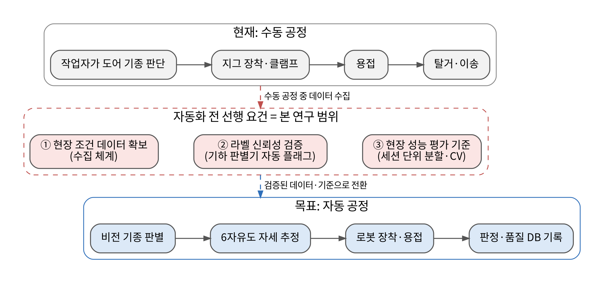

**그림 1 2차년도 연구 범위 — 현재 수동 공정, 자동화 전 선행 요건(본 연구), 목표 자동 공정**

#### ▪ 부품 위치 추정 AI 학습용 기초 데이터셋 구축

##### ◦ 부품 위치 추정 알고리즘 개발을 위한 모사 시험 환경 구축

부품 위치 추정은 실측 정답(GT) 자세를 현장에서 직접 얻기 어려우므로, 정답이 알려진 모사 환경과 실물 환경을 병행하여 구축함.

- ㅇ CAD 기반 합성 모사 환경: 도어 CAD(STL, 8종)를 정답 자세로 z-버퍼 렌더링하여 깊이 영상(도어 뒤 400mm 배경 평면 포함)을 생성하고, CAD 홀 좌표를 투영한 뒤 랜드마크 픽셀 노이즈·깊이 노이즈를 주입하는 환경(04_evaluate_synthetic.py)을 구축함. 검출기를 우회하고 기하 체인(평면 피팅 → 리세스 보정 역투영 → 볼트 대응 → 강체 정합)만을 GT와 직접 비교할 수 있음.
  - 조건 3종: clean(노이즈 0), field(랜드마크 1px + 깊이 3mm — 현장 유사), stress(2px + 6mm). 8종 × 6포즈 = 48회, 카메라 내부 파라미터는 현장 실측값 사용.
- ㅇ 실험실 실물 환경(1차년도 계승): 세종 실험실의 도어 8종 실물 RGB-D 1,256장(ZED X Mini)에 홀 랜드마크 라벨을 추가하여 홀 검출기 학습·홀드아웃 평가에 사용함.
- ㅇ 현장 지그 환경: 명성공업 용접 지그 상부에 카메라를 고정 설치하여 도어가 지그에 장착된 실제 조건(거리 약 1.45m, 정면)에서 데이터를 수집함(상세는 "학습 데이터 수집 장치 설치" 절).
- ㅇ 절대 정확도 실측 환경(준비 완료): 레이저 트래커로 도어 6홀 중심을 측정하여 카메라 추정 자세와 대조하는 절차서(8포즈 계획, 홀 측정법, 판정 기준 ±5mm/±1°)와 기록 양식·비교 스크립트(05_evaluate_tracker_gt.py, 자체 검증 통과)를 준비함. 【장비·일정 확보 후 실측 예정】

##### ◦ 다양한 조건을 반영한 다중 형태 데이터 수집 및 전처리 수행

위치 추정 학습·평가용 데이터는 다음 네 가지 형태로 구성하였음(표 2).

**표 2 부품 위치 추정용 기초 데이터셋 구성**

| 구분 | 내용 | 규모 | 용도 |
|---|---|---|---|
| 홀 랜드마크 라벨 | 래치 볼트홀 4점 + 모서리 프레임 홀 2점(힌지·래치)의 픽셀 좌표를 자체 제작 브라우저 라벨링 도구(15_label_holes.py)로 수작업 표기 | 134장 × 6점(실험실 118 + 첫 방문 현장 16), 학습 107 / 홀드아웃 27 | 홀 검출 CNN 학습·평가(판별·자세 공용) |
| CAD 홀 3D 좌표 | STL 메시에서 홀 벽면 삼각형 클러스터 + 평면 원 피팅으로 홀 중심 추출, 도어 로컬 좌표계(원점=코너 홀 중점) 정의, 볼트홀 리세스(5.8mm) 반영 | 9종(E23은 2026-09-23 어셈블리 STEP 메시로 정식 등록) | 강체 정합 기준점(cad_holes.json) |
| 현장 세션 RGB-D | 지그 장착 상태 도어의 RGB(1920×1200)·깊이(mm, 16bit) 쌍, 세션 meta.json(기종·시각·카메라 실측 내부 파라미터·매수·종료 사유) | 9종 192세션 18,303쌍(2026-08-27~09-23) | 자세 추정 현장 평가(정합 잔차·반복 정밀도) |
| 합성 GT 렌더 | STL z-버퍼 깊이 영상 + 투영 랜드마크 + 노이즈 3조건 | 8종 × 6포즈 × 3조건 = 144회 | 기하 체인 절대 정확도 검증 |

- ㅇ 전처리·규약: 카메라 좌표계는 OpenCV 광학 좌표계(x우/y하/z전방, mm)로 통일하고, 세션 meta.json에 좌안 rectified 내부 파라미터(fx=fy=1269.746, cx=961.669, cy=598.594, 시리얼 54910212)를 기록하여 저장 영상 평가와 실시간 추론이 같은 역투영 경로를 쓰도록 함. 근사 내부 파라미터(fx=1065) 경로의 절대 거리가 0.85배 압축되어 있던 문제를 실측값 적용으로 해소함.
- ㅇ CAD 정합 시 관측면(카메라가 보는 면)은 CAD 설명 문서의 ±Z 규약을 정본으로 하고 STL 좌표(Z=−Y)로 매핑함. 코너 홀에는 평행이동 쌍둥이 홀(30~74mm 간격)이 있어 검출 6점의 상대 배치 특징(ul, wl, uh, wh, D)으로 판별함.
- ㅇ 연속 프레임(2초 간격)은 중복이 크므로 학습·평가에는 세션당 최대 20장을 시간축 균등 선별하고, 분할은 세션 단위로만 허용함(자세 평가 집합은 판별기·CNN과 동일).

##### ◦ 데이터 증강 기법 적용을 통한 학습 데이터 다양성 확보

**표 3 2차년도 데이터 증강 적용 내역**

| 대상 모델 | 증강 기법 | 파라미터·비고 |
|---|---|---|
| 홀 랜드마크 검출기(ResNet18-FPN) | 임의 회전·스케일·좌우 반전·밝기·가우시안 블러(온라인) | 회전 ±180°(도어가 바닥에 임의 각도로 놓이는 상황 대응), 1280×768 letterbox, 히트맵 σ=2 |
| 외관 기반 CNN(RGBE NoAux 448) | 1차년도 온라인 증강 유지(공간 변환 RGB·엣지 동기, 색상·노이즈·블러 RGB만) | Canny 엣지는 증강 후 RGB에서 계산, 전체 프레임 letterbox(크롭 없음) |
| 자세 추정 기하 체인(합성) | 랜드마크 픽셀 노이즈 + 깊이 노이즈 3조건 | clean 0/0, field 1px/3mm, stress 2px/6mm |
| 오프라인 증강 세트(datasets_aug/aug2) | 1차년도 생성분 유지 | 학습 금지·강건성 평가 전용(평가 방법론 원칙) |

홀 검출기는 증강을 포함한 134장 학습만으로 홀드아웃 27장에서 6점 모두 중앙값 1.0~1.4px(≈1.3mm)의 검출 정확도(4px 이내 100%, 오검출 0%)를 보였고, 현장 영상에 대한 추가 라벨링 없이 현장 9종 판별·자세 추정에 그대로 사용됨(그림 2).

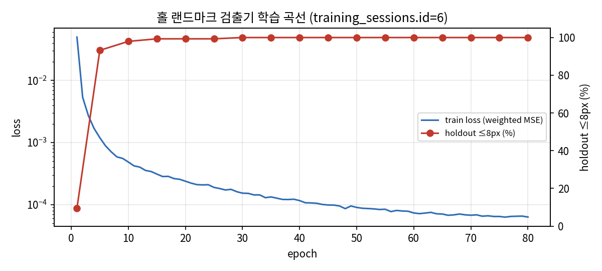

**그림 2 홀 랜드마크 검출기 학습 곡선**

#### ▪ 학습 데이터 수집 장치 설치

##### ◦ 학습 데이터 수집을 위한 하드웨어 설치 및 테스트

1차년도에 선정한 하드웨어(ZED X Mini + ZED Box)를 기반으로 작업자가 버튼 조작만으로 데이터를 수집하는 무인 수집 장치를 제작하여 2026-08-27 명성공업 경주공장 도어 레이저 용접 라인에 설치하였음(그림 3, 표 4).

**표 4 현장 무인 수집 장치 구성**

| 구분 | 장비·사양 | 역할 |
|---|---|---|
| 카메라 | Stereolabs ZED X Mini(GMSL2), HD1200 1920×1200, NEURAL depth(mm), 시리얼 54910212 | 지그 상부 정면에서 도어 RGB·깊이 동시 취득 |
| 엣지 컴퓨터 | ZED Box Mini(NVIDIA Jetson Orin NX 16GB) | 수집 서비스·키오스크 UI 구동, 세션 저장 |
| 입력·표시 | 16인치 터치 모니터 | 작업자 기종 선택·취득 시작/종료·시스템 종료 |
| 통신 | LTE 라우터, VPN(tailscale 주 / ZeroTier 예비) | NAS 자동 업로드, 세종 원격 모니터링 |
| 설치 위치 | 명성공업(경주) 도어 레이저 용접 지그 상부(도어 평면 거리 약 1.45m, 정면) | 지그 장착 상태 도어 촬영 |

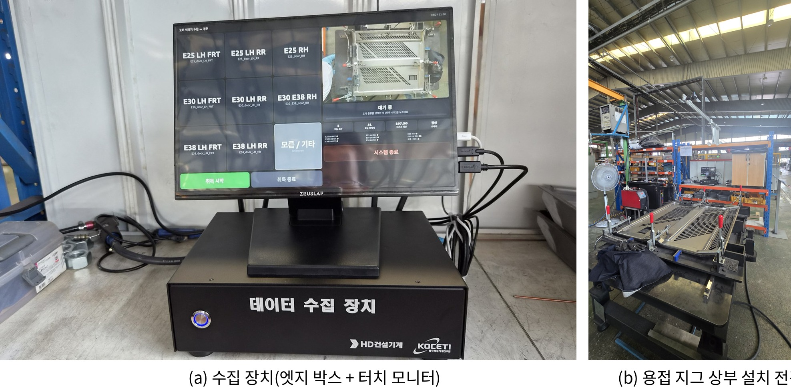

**그림 3 현장 무인 수집 장치 및 설치 전경**

- ㅇ 수집 소프트웨어(06_factory_capture.py, Flask :5000)와 터치 키오스크 UI(기종 버튼 9개 + 취득 시작/종료 + 시스템 종료, 상태·프리뷰 표시)를 구현함(그림 4). 부팅 시 systemd 서비스(door-capture.service, 비정상 종료 시 5초 후 자동 재시작)와 GUI 자동 로그인 후 전체화면 웹뷰(WebKit2GTK)가 자동 실행되며, 설치 스크립트(install_factory.sh) 1회 실행으로 배포됨.

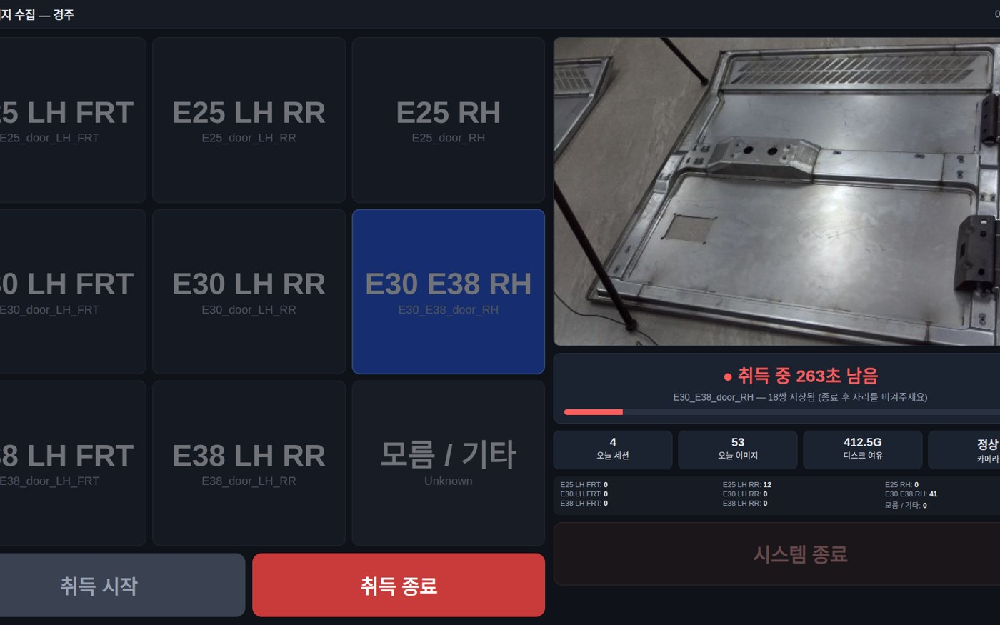

**그림 4 작업자 키오스크 UI(취득 중 화면) — 기종 선택 → 취득 시작 → 자동 저장**

**표 5 수집 동작 사양 및 세션 메타데이터**

| 항목 | 사양 |
|---|---|
| 취득 절차 | 작업자가 도어 종류 버튼 선택 → [취득 시작] → 2초 워밍업(노출 안정화) → 2초에 1장 RGB/깊이 쌍 저장 → [취득 종료](미조작 시 300초 후 자동 종료) |
| 라벨 실수 방지 | 취득 종료 시 선택 기종이 Unknown(모름/기타)으로 자동 복귀, 취득 중 기종 변경·중복 시작·시스템 종료 거부 |
| 저장 구조 | datasets_factory_collect/<날짜>/<기종>/s_HHMMSS/{rgb_NNNN.png(1920×1200), depth_NNNN.png(uint16 mm), meta.json}, 모든 버튼 이벤트는 events.jsonl에 기록 |
| 세션 meta.json | 기종, 시작·종료 시각, 저장 쌍 수, 종료 사유(수동/자동), 카메라 좌안 rectified 내부 파라미터·시리얼(2026-08-31부터) |
| 카메라 복구 | grab 60회 연속 실패 시 자동 재연결, 부팅 시 CUDA 준비 전 대기 |
| NAS 업로드 | 세션 종료 시 nas_sync.sh 실행 + cron 5분 주기 보완, finished:true 세션만 rclone copy, 성공 시 .uploaded 마커, flock으로 중복 실행 방지 |
| 원격 확인 | 세종에서 VPN으로 현장 화면·프리뷰·당일 통계·로그 확인(1일 2회), SSH 로그 열람 |

- ㅇ 설치·시험: 7/29 개발 완료 후 사무실 시험 촬영(7/29~8/11, 4세션) → 8/10 현장 시험 운영(E25 우측 도어 16장) → 8/27 정식 설치(설치 당일 작업자 시연 후 작업자가 직접 E30 뒷문·앞문 3세션 189장 수집) → 이후 작업자 자율 운영. 설치일 체크리스트(LTE·VPN 접속, 화각·마운트, 전원 사이클 자동 부팅, 종료 버튼, 작업자 시연, 안내문 부착)를 적용하고 작업자용 사용설명서와 1장 사용순서 안내문을 현장에 게시함.
- ㅇ 시스템 구성과 업로드 흐름은 그림 5, 그림 6와 같음. 업로드 중단 대응: 업로드 도중 장비를 끄면 NAS에 .partial 파일이 남지만 .uploaded 마커가 없어 재부팅 후 누락분만 재전송됨(중복 없음)을 실측 확인함. 서비스 로그(logs/factory_YYYYMMDD.log)와 업로드 로그(nas_sync.log)로 상태를 추적함.

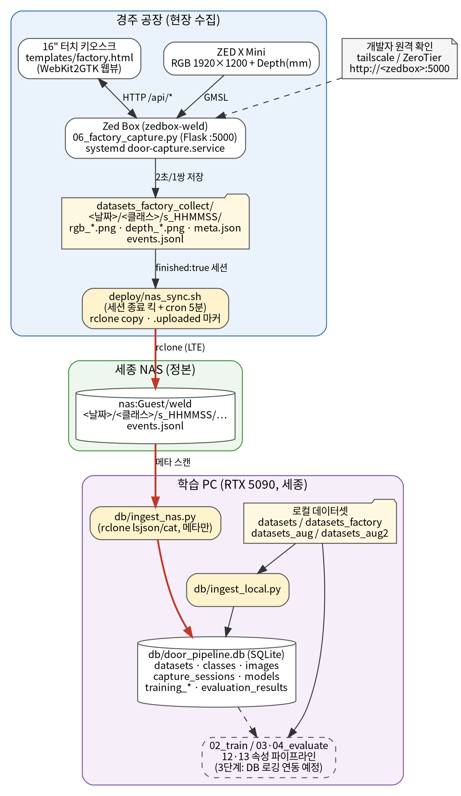

**그림 5 현장 수집 시스템 구성도(현장 장비 → NAS 정본 → 학습 PC 메타데이터 DB)**

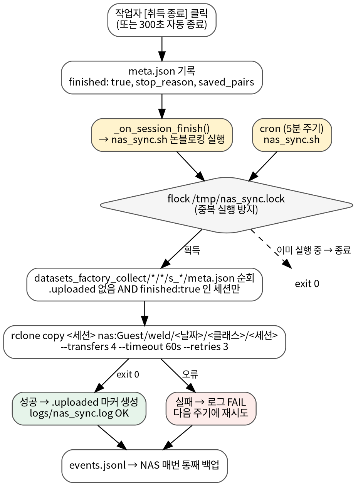

**그림 6 NAS 자동 업로드 흐름(세션 종료 킥 + cron 보완, 마커 기반 재시도)**

##### ◦ 현장 데이터 수집 현황

정식 설치(2026-08-27) 이후 2026-09-23까지 도어 9종 192 유효 세션 18,303쌍(유효 샘플 3,780장)을 확보하였음(표 6, 그림 7). 학회 초록·내부 보고의 공표 수치는 9/7 유입분까지의 84세션 8,102쌍(공통 평가 집합 기준일 2026-09-09)이며, 이후 유입분은 내부 검증을 계속하고 있음.

**표 6 현장 데이터 수집 현황(기종별 유효 세션·RGB-D 쌍, DB door_pipeline.db 2026-09-23 조회)**

| 기종(클래스) | 9/7 기준 세션 / 쌍 | 9/23 기준 세션 / 쌍 | 학습·평가용 샘플 (세션당 ≤20장) | 비고 |
|---|---|---|---|---|
| E23_door_LH_FRT | 4 / 351 | 6 / 468 | 120 | 9번째 기종, 9/7 신규 등록(9/23 어셈블리 CAD 정식 등록) |
| E25_door_LH_FRT | 1 / 152 | 3 / 447 | 40 | 9/16·9/23 세션이 진짜 E25로 확인(D 718) → 유효 3세션(9/23분 미러 전), 재수집 진행 중 |
| E25_door_LH_RR | 15 / 1,516 | 37 / 3,444 | 698 |  |
| E25_door_RH | 15 / 1,710 | 33 / 3,472 | 659 | 8/10 설치 전 세션 1개 무효 |
| E30_E38_door_RH | 17 / 1,376 | 42 / 3,826 | 797 | E30·E38 공용 부품 |
| E30_door_LH_FRT | 9 / 864 | 16 / 1,549 | 428 |  |
| E30_door_LH_RR | 10 / 851 | 19 / 1,910 | 392 | 짧은 세션 3개 라벨 정정, 8/27 초기 세팅 세션·빈 지그 세션 각 1개 무효 |
| E38_door_LH_FRT | 6 / 710 | 16 / 1,570 | 298 |  |
| E38_door_LH_RR | 7 / 572 | 20 / 1,617 | 348 |  |
| 합계(9종) | 84 / 8,102 | 192 / 18,303 | 3,780 | 무효 7세션: Unknown 4세션 61쌍(설치 전 시험 촬영), 8/10 1세션 16쌍(설치 전), 8/27 2세션 40쌍(초기 세팅 시험 촬영·빈 지그) |

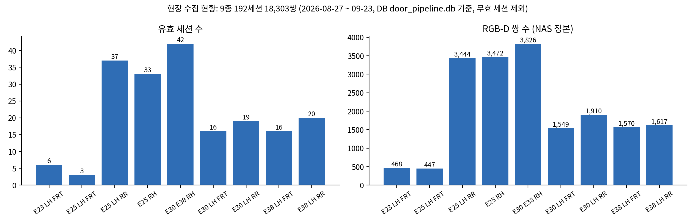

**그림 7 기종별 유효 세션 수·RGB-D 쌍 수(2026-08-27~09-23)**

- ㅇ 세션 무효화 규칙: 지그·카메라 설치 이전 촬영(8/10), 초기 세팅 중 시험 촬영(작업자·장비가 프레임에 유입, 8/27 1세션), 설치 전 사무실 시험 촬영(Unknown 4세션)은 "촬영 프로토콜 이전 데이터"로 분류하여 학습·평가에서 제외함. 무효화 근거는 항상 촬영 조건이며, 판정이 틀렸다는 이유로 제외하지 않음.

##### ◦ 세션 단위 라벨 자동 검증 및 정정

작업자가 입력한 기종 라벨은 오선택이 가능하므로, 홀 랜드마크 기하 판별기(후술)로 프레임마다 모서리 홀 거리 D를 측정하여 세션 다수결과 라벨을 대조하고, 불일치·보류 지속 세션을 자동 플래그한 뒤 대조 시트로 육안 확정하여 DB에서만 정정(파일 이동 없음, 정정 사유 기록)하는 절차를 운영함(그림 8, 표 7).

**표 7 라벨 정정·무효화 이력(2026-09-23 기준)**

| 일자 | 세션 | 현장 입력 라벨 | 정정 결과 | 근거 |
|---|---|---|---|---|
| 9/7 | 9/3 3세션, 9/5 1세션 | E25_door_LH_FRT | E23_door_LH_FRT(신규 기종) | 홀 거리 D≈460mm로 일관(E25 CAD 724), 육안·CAD 확인 후 9번째 기종 등록(CAD D=456) |
| 9/16 | 9/12 2세션 | E25_door_LH_FRT | E23_door_LH_FRT | 동일 패턴(D≈456) — 현장에 E23/E25 앞문 구분 안내 필요 |
| 9/7 | 9/3 s_151736 | E30_door_LH_RR | E25_door_LH_RR | 시작 직후 수동 종료된 짧은 세션, D 1038 |
| 9/7 | 9/3 s_183159, 9/5 s_123451 | E30_door_LH_RR | E30_E38_door_RH | 짧은 세션, D≈1100 |
| 9/16 | 9/14 s_170035 | E30_door_LH_RR | E30_E38_door_RH | D 1080 |
| 8/28 | Unknown 4세션(7/29~8/11, 61쌍) | Unknown | 무효(is_valid=0) | 설치 전 사무실 시험 촬영(도어 없음) |
| 9/7 | 8/10 E25_door_RH s_091317(16쌍) | E25_door_RH | 무효 | 지그·카메라 설치 전 촬영(도어 기울어짐·근접·프레임 이탈) |
| 9/11 | 8/27 E30_door_LH_RR s_111705(31쌍) | E30_door_LH_RR | 무효 | 초기 세팅 중 시험 촬영(작업자·노트북·가방 프레임 유입) |
| 9/23 | 8/27 E30_door_LH_RR s_122816(9쌍) | E30_door_LH_RR | 무효 | 도어 없는 빈 지그(홀 판별기 전부 보류, 레이더 검사 미정) |
| 9/23 | RR/RH 147세션 | (옵션 정보 없음) | 레이더 옵션 확정(O 52·X 95) | 브래킷 투영 규칙 검사 자동 판정을 세션별 크롭으로 육안 검토 후 확정(품번 14종 판정 근거) |

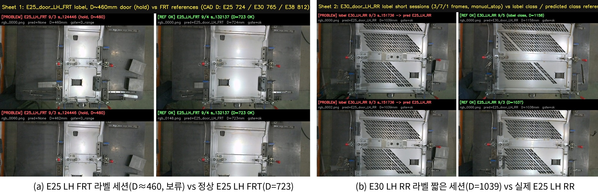

**그림 8 라벨 자동 검증 대조 시트 — (a) 미등록 기종 E23이 E25 앞문으로 입력된 세션, (b) 짧은 세션의 기종 오선택**

- ㅇ 시사점: 판별기가 라벨 검증 도구를 겸하여 현장 추가 라벨링 없이 데이터 신뢰도를 확보함. 기종 목록에 없던 부품(E23)이 실제 생산에 투입되고 있음을 데이터로 발견하였고, CAD 치수 1건 등록만으로 즉시 판별 대상에 추가함.
- ㅇ 재발 방지: 미등록 도어(unknown) 판정을 판별기에 추가(최근접 CAD D와 30mm 이상 벌어지면 억지 배정하지 않고 unknown 출력)하고, ingest 재실행 시 정정 라벨이 유지되도록 DB 인제스트를 수정함(세션·파일명 UNIQUE 인덱스).

##### ◦ 평가 프로토콜: 세션 단위 분할과 공통 평가 집합

- ㅇ 한 세션의 연속 프레임은 동일 부품을 거의 같은 조건으로 촬영한 것이므로 프레임 단위로 학습/시험을 나누면 성능이 과대평가됨. 따라서 분할은 세션 단위(70/15/15)로만 허용하고, DB의 auto-split이 기종별 세션을 시간순으로 배정함(세션 3개 미만 기종은 전부 train, 클래스별 첫 확보 세션은 test로 고정). 프레임 단위 분할은 금지함(그림 9).
- ㅇ 외관 기반 CNN은 단일 분할 수치가 test 세션 1개로 ±8% 흔들리므로, 세션을 5개 묶음으로 나눠 모든 세션이 한 번씩 시험되는 세션 그룹 5-fold 교차검증으로 대표 수치를 산출함.
- ㅇ 공통 평가 집합(2026-09-09 확정, datasets_eval20): 8/27~9/7 유효 세션 전부, 세션당 최대 20장 → 세션 3개 이상인 8종 83세션 1,571장(별도: E25_door_LH_FRT 1세션 20장). 홀 판별기·CNN·자세 추정을 같은 집합에서 평가하여 학회 초록 v3·내부 보고 수치의 정본으로 삼음.
- ㅇ 최신 평가(2026-09-16·09-23): 9/16 유입분까지 반영한 유효 151세션을 재분할(train 103 / val 23 / test 25세션 596장)하여 test를 재평가하고, 9/16 오후~9/23 유입 35세션 663장은 어떤 학습·분할에도 쓰지 않은 블라인드 집합으로 별도 평가함.
- ㅇ 실험실 데이터의 지위: 실험실 8종 1,256장은 1차년도 프레임 단위 층화 분할을 유지하고 현장 평가와 분리함. 오프라인 증강 세트는 학습 금지·강건성 평가 전용이며, 현장 성능은 현장 세션 격리 기준으로만 공표함.

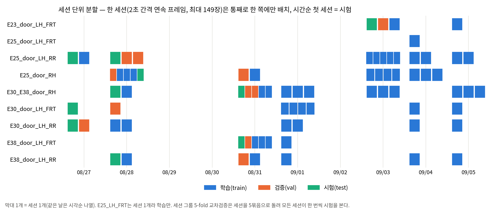

**그림 9 세션 단위 분할 개념도(실제 split, 8/27~9/5) — 한 세션은 통째로 train/val/test 중 한 쪽에만 배치**

#### ▪ (1차년도 연계) 학습 데이터 수집을 위한 서버 및 DBMS 환경 구축

##### ◦ 메타데이터 DBMS 구현 및 운영

1차년도에 설계한 하이브리드 저장 구조(이미지 파일은 파일시스템/NAS, 메타데이터·학습 이력·평가 결과는 RDBMS)와 4단계 구축 계획(① SQLite 메타데이터 DB, ② 수집 서버 DB 연동, ③ 학습·평가 자동 기록, ④ PostgreSQL 전환)을 2차년도에 구현·운영하였음(표 8).

**표 8 DBMS 구축 단계별 진행(1차년도 설계 대비)**

| 단계 | 1차년도 계획 | 2차년도 실적 | 상태 |
|---|---|---|---|
| 1 | SQLite 기반 메타데이터 DB 구축 | schema.sql(9개 테이블) 구현, 로컬 데이터셋·NAS 세션 인제스트(ingest_local/ingest_nas), 2026-08-13 | 완료 |
| 2 | 수집 서버(Flask)에 DB 연동 | 현장 장비는 DB를 모르는 구조(meta.json/events.jsonl이 인터페이스)로 두고, 학습 PC crontab 30분 주기 NAS 인제스트로 대체(2026-08-28). 세션 메타는 30분 내 자동 등록 | 대체 완료 |
| 3 | 학습·평가 결과 자동 기록 | db_log.py로 02/03/04(CNN), 17(홀 판별기), 03(자세) 스크립트가 models·training_sessions·training_metrics·evaluation_results에 자동 기록(2026-08-25), 자세 평가용 eval_type 확장(2026-08-31) | 완료 |
| 4 | PostgreSQL 전환 | SQLite 단일 파일로 운영 중, 전환 시점·스키마 리뷰는 DB 전문가 미팅 후 결정 | 검토 중 |
| 추가 | — | 세션별 드리프트 지표 테이블(session_hole_metrics, 2026-09-16), 시각 KST 통일·스키마 버전 관리(user_version 1→2), 세션·파일명 UNIQUE 인덱스, 세션 옵션(레이더) 컬럼·검사 표·홀 다수결 컬럼(2026-09-23) | 완료 |

**표 9 메타데이터 DB 테이블 구성(door_pipeline.db, SQLite 3, ERD는 그림 10)**

| 테이블 | 내용 | 설계 대비 변경점 |
|---|---|---|
| datasets | 데이터셋 단위(실험실·증강·현장 NAS·홀 라벨 등, 9개) | — |
| classes | 기종 정보(굴착기 모델, 부품 유형, CAD 확보 여부) | 9종 + Unknown |
| capture_sessions | 촬영 세션 이력(세션 폴더, 현장 입력 원본 라벨, 카메라, 취득 간격, 저장 쌍 수, 종료 사유, 시각, 정정 메모, 레이더 옵션 확정값·출처) | 06_factory_capture의 meta.json 필드 반영, 옵션 컬럼 4개 추가(2026-09-23) |
| images | RGB·깊이 쌍 메타(경로, 해상도, 유효 여부, 로컬 동기화 여부, split) | width/height NULL 허용(NAS만 존재), synced_local 추가, (session_id, rgb_filename) UNIQUE |
| models | 학습 모델(아키텍처, 입력 채널·해상도, 가중치 경로) | 홀 검출기·CNN·(아카이브)U-Net 등 7건 |
| training_sessions / training_metrics | 학습 실행 이력(하이퍼파라미터, 분할 수량, 최적 에폭) / 에폭별 손실·정확도 | CNN·홀 검출기 학습 11건 |
| evaluation_results | 평가 결과(정확도·F1·혼동행렬·클래스별 결과·보류 사유) | eval_type에 pose_pipeline 추가(자세 평가 기록), 49건 |
| augmentation_configs | 증강 설정 | — |
| session_hole_metrics | 세션별 홀 판별기 드리프트 지표(K_session, dev, z, tilt, 마진)와 홀 판정 다수결(pred_major) | 2026-09-16 신설, 다수결 컬럼 9/23 추가 |
| session_radar_check | 세션별 레이더 옵션 자동 검사 근거(판정 프레임 수, 레이더/없음 표, 점수 중앙값, 크롭 경로) | 2026-09-23 신설 |

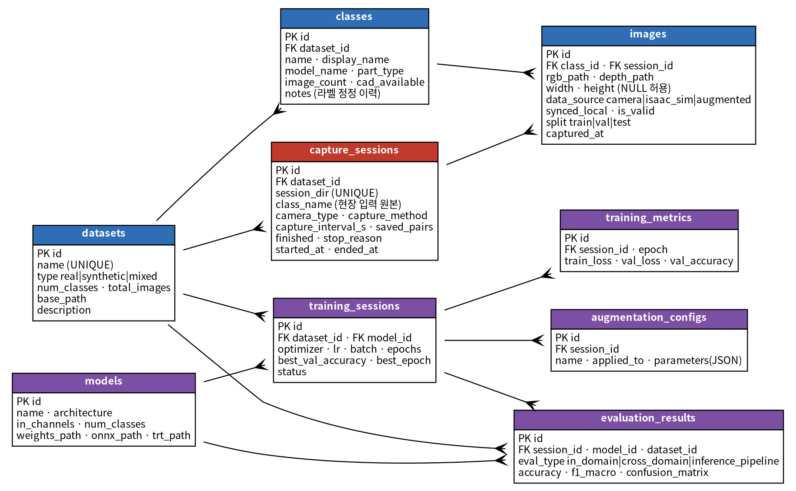

**그림 10 메타데이터 DB ERD(2026-08-21 구현 기준, 이후 session_hole_metrics 추가)**

- ㅇ 데이터 흐름(정본=NAS 원칙): NAS(전량, 세종 DS1522+ 20TB) ⊃ 학습 PC 미러(datasets_factory_collect/, 세션당 20장 샘플, pull_nas.py) ← 학습·평가용 심볼릭 링크 뷰(datasets_factory_v2/{all,train,val,test}, build_dataset.py). 유입 세션 처리 순서는 ingest_nas → pull_nas → 홀 판별기 평가(17) → auto-split → build → 드리프트 기록(20)으로 표준화함(그림 11).
- ㅇ 라벨 정정은 파일을 옮기지 않고 DB에서만 수행(build_dataset.py relabel)하며, 현장 입력 원본 라벨은 capture_sessions.class_name에 보존하고 정정 이력을 notes에 남김. 세션 무효화(invalidate)도 같은 방식임.
- ㅇ 현재 규모(2026-09-23 대시보드): 데이터셋 9, 촬영 세션 193, 이미지 메타 21,699행, 로컬 보유 5,185장, 모델 7, 평가 기록 49건.

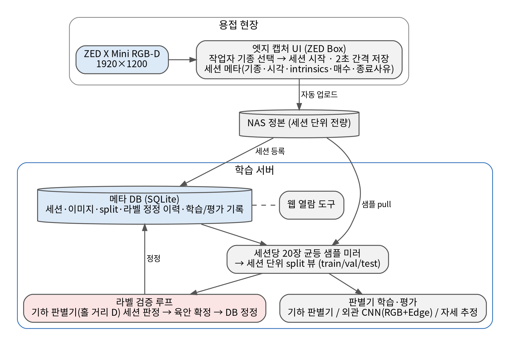

**그림 11 현장 데이터 수집·검증 체계 구성도(엣지 캡처 UI → NAS 정본 → 메타 DB → 라벨 검증 루프 → 학습·평가)**

##### ◦ 열람·관리 대시보드(웹 도구) 설계 및 구현

SQL을 모르는 사용자도 브라우저에서 데이터·학습·평가 이력을 열람하고 라벨·분할·무효화·옵션 확정을 관리할 수 있도록 전용 웹 도구(db/webapp.py, Flask + waitress, :5050)를 설계·구현하였음(표 10, 그림 12, 그림 13). 1차년도에 계획한 "Flask 웹 서버 DB 연동"을 열람·관리 화면으로 구체화한 것임.

**표 10 DB 웹 도구 화면 구성**

| 화면 | 내용 |
|---|---|
| 대시보드(/) | 요약 카드(데이터셋·세션·이미지·로컬 보유·모델·평가 수), 최신 벤치마크 카드(홀 판별기 test 정확도, CNN 폴백 정확도, 자세 CAD 정합 잔차·반복 정밀도, 최근 7세션 픽셀 폭 스케일 중앙값), 데이터셋 표, 기종별 현장 수집 표(미수집·라벨 미정 강조, NAS/로컬 구분) |
| 세션 목록·상세(/sessions) | 세션별 기종·시각·쌍 수·split·유효 여부, 상세 화면의 썸네일 그리드와 관리 버튼(relabel·split·invalidate·이력 메모 — build_dataset.py 함수 재사용) |
| 이미지 브라우저(/images) | 데이터셋·기종·split·유효 여부 필터, 썸네일 캐시 |
| 홀 라벨 뷰(/labels) | 수동 라벨 134건을 점 오버레이로 렌더, 기종별 라벨 집계 |
| 학습·평가 이력(/training) | 학습 run별 SVG 학습 곡선, 평가 클릭 시 기종별 결과표·보류 이미지 사유, 자세 평가는 세션별 RMS·θ·tilt·std 표 |
| 드리프트(/drift) | 세션별 K_session·dev·z·tilt 산점 시계열과 경보 표(±1%·±15mm 기준) |
| 옵션·품번(/options) | RR/RH 세션별 브래킷 크롭 몽타주와 자동 판정(점수·표)을 보고 레이더 O/X를 확정, 품번 표시, 클래스·상태 필터(2026-09-23) |
| 운영 옵션 | --readonly(열람 전용 잠금), --auth id:pw(기본 인증), 외부 열람은 tailscale funnel(HTTPS)로 공개(2026-09-01, 읽기 전용), SQL 직접 조회용 sqlite_web 병행 |

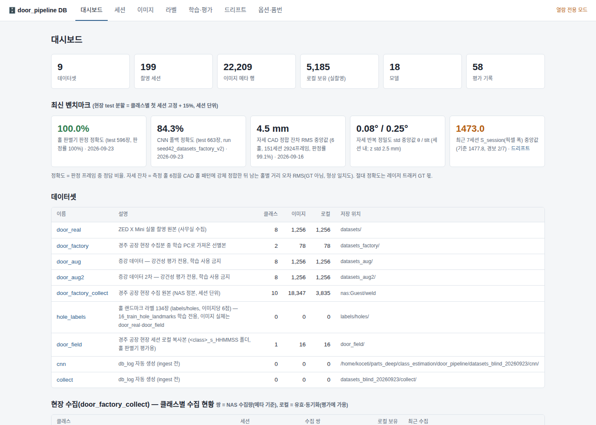

**그림 12 DB 웹 도구 대시보드(2026-09-23 캡처) — 요약 카드·최신 벤치마크·데이터셋·기종별 수집 표**

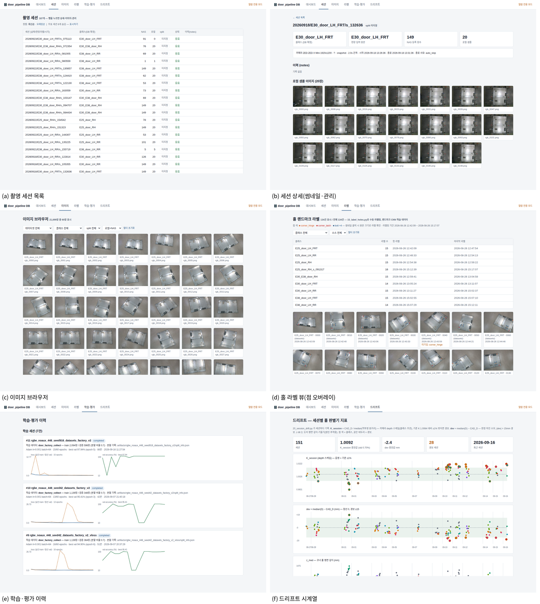

**그림 13 DB 웹 도구 화면 — (a) 세션 목록 (b) 세션 상세 (c) 이미지 브라우저 (d) 홀 라벨 뷰 (e) 학습·평가 이력 (f) 드리프트 시계열**

- ㅇ 모델 배포 동기화: 학습 PC와 추론 PC 간 모델(pth) 교환을 위해 GitHub + 자체 Gitea 이중 push와 Gitea LFS 모델 동기화 체계(scripts/model_sync.sh push/pull/status)를 구축함(2026-09-10). 배포 모델은 홀 판별기와 CNN 정식 run 2종임.

#### ▪ 부품 인식 AI 모델 및 알고리즘 개발

##### ◦ 접근 방식 전환: 형상 학습 CNN에서 설계 치수 기반 기하 판별로

- ㅇ 1차년도 실험실 모델(RGBD/RGBE ResNet18)은 실험실 시험셋 99.5~100%였으나, 현장 개체에 그대로 적용하면 14.1%(2026-04 현장 78장)·22.9%(현장 384장, 세션 격리)로 붕괴함. 도어 8종은 형상이 거의 같고 치수(폭 828~1,456mm, FRT 계열 최소 차이 41mm)만 다른데, 클래스당 실물 1개로 학습한 CNN이 개체의 외관을 암기한 결과임.
- ㅇ 이에 AI는 "홀 위치 검출"에만 쓰고 판정은 설명 가능한 CAD 치수 비교로 하는 홀 랜드마크 기하 판별기를 주 판별기로 확정(2026-08-26)하고, 외관 기반 CNN은 현장 데이터로 재학습하여 홀이 가려지거나 프레임 밖일 때의 보조(폴백) 판별기로 운용함(2026-09-07 결정).
- ㅇ 중간 단계로 검토한 CAD 설계 속성 기반 파이프라인(MobileSAM 전경 분리 → 정면 뷰 변환 → 통풍구 U-Net → CAD 템플릿 정합 × 종횡비)은 실험실 99.2%·현장 그룹 100%였으나 기종 판별에서 홀 판별기 대비 이점이 없어(그룹 제약 기여 +0.5%p) 2026-09-11 폐기·아카이빙하고, 폴백 역할은 CNN이 승계함.

##### ◦ 홀 랜드마크 기하 판별기(주 판별기)

- ㅇ 원리: 8종 모두 좌우 세로 프레임 끝에 동일 오프셋의 Ø6mm 모서리 홀 한 쌍이 있어 두 홀의 중심 거리 D = 도어 폭 − 106mm임. 8종(+E23)의 폭이 모두 달라 D만으로 기종이 구분되며(표 11), 홀 중심은 클램프 가림·조명·녹에 무관한 안정적 기준점임(그림 14). 중앙 보강대 패드 홀은 옵션·리비전에 따라 패턴이 바뀌어 사용하지 않음.

**표 11 기종별 판별 기준 거리 D(CAD, mm)와 인접 기종 간격**

| 기종 | E23 LH FRT | E25 LH FRT | E30 LH FRT | E38 LH FRT | E25 RH | E25 LH RR | E30/E38 RH | E30 LH RR | E38 LH RR |
|---|---|---|---|---|---|---|---|---|---|
| CAD D | 458 | 724 | 765 | 812 | 886 | 1,037 | 1,087 | 1,158 | 1,352 |
| 인접 간격 | — | 266 | 41 | 47 | 74 | 151 | 50 | 71 | 194 |

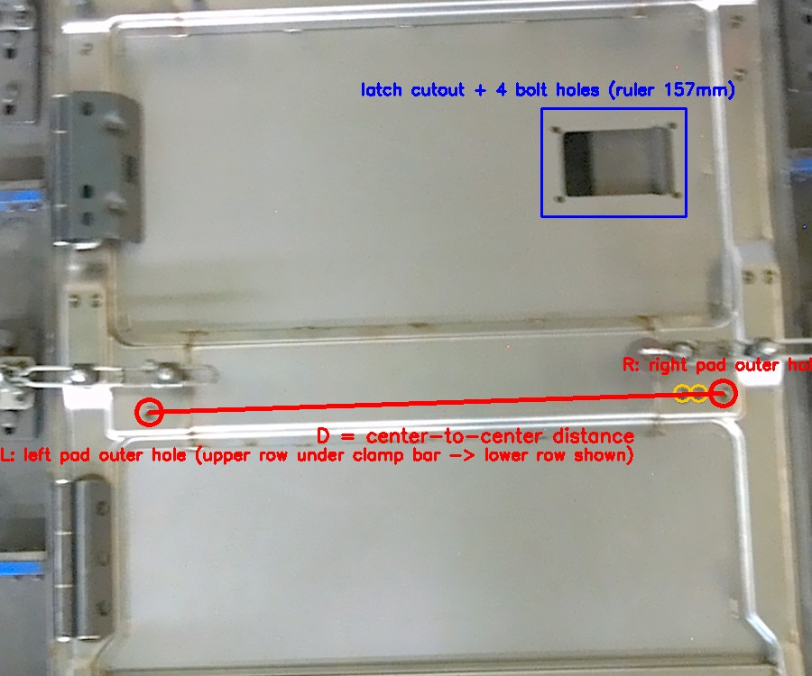

**그림 14 판별 기준 홀 — 래치 각공 볼트홀 4점(스케일·기하 게이트) + 좌우 모서리 프레임 홀 2점(거리 D)**

**표 12 홀 랜드마크 검출기 및 판정 알고리즘**

| 구분 | 내용 |
|---|---|
| 검출 모델 | ResNet18(ImageNet 사전학습) 인코더 + FPN 디코더, 입력 1280×768 letterbox, stride-4 가우시안 히트맵 3채널(bolt / corner_hinge / corner_latch), 가중 MSE, AdamW 1e-4·코사인 감쇠·80 epoch, 배치 4. 2026-09-23부터 레이더 브래킷 홀 채널을 더한 4채널 모델(정본 가중치에서 미세조정, 6점 정밀도 동일)을 배포 정본으로 사용하며 출력 채널 수로 3/4채널을 자동 판별함 |
| 학습 데이터 | 134장 × 6점(실험실 118 + 현장 16), 기종별 층화 20% 홀드아웃(27장), 회전·스케일·반전·밝기·블러 증강 |
| 검출 정확도 | 홀드아웃 27장 6점 모두 중앙값 1.0~1.4px(≈1.3mm), 4px 이내 100%, 오검출 0%. 규칙 기반(모폴로지·템플릿 NCC) 검출은 GT 대비 오검출 48~60%로 폐기 |
| 거리 측정 | 모서리 홀 2점 거리 D(mm). 2026-09-23부터 힌지↔래치 코너 홀의 픽셀 폭 × S_PIXEL / fx(현장 카메라 S_PIXEL = 1,477.8mm, 기준 세션 1,747프레임으로 보정)로 측정하고 깊이는 z·tilt 가드로만 사용. 그 전(8/26~9/22)에는 깊이 평면 역투영 3D 거리에 카메라별 잔차 스케일 K_CAMERA(1.0064, 83세션 재적합)를 곱해 사용 |
| 판정 | D를 기종별 CAD D와 최근접 대조 → 기종 출력. 최근접 CAD D와 30mm 이상 벌어지면 미등록 도어(unknown) 출력(억지 배정 금지) |
| 보류(게이트) | 홀이 프레임 밖(no_frame)·모서리 미검출(no_corner)·경계 근접(near_border)·볼트 프레임 기하 불일치(same_side/not_collinear/latch_offset)·D 범위(400~1,500mm) 밖이면 판정 보류 — 오판 대신 보류 |
| 세션 집계 | 실시간은 슬라이딩 윈도(10프레임) D 중앙값, 저장 영상은 세션 다수결. 판정률(보류 제외 출력 비율)과 판정 정확도(판정 중 정답)를 구분 보고 |
| 처리 속도 | RTX 5090 기준 홀 단계 41ms/프레임, 모델 로드 약 0.5초 |

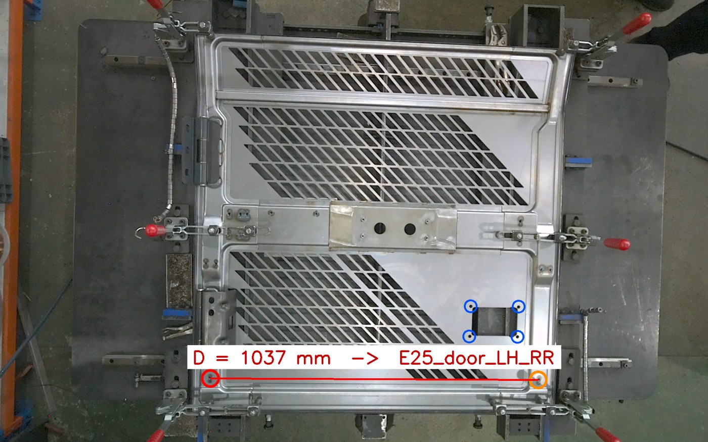

**그림 15 현장 판정 예 — 홀 6점 검출과 모서리 홀 거리 D=1,037mm → E25_door_LH_RR**

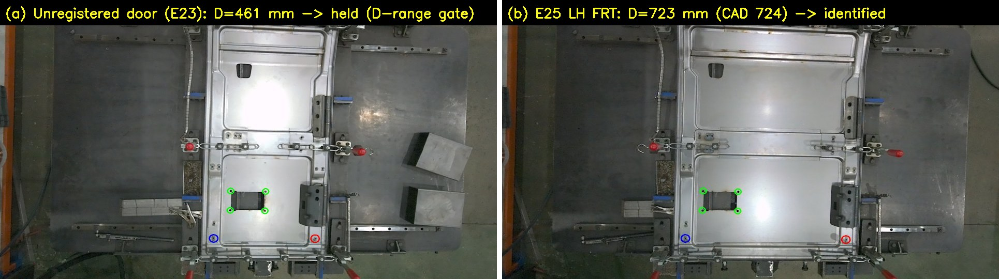

**그림 16 미등록 기종 처리 — (a) E23 도어(D=461mm)는 D 범위·unknown 게이트로 보류, (b) E25 LH FRT(D=723mm) 판별**

- ㅇ 현장 판정 예와 미등록 기종 처리 예는 그림 15, 그림 16과 같음. 거리 정밀화(2026-09-16): 실측 내부 파라미터 자체는 D를 +1mm만 바꾸고, 효과는 현장 83세션으로 잔차 스케일 K를 재적합(1.0140 → 1.0064)한 데서 나옴. |D−CAD| 95분위 18.3 → 11.8mm, 최소 마진 5분위 27.3 → 35.4mm, 판정 변경 0건(표 13).

**표 13 잔차 스케일 K 재적합 전후(현장 83세션 1,748판정)**

| 구분 | 편차 중앙값(mm) | \|편차\| p95(mm) | 최대(mm) | 판정 정확도 | 마진 p5(mm) |
|---|---|---|---|---|---|
| 기존(K 1.0140, 1세션 캘리브) | +6.6 | 18.3 | 24 | 1,746/1,748 | 27.3 |
| 재적합(K 1.0064, 83세션) | +0.1 | 11.8 | 18 | 1,746/1,748 | 35.4 |

- ㅇ 남은 오차는 세션 단위 깊이 스케일 요동(±0.6%, 최대 ±1.5%)으로, 세션의 도어 평면 깊이 z와 −0.95의 상관을 보임. 이를 세션별 지표(K_session = CAD_D / median(D_raw), dev = median(D) − CAD_D)로 DB에 누적하고 대시보드에서 감시함(드리프트 절 참조).

##### ◦ 외관 기반 CNN 현장 재학습(보조 판별기)

- ㅇ 알고리즘은 1차년도 확정 RGBE NoAux 448(ResNet18, RGB + Canny 엣지 4채널, 전체 프레임 letterbox, 파라미터 11.3M) 그대로이며, 바꾼 것은 데이터와 분할 방식뿐임. 현장 데이터만으로 세션 단위 분할 학습(8/27 이후 데이터, DB auto-split)하고, 홀 판별기가 보류한 프레임에서만 실행되는 폴백으로 통합함.

**표 14 CNN 현장 학습 실험 이력(동일 알고리즘, 데이터·분할만 변경)**

| 일자 | 실험 | 학습 데이터 | 시험 데이터 | 결과 | 비고 |
|---|---|---|---|---|---|
| 9/6 | 실험실 모델 → 현장 | 실험실 1,256장 | 현장 384장(세션 격리) | 22.9% | 6종 0%, E30_E38_RH로 쏠림 |
| 9/6 | 현장 학습(8종 실험 분할) | 현장 55세션 1,099장 | 9세션 344장 | 95.3% | 오답 16장 전부 8/10 설치 전 세션 |
| 9/7 | 정식 run #10(9종 auto-split, 8/10 무효 후) | 57세션 1,139장 | 10세션 348장 | 91.4% | 실패 = 8/27 초기 세팅 세션 1개(0/30) |
| 9/9 | 5-fold 세션 그룹 CV(공통 평가 집합) | 83세션 1,571장 | 전 세션 1회 시험 | 95.9%(fold 88.6~100) | 83세션 중 79세션 전수 정답, 정본 수치 |
| 9/16 | run #10 → 재분할 test | (동일) | 25세션 596장 | 93.3% | E30_LH_RR 19/59 — 학습 중 val loss 폭발 후 덜 학습된 체크포인트 저장 |
| 9/16 | seed916(재학습, 9/16 스냅샷) | 103세션 2,094장 | 25세션 596장 | 99.8%(595/596) | E30_LH_RR 59/59, 오답 1장(E30↔E38 FRT) |
| 9/23 | seed916 블라인드 | (동일) | 35세션 663장(미사용 세션) | 99.4%(659/663), macro F1 99.0 | run #10은 84.3% → seed916을 정식 폴백으로 교체 |
| 9/23~24 | 5-fold 세션 CV(sqrt 가중치 레시피, 처음부터 학습) | 186세션(fold당 train 4묶음) | 전 세션 1회 시험 3,749장 | 99.68%(fold 98.98~100) | 클래스 붕괴 없음 → 레시피 확정 |

**표 15 블라인드 집합(9/16~9/23 유입 35세션 663장) 기종별 CNN 정확도(%)**

| 기종 | n | seed916(정식) | run #10(이전) | 홀 판별기 |
|---|---|---|---|---|
| E25_door_LH_FRT | 20 | 100 | 0 | 100 |
| E25_door_LH_RR | 158 | 100 | 100 | 100 |
| E25_door_RH | 120 | 100 | 100 | 100 |
| E30_E38_door_RH | 139 | 100 | 100 | 100 |
| E30_door_LH_FRT | 40 | 97.5 | 100 | 100 |
| E30_door_LH_RR | 60 | 100 | 20.0 | 100 |
| E38_door_LH_FRT | 60 | 95.0 | 40.0 | 100 |
| E38_door_LH_RR | 66 | 100 | 100 | 100 |
| 합계 | 663 | 99.4 | 84.3 | 100(판정률 100%) |

- ㅇ 오답 분석: 남은 오답은 폭 차이 41~47mm인 인접 기종 쌍(E30↔E38 LH FRT)에서 저신뢰(p 0.55~0.70)로 발생하며, RR 계열은 지그 폭을 꽉 채워 좌우 가장자리가 클램프·측판에 가려져 CNN이 폭 단서를 얻기 어려움(Grad-CAM). 기하 판별기가 인접 기종 구분에서 우위임을 재확인함(그림 17).
- ㅇ 학습 레시피 개선·확정(2026-09-23~24): run #10과 교차검증 일부 fold에서 관측된 val loss 폭발·클래스 붕괴의 유력 원인이 역빈도 클래스 가중치(세션 1개 기종에 약 23배)와 학습률 1e-3의 조합으로 판단되어 클래스 가중치 기본을 sqrt 역빈도로 바꾸고 학습률 인자를 추가함. 새 레시피로 처음부터 학습하는 5-fold 세션 CV(186세션 3,749장)에서 합산 99.68%(fold 98.98/100/99.58/100/100), 클래스 붕괴 없음(최저 기종 E30 LH RR 97.8%)을 확인하여 레시피를 확정함. 초반 val loss 스파이크는 남아 있으나 모두 3~8에폭 안에 회복되어 손상된 체크포인트가 저장되지 않았음.

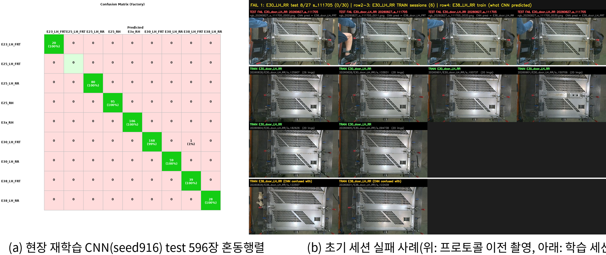

**그림 17 현장 재학습 CNN 결과 — (a) seed916 test 596장 혼동행렬, (b) 초기 세션 실패 사례(프로토콜 이전 촬영 조건)**

##### ◦ 실시간 추론 서버 통합

- ㅇ 홀 판별기 전용 실시간 추론 서버(18_realtime_inference_hole.py, 웹 UI :5004, ZED 카메라/리플레이 모드)를 구현하고, 보류 프레임에 대한 CNN 폴백을 통합함(2026-09-16). 판정 우선순위는 홀 확정 > 홀 수집 중 > CNN 투표(최소 판정 수·평균 확률 조건) > 보류이며, 홀 판정과 CNN 다수결이 다르면 conflict로 표시만 하고 홀 판정을 따름.
- ㅇ API(/api/inference_result)는 기종, 그룹, 신뢰도(판정 프레임 비율), D 중앙값, 마진, 게이트 분포, 후보 기종별 CAD D 차이, 프레임별 검출점을 반환하고, 도어 교체 시 /api/reset으로 윈도를 초기화함. 카메라 시리얼로 K_CAMERA를 자동 적용함.
- ㅇ 레이더 옵션·품번 출력(2026-09-23): RR/RH 판정 프레임마다 4채널 모델의 브래킷 피크 → 보류 시 규칙 검사의 하이브리드로 레이더 유무를 판정하고 윈도 표(판정 ≥3, 80%)로 O/X를 확정한 뒤 품번(part_no/part_name)을 출력함. UI에 "레이더 옵션·품번" 카드와 브래킷 점 오버레이를 추가하였고 --no_option으로 끌 수 있음.
- ㅇ 남은 과제: 빈 지그를 CNN이 도어로 오판할 수 있어(홀 판별기는 정상 보류) 도어 유무 게이트가 필요하며, ZED Box(Jetson) TensorRT/FP16 배포와 세션 종료 시 자동 판정→DB 기록(엣지 자동 판정 루프)은 3차년도 항목임.

##### ◦ 품번(14종)·레이더 옵션 판정 확장

2026-09-23 입수한 통합모델 SIDE DOOR 어셈블리 도면(14종)·사양표를 분석한 결과, 도어 어셈블리 품번은 14종 = 형상군 9종 × RADAR 옵션(LH REAR·RH에만 존재)이며, E23은 LH FRT만 고유하고 REAR·RH는 E25와 공용임(표 16). RADAR 사양은 외판·중앙 보강재 위 브래킷 판(Ø34 홀 2개, 간격 91.6mm, 판 높이 70mm)·레이더 커버만 다르고 좌우 세로 보강재의 코너 홀·볼트 사각·힌지는 공용이므로, 거리 D 판정과 자세 추정 랜드마크는 옵션과 무관함. 기존 RR/RH CAD 5종은 모두 RADAR 사양이었고 현장 라벨 안에는 두 사양이 섞여 있었음(RR/RH 147세션 중 레이더 사양 52세션). 과거 관측된 중앙 보강대 패드 홀 패턴 차이(2+2 vs 1+3)와 CNN의 대차 세션 혼동은 모두 이 옵션 차이였음.

**표 16 통합모델 SIDE DOOR 어셈블리 품번 체계(14종, 2026-09-23 입수 도면·사양표 기준)**

| 품번 | 명칭 | 적용 기종 | 위치 | 레이더 | 사양표 폭(mm) | CAD D(mm) | 형상군 클래스 |
|---|---|---|---|---|---|---|---|
| 110982-02444 | DOOR,SIDE;LH FRT | E23 | LH FRT | — | 562 | 458 | E23_door_LH_FRT |
| 110982-02431 | DOOR,SIDE;LH;FRONT | E25 | LH FRT | — | 828 | 724 | E25_door_LH_FRT |
| 110982-02414 | DOOR ASSY,SIDE;LH,FR | E30 | LH FRT | — | 869 | 765 | E30_door_LH_FRT |
| 110982-02447 | DOOR ASSY,SIDE;LH,FR,W_AVM | E35/E38 | LH FRT | — | 916 | 812 | E38_door_LH_FRT |
| 110982-02427 | DOOR,SIDE;LH,RR,W_O RADAR | E23/E25 | LH REAR | X | 1,141 | 1,037 | E25_door_LH_RR |
| 110982-02375 | DOOR,SIDE;LH;REAR (RADAR) | E23/E25 | LH REAR | O | 1,141 | 1,037 | E25_door_LH_RR |
| 110982-02352 | DOOR ASSY,SIDE;LH,REAR | E30 | LH REAR | X | 1,262 | 1,158 | E30_door_LH_RR |
| 110982-02360 | DOOR ASSY,SIDE;LH,RR (RADAR) | E30 | LH REAR | O | 1,262 | 1,158 | E30_door_LH_RR |
| 110982-02292 | DOOR ASSY,SIDE;LH,RR,W_O RADAR | E35/E38 | LH REAR | X | 1,456 | 1,352 | E38_door_LH_RR |
| 110982-02325 | DOOR ASSY,SIDE;LH,RR,W_RADAR | E35/E38 | LH REAR | O | 1,456 | 1,352 | E38_door_LH_RR |
| 110982-02320 | DOOR,SIDE;RH | E23/E25 | RH | X | 990 | 886 | E25_door_RH |
| 110982-02424 | DOOR,SIDE;RH,W_RADAR | E23/E25 | RH | O | 990 | 886 | E25_door_RH |
| 110982-02334 | DOOR ASSY;RH (W_O RADAR) | E30/E35/E38 | RH | X | 1,191 | 1,087 | E30_E38_door_RH |
| 110982-02327 | DOOR ASSY,SIDE;W_RADAR | E30/E35/E38 | RH | O | 1,191 | 1,087 | E30_E38_door_RH |

> ※ 사양표 폭은 CAD D + 106보다 일관되게 2mm 작음(코너 홀 오프셋 52/53mm 차이). 판정에는 현장 실측으로 검증된 CAD D를 사용. E35/E38 FRT 도면은 W_AVM 사양 1종만 입수되어 AVM 옵션은 구분하지 않음.

- ㅇ 판정 구조(2026-09-23 결정): 클래스 체계(9종 형상군)·현장 태블릿 라벨·홀 판별기·CNN은 그대로 두고, 세션 단위 옵션(레이더 1/0/해당 없음)을 DB에 얹어 품번 = 형상군 × 레이더로 매핑함(partno/part_numbers.json). 공식 지표는 품번 판정률·판정 정확도이며, 현장 태블릿에 옵션 버튼을 추가하는 대신 자동 판정 + 시트 확인으로 라벨을 확보함.

**표 17 레이더 옵션 규칙 검사 절차(partno/radar_check.py, 학습 없음)**

| 단계 | 내용 |
|---|---|
| ① 브래킷 좌표 추출 | RADAR 사양 CAD 메시를 도어 좌표계(원점 코너 홀 중점)에 놓고 중앙 보강재 밴드의 카메라 쪽 최대 z 지도(1mm/px)에서 빈 원형 영역 쌍을 검출 → RR/RH 5개 형상군의 브래킷 홀 2개 좌표·판 높이(partno/radar_bracket.json) |
| ② 투영 | 홀 랜드마크 6점(볼트 4·코너 2)과 CAD 도어 좌표의 최소자승 아핀 변환으로 브래킷 홀 2개를 프레임에 투영(깊이 평면 깊이로 시차 보정, ±12px 탐색) |
| ③ 단서 | 밝기 점수 = (주변 고리 밝기 − 홀 안 밝기)/고리 밝기, 판 높이 h = 홀 주변 고리의 깊이가 6홀 평면보다 카메라 쪽인 거리(브래킷 판 40~74mm vs 보강재 ≤37mm, 조명 무관) |
| ④ 프레임 판정 | 점수 ≥0.30 → 레이더 / 점수 ≥0.08 & h ≥37mm → 레이더 / 점수 ≤0.12 & h <49mm → 없음 / 점수 ≤0.04 → 없음 / 판이 프레임 밖·아핀 잔차 >12px → 미판정 |
| ⑤ 세션 판정·확정 | 판정 프레임 ≥3, 다수 ≥80%일 때 자동 플래그(auto). 웹 도구 /options에서 세션별 크롭 몽타주를 보고 사용자가 확정(user)하면 자동 재검사가 덮어쓰지 않음. 품번 정확도의 GT는 사용자 확정값만 사용 |

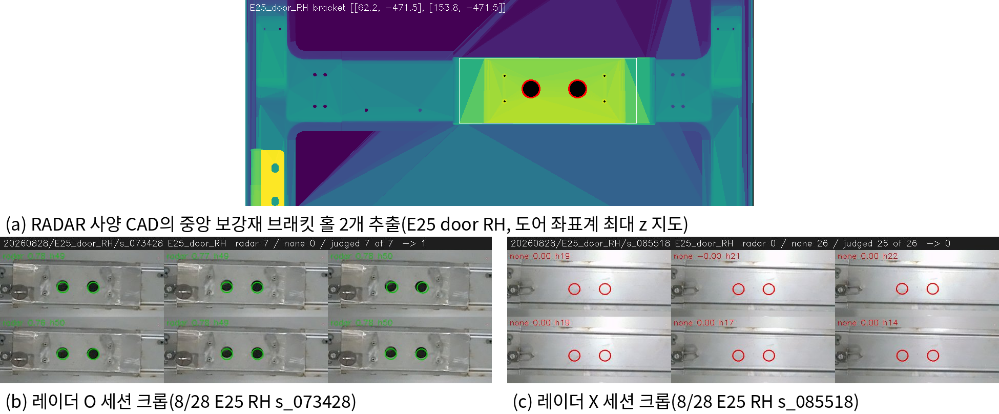

**그림 18 레이더 옵션 규칙 검사 — (a) RADAR 사양 CAD의 브래킷 홀 2개 추출, (b) 레이더 O 세션 크롭(어두운 홀 2개, 초록), (c) 레이더 X 세션 크롭(빨강)**

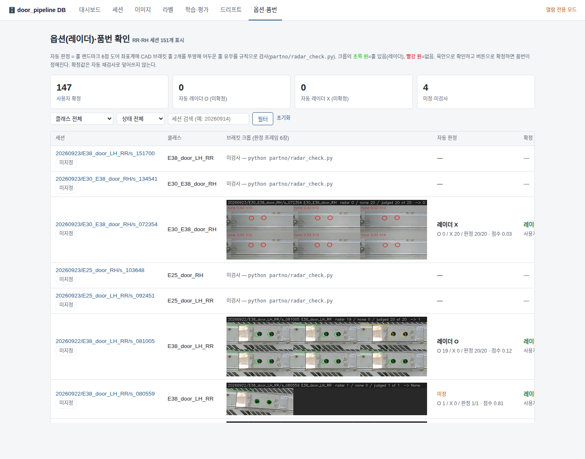

**그림 19 DB 웹 도구 옵션·품번 확인 화면(/options, 2026-09-23 캡처) — 자동 판정 크롭·점수·표를 보고 세션별 레이더 O/X를 확정**

- ㅇ 확정 결과: RR/RH 148세션 자동 검사 → 레이더 51·없음 94·미정 3(밝기 O 0.12~0.80 / X ≤0.04, 판 높이 O 40~74 / X ≤37mm로 두 단서에서 겹침 없음). 사용자가 크롭을 세션별로 검토한 뒤 일괄 승인하고 미정 3세션은 개별 확정·무효화(빈 지그)하여 147세션(레이더 52·없음 95)을 확정함. 품번 정확도(partno/evaluate_partno.py): 고정 test 23세션 596장 판정률·판정 정확도 100%, 전량 185세션 판정 183·정확도 100%. 이는 규칙 판정과 사람 검토의 일치율이며, 독립 검증은 아래 블라인드 평가로 수행함.
- ㅇ 생산계획 대조: 9~10월 통합모델 일별 생산계획(210대)의 레이더 표기를 기종·월별로 집계하면 9월 레이더 장착 비율은 E23 13%, E25 40%, E30 9%, E35/38 20%임. 도어 제작이 L/ON보다 1주 이상 앞서고 카메라가 라인 도어의 일부(주별 40~60%)만 잡으므로 세션↔개체 1:1 매칭은 하지 않고 비율만 대조하며, 현장 자동 판정의 레이더 비율이 계획보다 높은 점은 공장 확인 항목으로 둠.
- ㅇ DB·도구: 세션 옵션 컬럼(option_radar/source/note/at)과 자동 검사 근거 표(session_radar_check), 홀 판정 다수결 기반 오라벨 자동 재배정(auto-relabel, CAD D 차 ≥100mm), 임의 폴더 품번 추론(infer_partno.py), 품번 기준 데이터 명세서 자동 생성(DOC_dataset_spec.md/.docx)을 추가함.
- ㅇ 학습형 판정기 연구(door_partno): 확정 라벨로 홀 랜드마크 검출기에 브래킷 채널을 추가(4채널)하여 미세조정하고, CNN(9클래스+레이더 헤드 / 14클래스 / 640 해상도)을 학습하여 규칙과 같은 프레임에서 비교함(표 18). 블라인드 집합은 어느 모델도 학습에 쓰지 않은 35세션 663장(9/16 오후~9/23 유입)임.

**표 18 품번(14종) 판정 결과 — 고정 test(23세션 596장)와 블라인드(35세션 663장)**

| 판정기 | 고정 test 품번 | 블라인드 판정률 | 블라인드 품번 정확도 | 비고 |
|---|---|---|---|---|
| 규칙 검사(브래킷 투영 + 밝기·판 높이) | 596/596 = 100% | 99.8% | 662/662 = 100% | 운영 정본, 학습 없음 |
| 4채널 홀 랜드마크 검출기(브래킷 채널) | 596/596 = 100% | 97.1% | 644/644 = 100% | 블라인드 세션 제외 학습, 6점 정밀도 정본과 동일(중앙값 0.5px), 미판정 19장은 회색 홀 세션 1개 |
| CNN 9클래스 + 레이더 헤드 448 | 596/596 = 100% | 100% | 603/663 = 91.0% | 오류 전부 형상군 혼동(E30↔E38 LH FRT), 레이더 오류 0; 세션 5-fold CV 99.4% |
| CNN 14클래스 448 | 596/596 = 100% | 100% | 599/663 = 90.3% | 비교 기준선 |
| CNN 9클래스 + 레이더 헤드 640 | 596/596 = 100% | 100% | 631/663 = 95.2% | 해상도 변형 |
| CNN 9클래스 + 레이더 헤드 448, lr 1e-4 | 595/596 = 99.8%(2에폭) / 596/596(40에폭) | 100% | 662/663 = 99.8%(2에폭) / 605/663 = 91.3%(40에폭) | 오래 학습할수록 학습 세션 외관에 과적합(E30↔E38 LH FRT), 레이더 헤드·학습률과 무관 |

- ㅇ CNN 오류 원인 확인(9/23 저녁): 학습률 1e-4 재실험에서 2에폭 체크포인트는 블라인드 99.8%였으나 오래 학습한 run은 헤드 유무와 무관하게 91%대로 떨어졌고 오류는 전부 9/22 E38 LH FRT 3세션 → E30 LH FRT(폭 차 47mm)였음. 즉 CNN의 형상군 오류는 레이더 헤드나 학습률이 아니라 학습 세션 외관에 과적합하는 구조적 한계이며, 형상군은 기하 규칙으로 운영함.
- ㅇ 결론: 형상군은 홀 거리 규칙, 레이더는 검출기의 브래킷 채널이 새 세션에서도 100%를 유지하여 4채널 검출기를 배포 정본으로 채택하고, 실시간 추론 서버에 브래킷 피크 → 규칙 하이브리드로 레이더 O/X·품번 출력을 통합함(2026-09-23). 리플레이 검증에서 E25 RH 레이더 O 10/10 → 110982-02424, E30/E38 RH 레이더 X 10/10 → 110982-02334, E30 LH FRT(옵션 없음) → 110982-02414로 품번이 출력됨. 신규 세션은 확정 전에 예측을 저장하고 확정 후 채점하는 블라인드 루틴(door_partno/19_blind_eval.py)으로 상시 검증함. 4채널 검출기의 판정 예는 그림 20와 같음.

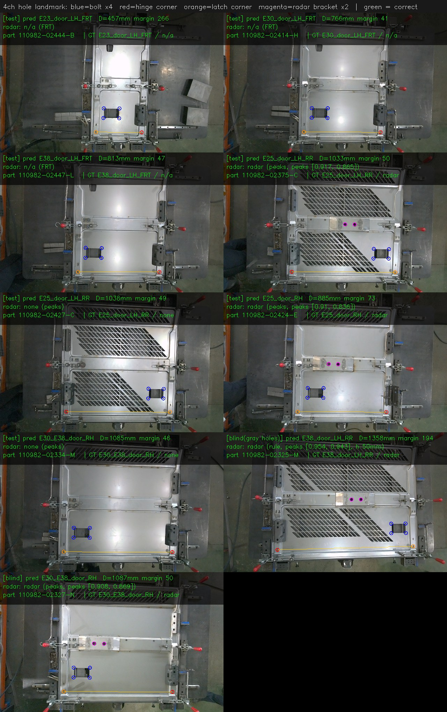

**그림 20 4채널 홀 랜드마크 검출기 판정 예(test·블라인드) — 볼트홀 4(파랑)·힌지 코너(빨강)·래치 코너(주황)·레이더 브래킷 홀 2(자홍), 형상군 D·마진·레이더·품번 출력**

##### ◦ 부품 인식 평가 결과

공통 평가 집합(8종 83세션 1,571장)에서 홀 판별기·CNN·자세 추정을 동일 집합으로 평가한 결과는 표 19과 같음. 홀 판별기는 판정률 98.3%, 판정 정확도 99.9%(오판 1장, 용접 중 프레임), 보류를 오답으로 계산한 전체 정확도 98.3%이며 8종 중 7종은 오판이 없었음. 별도 집합의 E25 LH FRT는 20/20, 신규 기종 E23은 CAD 치수 한 값 등록만으로 80/80 판별됨.

**표 19 공통 평가 집합(2026-09-09, 8종 83세션 1,571장) 기종별 종합 결과**

| 기종 | 세션 / 장 | 홀 판별기 판정 / 정답 | 홀 판별기 판정 정확도 | CNN 5-fold CV 정답 / 장 | CNN 정답률 | 자세 산출 | 자세 잔차 RMS 중앙값(mm) |
|---|---|---|---|---|---|---|---|
| E23_door_LH_FRT | 4 / 80 | 80 / 80 | 100% | 80 / 80 | 100% | 80 | 3.25 |
| E25_door_LH_RR | 15 / 282 | 282 / 282 | 100% | 282 / 282 | 100% | 282 | 4.15 |
| E25_door_RH | 15 / 286 | 286 / 286 | 100% | 286 / 286 | 100% | 286 | 4.19 |
| E30_E38_door_RH | 17 / 307 | 305 / 305 | 100% | 307 / 307 | 100% | 305 | 5.49 |
| E30_door_LH_FRT | 9 / 179 | 179 / 179 | 100% | 179 / 179 | 100% | 179 | 4.74 |
| E30_door_LH_RR | 10 / 189 | 180 / 180 | 100% | 180 / 189 | 95.2% | 180 | 4.79 |
| E38_door_LH_FRT | 6 / 120 | 106 / 105 | 99.1% | 65 / 120 | 54.2% | 107 | 6.85 |
| E38_door_LH_RR | 7 / 128 | 127 / 127 | 100% | 128 / 128 | 100% | 127 | 4.07 |
| 합계 | 83 / 1,571 | 1,545 / 1,544 | 99.9% | 1,507 / 1,571 | 95.9% | 1,546 | 4.56 |
| 별도 E25_door_LH_FRT | 1 / 20 | 20 / 20 | 100% | — (CV 불가) | — | 20 | 2.84 |

> ※ 홀 판별기 보류 26장(1.7%): same_side 10, no_corner 10, no_frame 4, D_range 1, latch_offset 1. 자세 산출 실패 25장은 홀 미검출·정합 게이트(15mm) 초과. CNN 오답 세션: E38_LH_FRT 8/31·9/1 3세션(→E30_LH_FRT), E30_LH_RR 8/27 s_122816(홀 프레임 밖).

최신 평가(표 20, 그림 21, 판정·보류 샘플은 그림 22)에서는 재분할 test 596장과 블라인드 663장 모두에서 홀 판별기 100%(판정률 100%, unknown 0), 정식 폴백 CNN 99.8%·99.4%를 확인함.

**표 20 최신 평가 결과(2026-09-16 재분할 test, 2026-09-23 블라인드)**

| 판별기 | 현장 test 25세션 596장 | 블라인드 35세션 663장 | 비고 |
|---|---|---|---|
| 홀 랜드마크 기하 판별기(주) | 596/596 = 100% | 663/663 = 100% | 판정률 100%, unknown 0, 9/16 E25_LH_FRT 세션 D 718(진짜 E25로 확인) |
| CNN seed916(정식 폴백) | 595/596 = 99.8% | 659/663 = 99.4%(macro F1 99.0) | 오답 5장 모두 E30↔E38 LH FRT 인접 쌍·저신뢰 |
| CNN run #10(이전 폴백) | 556/596 = 93.3% | 559/663 = 84.3% | E30_LH_RR 붕괴 → 교체 |
| 4채널 홀 랜드마크 검출기(브래킷 채널, 9/23 정식 채택) | 596/596 = 100% | 644/644 = 100%(판정률 97.1%, 블라인드용 재학습본) | 6점 정밀도 정본과 동일(중앙값 0.5px), 레이더 옵션 판정 겸용 |

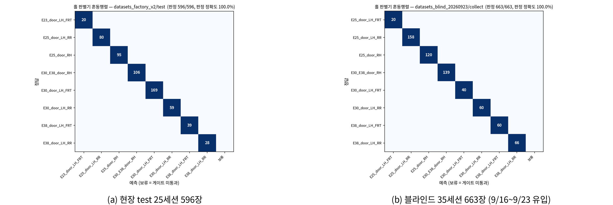

**그림 21 홀 판별기 혼동행렬 — (a) 현장 test 596장, (b) 블라인드 663장(보류 열 포함, 보류 0)**

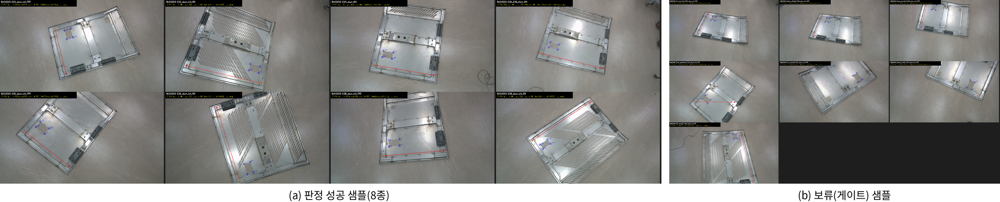

**그림 22 홀 판별기 판정·보류 샘플 — (a) 기종별 판정 성공 예, (b) 게이트 보류 예(홀 프레임 밖·미검출·기하 불일치 등)**

##### ◦ 운영 감시: 세션별 드리프트 시계열

- ㅇ 판정은 100%를 유지하더라도 카메라 깊이 스케일이 흔들리면 판정 마진이 소모되므로, 세션마다 K_session·dev·z·tilt를 계산해 DB(session_hole_metrics)에 기록하고 대시보드 /drift에서 시계열과 경보(K ±1%, |dev| 15mm)를 보도록 함(20_session_drift.py, 2026-09-16).
- ㅇ 발견: 9/9 이후 깊이 스케일이 계단식으로 변함(8/27~9/7 83세션 K 중앙값 1.0065·dev +0.1mm → 9/9~9/16 68세션 1.0132·dev −7.3mm, 경보 20/68). 판정은 불변이나 마진을 7~20mm 소모 중이며(FRT 간격 41mm), 정적 상수 K로는 부족함(표 21, 그림 23).

**표 21 기간별 드리프트 지표(151세션)**

| 기간 | 세션 | K_session 중앙값 | dev 중앙값(mm) | z 중앙값(mm) | 경보(±1% 밖) |
|---|---|---|---|---|---|
| 8/27 ~ 9/7 | 83 | 1.0065 | +0.1 | 1,455 | 8 |
| 9/9 ~ 9/16 | 68 | 1.0132 | −7.3 | 1,449 | 20 |

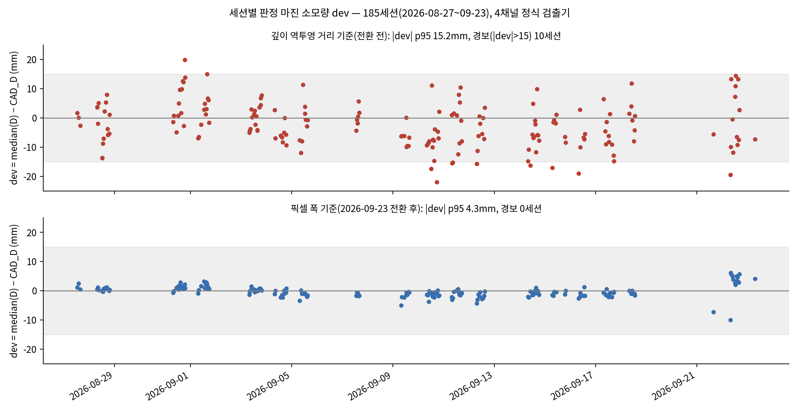

**그림 23 세션별 판정 마진 소모량 dev 시계열(185세션, 2026-08-27~09-23) — 위: 깊이 역투영 거리 기준(전환 전), 아래: 픽셀 폭 기준(전환 후). 4채널 정식 검출기 재계산 기준 |dev| p95 15.2 → 4.3mm, 경보 10 → 0**

- ㅇ 원인 규명(2026-09-23): 186세션에서 K_session × z / cos(tilt)가 0.16%로 일정하여 도어 위치와 코너 홀의 픽셀 폭은 세션 간에 변하지 않았고, 깊이 맵 자체가 세션마다 ±1.4% 스케일·겉보기 기울기 5~11°로 흔들리는 아티팩트(ZED 세션별 자기보정 추정)임을 확인함. 운영 규칙 4안을 오프라인 비교한 결과 픽셀 폭 기준이 가장 안정적이었음(표 22).

**표 22 D 측정 방식별 세션 편차 비교(186세션, |dev| = |D 중앙값 − CAD D|)**

| 방식 | \|dev\| p95(mm) | \|dev\| 최대(mm) | 경보 세션 | 비고 |
|---|---|---|---|---|
| 상수 K(깊이 역투영, 전환 전 운영) | 15.1 | 20.7 | 10 | K_CAMERA 1.0064 고정 |
| 최근 세션 이동 중앙값 K | 14.9 | 19.3 | 9 | 운영 규칙 후보 ① |
| z 앵커(깊이 z 기준 보정) | 9.7 | 16.7 | 3 | 운영 규칙 후보 ② |
| 픽셀 폭 × S_PIXEL / fx(채택) | 5.2 | 10.3 | 0 | 깊이는 z·tilt 가드로만 사용 |

- ㅇ 전환(2026-09-23, 사용자 결정): 홀 판별기 기본 스케일을 픽셀 폭 방식으로 바꾸고(hole_classifier SCALE_DEFAULT=pixel, S_PIXEL 1,477.8mm·기준 프레임 std 0.16%·9종 클래스별 ±0.3%) 전량 재검증함 — 185세션 3,762프레임 판정 변경 0, 세션 |dev| p95 15.1 → 4.1mm, 경보 10 → 0, 최소 마진 12 → 17mm, 현장 test 596/596. 드리프트 지표도 S_session(=CAD D·fx/픽셀 폭, ±0.5% 경보)과 dev_pix로 바꾸어 DB·대시보드에 기록하며, 4채널 정식 검출기로 전량 재계산한 S_session std는 0.19%임(그림 23).
- ㅇ 남은 항목: 자세 추정의 z와 레이저 트래커 대조를 위해 깊이 스케일 자체의 원인(9/9 전후 카메라·SDK·ZED 자기보정 재오픈 여부)은 다음 현장 방문 시 체커보드 실측(19_checker_scale_calib.py)으로 확인함. 【현장 방문 후 원인 기재】

#### ▪ 부품 위치 추정 AI 모델 및 알고리즘 개발

##### ◦ 부품 위치(자세) 추정 정의 및 지표 체계

**표 23 도어 6자유도 자세 추정 정의(2026-08-31 확정)**

| 구분 | 내용 |
|---|---|
| 출력 | T_cam→door ∈ SE(3): 카메라 광학 좌표계(x우/y하/z전방, mm/deg) 기준 도어 로컬 프레임의 자세 + 정합 잔차 RMS·기하 게이트 + 세션 N프레임 집계(병진 중앙값·쿼터니언 평균·세션 분산) |
| 도어 로컬 프레임 | 원점 = 모서리 홀(힌지·래치) 중점, X = 힌지→래치, Z = 도어 평면 법선(카메라 쪽), Y = Z×X. 기종별 상수 T_door→cad 동시 산출(CAD 원점은 차체 좌표계라 부품이 1~3m 오프셋되어 직접 사용 금지) |
| 분해 리포트 | x/y/z(mm) = 도어 원점 위치, θ = 이미지 면내 회전(도어 X축 vs 카메라 x축), tilt = 도어 법선 vs 카메라 광축 이탈각 |
| 지표 체계 | ① 정합 정확도 = CAD 홀 대비 3D 홀 위치 잔차 RMS(홀별, mm, 게이트 15mm) ② z·tilt 신뢰도 = 평면 피팅 잔차·유효 픽셀 수 ③ 반복 정밀도 = 세션 내 자기일관성 std ④ 절대 정확도 = 합성 GT·레이저 트래커 실측으로만 주장 |
| 용도·목표 | 대차 위 도어의 로봇 픽업(파지) 및 성과 검증. 정확도 목표 ±5mm/±1°(2차년도 KPI 10mm 이하, 최종 3mm 이하). 로봇 변환(hand-eye)은 소비자 측 책임 |
| 학습 데이터 | 자세 라벨 0장 — 홀 검출 CNN(판별기와 공용)만 학습하고 자세 자체는 비학습 기하로 산출 |

##### ◦ 알고리즘 구현

- ㅇ CAD 홀 추출(01_extract_cad_holes.py): STL이 워터타이트 다층 판금이라 직교 투영으로는 홀이 가려지므로, 홀 벽면(법선⊥두께축) 삼각형을 3D 클러스터링하고 PCA 평면 원 피팅으로 홀 중심을 추출함. 8종 모두 CAD D와 −0.4mm 이내로 일치하며, 볼트홀이 코너 평면에서 약 5.8mm 리세스되어 있음을 실측하여 솔버에 반영함(그림 24).

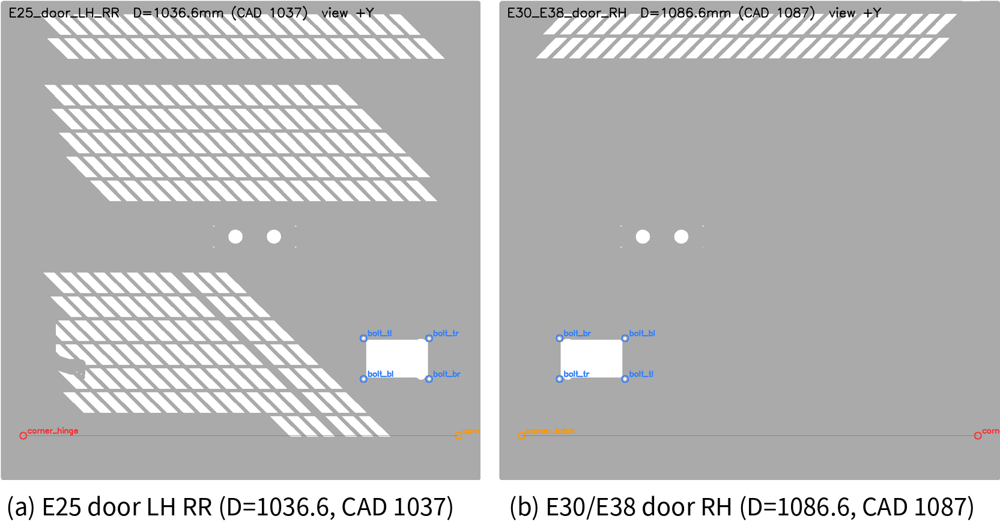

**그림 24 CAD 홀 추출 결과 — 관측면 투영에 볼트홀 4점(파랑)과 코너 홀(주황)을 표시**

- ㅇ 프레임당 절차(pose_solver.py, 결과 예는 그림 25): ① 홀 검출기로 볼트홀 ≤4점 + 코너 홀 2점 검출 → ② 깊이 영상에서 링 시드 평면 피팅 후 홀별 링(6~16px) 국소 깊이로 역투영(볼트홀은 리세스 오프셋만큼 평면을 밀어 교차) → ③ 코너 2점 유사변환으로 CAD 볼트를 이미지에 사상하여 상호 최근접 대응 → ④ Umeyama 강체 정합(스케일 고정) → T와 홀별 잔차(mm) 출력, 잔차 15mm 초과 시 보류.
- ㅇ 대조군: 깊이를 쓰지 않는 PnP(SQPNP) 경로를 병행하여 절대 스케일을 이중 확인함(현장 Δz +1.3mm 일치). 근평면 6점이라 회전은 약 2.5° 한계로 z 검산 전용임.
- ㅇ 실측 내부 파라미터 적용: 현장 카메라 시리얼 54910212의 HD1200 rectified 값(fx=fy=1269.746)을 세션 meta에 기록·사용하여 절대 위치를 물리 스케일로 복원함(근사 경로는 절대 t가 0.85배 압축되어 있었음). 잔차·반복·판별기 D에는 영향이 없는 공통모드 오차였음.
- ㅇ E23 정식 등록(2026-09-23): 9/23 입수한 어셈블리 STEP(110982-02444B, 보강재·힌지 포함)을 OCC healing 메시(gmsh, 곡률 기반 메시 크기)로 변환하여 코너 홀 거리 457.6mm로 정식 추출(CAD_D 456→458, 현장 정합 잔차 3.1mm)하고 잠정 등록을 해제함. 그 전까지는 외판 단일 CAD로 볼트홀·래치 코너는 E25 좌표, 힌지 코너는 CAD D 이동으로 합성한 잠정 좌표를 썼음(현장 4세션 80장 잔차 중앙값 3.25mm). E30 LH RR 신규 리비전(02360K) 메시는 홀 벽면 샘플 부족으로 추출에 실패하여 종전 메시를 유지함. 【E30 02360K 세밀 메시 재변환 후 교체】

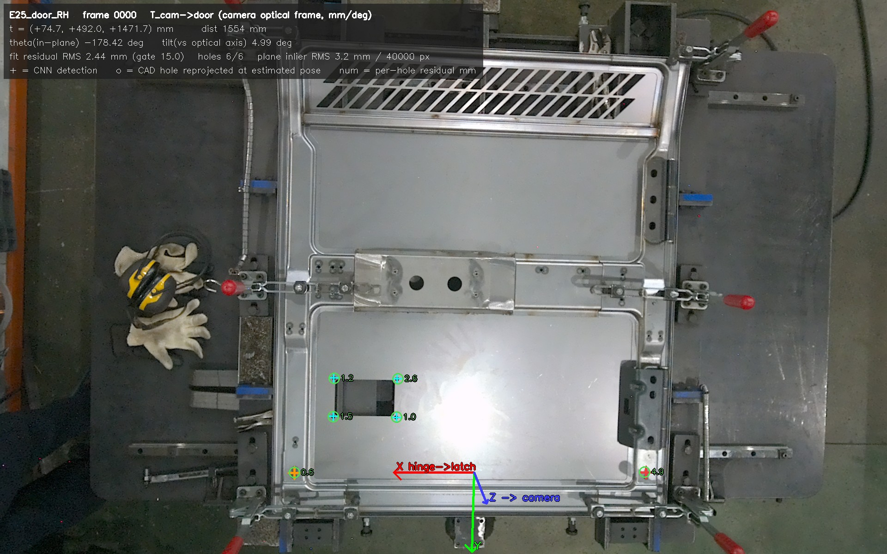

**그림 25 현장 프레임 자세 추정 결과 — 도어 좌표축과 추정 자세로 재투영한 CAD 홀(o) 오버레이**

##### ◦ 검증 결과

현장 프록시 지표(공통 평가 집합)는 표 19의 기종별 잔차와 같이 산출 1,546/1,571(98.4%), 잔차 RMS 전체 중앙값 4.56mm(90분위 6.63mm), 기종별 중앙값 3.25~6.85mm이며, 세션 내 반복 정밀도는 x/y ≤0.9mm·z ≤3.3mm·θ ≤0.10°·tilt ≤0.32°임. 9/23 기준 185세션 3,578프레임 재평가(자세 산출 3,563장, 99.6%; PnP 대조 Δz +1.0mm)에서도 기종별 잔차 중앙값 3.0~5.8mm로 동일 수준을 유지함(표 24).

**표 24 자세 추정 현장 재평가(2026-09-23, 185세션 3,578프레임, 4채널 정식 검출기)**

| 기종 | 세션 / 프레임 | 잔차 RMS 중앙값(mm) | 최대(mm) | std z(mm) | std θ(°) | std tilt(°) |
|---|---|---|---|---|---|---|
| E23_door_LH_FRT | 6 / 120 | 3.00 | 4.94 | 2.49 | 0.12 | 0.30 |
| E25_door_LH_FRT | 2 / 40 | 3.08 | 4.82 | 3.66 | 0.13 | 0.30 |
| E25_door_LH_RR | 36 / 698 | 4.36 | 7.43 | 1.05 | 0.03 | 0.10 |
| E25_door_RH | 32 / 626 | 3.89 | 11.54 | 1.88 | 0.06 | 0.23 |
| E30_E38_door_RH | 41 / 785 | 4.90 | 15.20 | 2.97 | 0.08 | 0.26 |
| E30_door_LH_FRT | 15 / 299 | 4.78 | 9.01 | 2.72 | 0.10 | 0.23 |
| E30_door_LH_RR | 19 / 378 | 5.02 | 7.71 | 0.85 | 0.04 | 0.10 |
| E38_door_LH_FRT | 15 / 298 | 5.75 | 12.50 | 2.69 | 0.09 | 0.29 |
| E38_door_LH_RR | 19 / 334 | 4.11 | 6.93 | 1.05 | 0.02 | 0.14 |

> ※ std = 세션 내 반복 정밀도(정지 도어 프레임 간 자기일관성)의 기종별 중앙값. 잔차·반복은 상시 평가 지표이며 절대 정확도는 아래 합성 GT·트래커 실측으로만 주장함.

- ㅇ 검출 정확도 프록시 — 홀-홀 거리 CAD 대비 편차(2026-09-24): 같은 기종의 홀 6점 사이 15쌍 거리는 CAD 값이 참값이므로, 측정 거리 − CAD의 세션 간 평균이 편향, 산포가 정밀도임. 현장 3,714장 55,710쌍을 집계하면 볼트 변 4쌍(157·96mm, 짧은 기선)은 편향 +0.22mm·std 1.85mm·|편차| p95 3.48mm로 홀 검출 위치 정확도가 1~2mm 수준임을 보이고, 코너 쌍 D(700~1,350mm)는 깊이 역투영 시 std 8.16mm·p95 16.4mm이나 같은 두 홀을 픽셀 폭으로 재면 std 1.75mm·p95 3.54mm로 줄어 잔차·z 산포의 주범이 검출기가 아니라 깊이 스케일임을 확인함(표 25). 이에 따라 지표 체계를 세션 내 반복 정밀도 = 카메라 잡음, 검출 정확도 = 홀-홀 거리 편차, 절대 정확도 = 트래커 실측, 스케일 전이 = 체커보드로 정리함.

**표 25 홀-홀 거리 CAD 대비 편차 집계(현장 3,714장 55,710쌍, 2026-09-24)**

| 구간 | 쌍 수 | 편향(평균, mm) | std(mm) | \|편차\| 중앙값(mm) | \|편차\| p95(mm) | 최대(mm) |
|---|---|---|---|---|---|---|
| 볼트 변 4쌍(157/96mm, 검출 정확도) | 14,856 | +0.22 | 1.85 | 1.36 | 3.48 | 21.9 |
| 볼트 대각 2쌍(184mm) | 7,428 | +0.16 | 2.52 | 1.66 | 4.98 | 25.3 |
| 코너 쌍 D 깊이 역투영 3D(700~1,350mm) | 3,714 | +2.65 | 8.16 | 6.24 | 16.36 | 34.4 |
| 코너 쌍 D 픽셀 폭 | 3,714 | −0.24 | 1.75 | 1.09 | 3.54 | 10.1 |
| 전체 15쌍 | 55,710 | +1.06 | 6.29 | 2.64 | 13.78 | 43.3 |

**표 26 합성 GT 검증 결과(8종 × 6포즈, 04_evaluate_synthetic.py)**

| 조건(랜드마크 px / 깊이 mm) | n | 면내 오차 중앙값(p95) | 법선 오차 중앙값(p95) | 회전 오차 중앙값(p95) | 잔차 RMS 중앙값 |
|---|---|---|---|---|---|
| clean (0 / 0) | 48 | 0.30 mm (0.44) | 1.46 mm (1.90) | 0.23° (0.50) | 0.53 mm |
| field (1 / 3) — 현장 유사 | 48 | 0.76 mm (1.50) | 1.43 mm (1.91) | 0.35° (0.57) | 1.67 mm |
| stress (2 / 6) | 48 | 1.17 mm (3.25) | 1.39 mm (4.29) | 0.62° (2.37) | 3.21 mm |

- ㅇ 합성 검증의 성과: 전역 평면 피팅의 계통 편향(법선 약 11mm, 회전 약 3°)을 적발하여 홀별 링 국소 깊이 방식으로 수정함. 이는 현장 프록시(잔차·반복 std)로는 원리상 보이지 않는 공통모드 오차로, 현장 조건에서 기하 체인의 절대 오차 ±5mm/±1° 충족을 GT로 입증함.
- ㅇ 대차 위 도어 위치 변동(2026-09-16, 80세션): 세션 간 면내 x p95 2.1mm·y 4.3mm·θ 0.30°로 대차 지그가 도어를 반복적으로 같은 자리에 놓으며, z p95 11.8mm의 대부분은 거치 편차가 아니라 세션별 깊이 편향(드리프트 표의 고 K 세션과 일치)임. 로봇 픽업이 흡수해야 할 범위를 면내 ±5mm, θ ±0.5°, tilt ±1.5°, z ±15mm로 제안함(표 27).

**표 27 대차 위 도어 위치 변동 통계(전 기종 합산, 세션 값 − 기종 중앙값)**

| 축 | 단위 | std | p95 \|편차\| | 최대 \|편차\| |
|---|---|---|---|---|
| x | mm | 1.05 | 2.13 | 2.39 |
| y | mm | 2.22 | 4.27 | 5.66 |
| z | mm | 4.94 | 11.79 | 16.58 |
| θ | deg | 0.14 | 0.30 | 0.44 |
| tilt | deg | 0.47 | 0.89 | 1.31 |

- ㅇ 미실시: 레이저 트래커 실측 GT. 절차서(8포즈, 홀 핀 네스트/터치 프로브 측정, 변화량 비교·최적 변환 잔차·독립 기준점 3방법)와 비교 스크립트(자체 검증 통과)를 준비하였으며, 장비·일정 확보 후 수행하여 KPI(2차년도 10mm, 최종 3mm)를 절대 오차로 입증할 계획임. 판별기 K(1.0064)와 자세 depth_scale(1.0140)의 0.75% 불일치도 트래커 실측으로 판가름할 항목임.

---

## 3. 연구개발과제의 수행 결과 및 목표 달성 정도

- ㅇ 해당연도 목표 달성 수준 ※ 연구개발계획서 요약문 상에 기재한 목표 관련 기재

| 추 진 목 표 | 달 성 내 용 | 달성도(%) |
|---|---|---|
| ㅇ 부품 위치 추정 AI 학습용 기초 데이터셋 구축 | ㅇ CAD 합성 GT 모사 환경(8종×6포즈×3조건)·실험실·현장 지그 환경 구축, 레이저 트래커 실측 절차 준비, E23 어셈블리 CAD 정식 등록 ㅇ 홀 랜드마크 라벨 134장, CAD 홀 3D 좌표 9종, 현장 세션 RGB-D 9종 192세션 18,303쌍(실측 내부 파라미터 포함) 확보·전처리 ㅇ 홀 검출기·CNN·합성 노이즈 증강 적용, 오프라인 증강은 평가 전용 원칙 유지 | ㅇ 70% 【초안 기준】 |
| ㅇ 학습 데이터 수집 장치 설치 | ㅇ 무인 수집 장치(ZED X Mini + ZED Box + 터치 키오스크 + LTE/VPN) 제작, 2026-08-27 명성공업 경주공장 용접 라인 설치·작업자 자율 운영 ㅇ 세션 단위 자동 저장·메타 기록·NAS 자동 업로드·원격 모니터링 체계 가동 | ㅇ 100% |
| ㅇ 부품 인식 및 위치 추정 AI 알고리즘 개발 | ㅇ 홀 랜드마크 기하 판별기(주) + 현장 재학습 CNN(보조) 구조 확정, 실시간 서버 통합, 미등록 도어 판정 ㅇ 현장 공통 평가 집합 판정 정확도 99.9%(2차년도 목표 80%), 최신 test·블라인드 100% ㅇ 도어 6자유도 자세 추정 정의·구현, 현장 CAD 정합 잔차 중앙값 4.6mm(2차년도 목표 10mm), 합성 GT 절대 오차 면내 0.8mm·법선 1.4mm·회전 0.35° ㅇ 품번 14종(형상군 9 × 레이더 옵션) 판정 확장: 규칙 검사 고정 test 596장·블라인드 663장 100%, 4채널 검출기 정식 채택·실시간 서버 품번 출력 통합 ㅇ 판정 거리를 픽셀 폭 기준으로 전환(세션 간 편차 p95 15→4mm), CNN 학습 레시피 확정(5-fold 세션 CV 99.68%), 홀-홀 거리 편차로 검출 정확도(std 1.85mm) 분리 ㅇ 미실시: 레이저 트래커 실측, 엣지(TensorRT) 배포 | ㅇ 60% 【초안 기준】 |
| ㅇ (1차년도 연계) 학습 데이터 수집을 위한 서버 및 DBMS 환경 구축 | ㅇ SQLite 메타데이터 DB(10개 테이블) 구현·운영, 학습·평가·드리프트 자동 기록, 세션 단위 분할·라벨 정정·무효화 관리 ㅇ 열람·관리 웹 대시보드(6개 화면) 구현, 외부 열람 공개, 모델 배포 동기화(Gitea LFS) ㅇ PostgreSQL 전환은 전문가 검토 후 결정 | ㅇ 80% 【초안 기준】 |
| ㅇ (연계) 현장 데이터 수집·검증 체계 운영 | ㅇ 판별기 기반 세션 단위 라벨 자동 검증(정정 10세션, 미등록 기종 E23 발견), 레이더 옵션 확정 147세션, 세션 단위 평가 프로토콜·공통 평가 집합·블라인드 평가 확립 ㅇ 진행 중: E25 LH FRT 재수집, 유입 세션 평가 루틴 자동화 | ㅇ 40% 【초안 기준】 |

### 3-1. 정성적 연구개발성과

- ㅇ 현장 데이터 확보 체계: 작업자 버튼 조작만으로 세션 단위 RGB-D 데이터가 자동 저장·업로드·DB 등록되는 무인 수집 체계를 구축하여 4주 만에 9종 192세션 18,303쌍의 실제 생산 현장 데이터를 확보함. 이는 1차년도 실험실 데이터(1,256장) 대비 규모와 조건 면에서 현장 적용 검증의 기반이 됨.
- ㅇ 설명 가능한 부품 판별: 형상을 학습하는 CNN 대신 CAD 치수(모서리 홀 간 거리)로 판정하는 기하 판별기를 개발하여, 실험실 위주 134장의 홀 라벨만으로 현장 9종에서 판정 정확도 99.9~100%를 달성함. 신규 기종은 CAD 치수 등록만으로 재학습 없이 추가되며(E23 사례), 판정 근거(D, 마진, 게이트)가 사람에게 설명됨.
- ㅇ 품번 단위 판정: 도면·사양표 분석으로 어셈블리 품번 14종 체계를 정립하고, 형상군(홀 거리 규칙) × 레이더 옵션(브래킷 투영 규칙 또는 4채널 검출기)의 2단 구조로 품번을 판정함. 학습 없는 규칙 검사와 사용자 확정으로 하루 만에 147세션의 옵션 라벨을 확보하였고, 블라인드 35세션 663장에서 규칙·4채널 검출기 모두 품번 정확도 100%를 확인하여 실시간 서버에 품번 출력을 통합함.
- ㅇ 데이터 신뢰도 관리: 판별기가 라벨 검증 도구를 겸하는 세션 단위 검증 루프로 작업자 오선택 4세션과 미등록 기종 6세션을 발견·정정하였고, 촬영 프로토콜 이전 세션 제외 기준과 세션 단위 분할·교차검증·블라인드 평가라는 현장 성능을 과장하지 않는 평가 기준을 확립함.
- ㅇ 위치(자세) 추정 기반 확보: 자세 라벨 없이 홀 검출 + 깊이 평면 역투영 + CAD 강체 정합으로 6자유도 자세를 산출하는 비학습 기하 파이프라인을 구현하고, 합성 GT로 기하 체인의 절대 오차(면내 0.8mm·법선 1.4mm·회전 0.35°)를 입증함. 현장 정합 잔차 중앙값 4.6mm로 2차년도 목표(10mm)를 자체 평가 기준으로 충족함.
- ㅇ 운영 인프라: 메타데이터 DB·웹 대시보드·드리프트 감시·모델 배포 동기화 등 데이터 유입에서 평가·감시까지의 운영 절차를 스크립트화하여, 이후 세션이 쌓일 때마다 같은 절차로 재평가할 수 있게 함. 깊이 스케일의 계단식 변화(9/9 이후 약 0.7%)를 드리프트 감시로 조기 발견하고, 원인을 깊이 맵 아티팩트로 규명하여 판정 거리를 픽셀 폭 기준으로 전환함(세션 간 D 편차 p95 15→4mm, 판정 변경 0).
- ㅇ 성과 확산: 2026 한국자동차공학회 추계 학술대회 초록(현장 데이터 수집·검증 체계 구축 사례) 작성, 연구원 AI 로드맵 발표자료 과제 소개, 공동참여기관 현장 점검(9/3) 대응 자료 및 AI팩토리 데이터 체크리스트 제출, 1차년도 워크샵 발표(5/14), 작업자 사용설명서·외부 열람 매뉴얼 등 문서화.

### 3-2. 정량적 연구개발성과

< 정량적 연구개발성과표 >

| 성과지표명 |  | 단계/연도 | 1단계 【기간 확인】 | 2단계 【기간 확인】 | 계 |
|---|---|---|---|---|---|
| 전담기관 등록·기탁 지표 | 국내·외 논문게재 건수 | 목표 | 1 | 1 | 2 |
|  |  | 실적 | (초고 작성) 【투고 상태 확인】 |  |  |
|  | 국내·외 학술대회 건수 | 목표 | 2 | 2 | 4 |
|  |  | 실적 | 1 【KSAE 추계 제출·채택 확인】 |  |  |
|  | 기술 요약 정보 건수 | 목표 |  |  |  |
|  |  | 실적 |  |  |  |
|  | 보고서 원문 건수 | 목표 |  |  |  |
|  |  | 실적 |  |  |  |
|  | 지식재산권(출원) 건수 | 목표 | 1 | 5 | 6 |
|  |  | 실적 |  |  |  |
|  | 지식재산권(등록) 건수 | 목표 |  |  |  |
|  |  | 실적 |  |  |  |
|  | 저작권 건수 | 목표 | 1 | 1 | 2 |
|  |  | 실적 | 1(1차년도 완료) |  | 1 |
| 연구개발과제 특성 반영 지표 | 시제품 제작 건 | 목표 | 2 | 2 | 4 |
|  |  | 실적 |  |  |  |
|  | 인력양성(채용) 명 | 목표 | 10 | 4 | 14 |
|  |  | 실적 |  |  |  |

> * 1」전담기관 등록·기탁 지표: 논문, 특허, 보고서원문, 연구시설·장비, 기술요약정보, 저작권, 생명자원, 표준화 등. 논문, 학술발표, 특허의 경우 목표 대비 실적은 기재하지 않아도 됩니다.

> * 2」연구개발과제 특성 반영 지표: 기술실시(이전), 기술료, 사업화, 비용 절감, 인증, 시제품 제작, 인력양성, 홍보 등 중 선택하여 기재합니다. (1단계 성과 지표: 논문(KCI 등재지) 1건, 소프트웨어 등록 1건(완료), 학술대회 2건 — 1차년도 워크샵 자료 기준)

### 3-3. 세부 정량적 연구개발성과(해당되는 항목만 선택하여 작성 후 증빙자료 별도 첨부)

[과학적 성과]

□ 국내 및 국제 학술회의 발표

| 번호 | 논문명 | 학술지명 | 주저자명 | 발행처 | 발행일자 | 등록번호(ISSN) | 기여율 |
|---|---|---|---|---|---|---|---|
| 1 | 굴착기 도어 용접 공정 자동화를 위한 현장 데이터 수집·검증 체계 구축 사례 | 2026 한국자동차공학회 추계 학술대회 【제출·채택 확인】 | 이민수 | 한국자동차공학회 | 【확인】 |  | 100% |

□ 논문(국내외 전문 학술지) 게재

| 번호 | 논문명 | 학술지명 | 주저자명 | 발행처 | 볼륨 | SCIE 여부 | IF | 발행일자 | 기여율 |
|---|---|---|---|---|---|---|---|---|---|
| 1 | 굴착기 부품 분류를 위한 RGB-Edge 하이브리드 입력 표현의 텍스처 변형 강건성 비교 연구(초고 v6, 2026-04) 【투고 여부·학술지 확인】 |  | 이민수 |  |  | 비SCIE |  |  |  |

[기술적 성과]

ㅇ 저작권(소프트웨어, 서적 등)

| 번호 | 저작권명 | 창작일 | 저작자명 | 등록일 | 등록 번호 | 저작권자명 | 기여율 |
|---|---|---|---|---|---|---|---|
| 1 | 굴착기 도어 부품 RGBD 영상 기반 분류 파이프라인 소프트웨어 | 2026-04 【확인】 | 이민수 외 【확인】 | 【1차년도 등록 정보 기입】 |  | 한국건설기계연구원 | 100% |

[인프라 성과]

□ 연구시설·장비

| 구축기관 | 연구시설/연구장비명 | 규격(모델명) | 개발여부(○/×) | 종합정보시스템 등록여부 | 등록번호 | 구축일자 | 구축비용(천원) | 비고(설치 장소) |
|---|---|---|---|---|---|---|---|---|
| 한국건설기계연구원 | 현장 학습 데이터 무인 수집 장치 | ZED X Mini + ZED Box Mini(Jetson Orin NX 16GB) + 16인치 터치 모니터 + LTE 라우터 | ○(자체 제작) | × 【확인】 |  | 2026-08-27 | 【확인】 | 명성공업 경주공장 도어 용접 라인 |

### 3-4. 계획하지 않은 성과 및 관련 분야 기여사항(해당 시 작성합니다)

- ㅇ 부품 판별기의 라벨 검증 도구 활용: 현장 작업자 입력 라벨의 오류(오선택 4세션)와 기종 목록에 없던 신규 부품(E23, 6세션)을 판별기가 자동으로 찾아내어, 현장 데이터의 라벨 신뢰도를 추가 라벨링 없이 관리하는 방법을 확립함.
- ㅇ 레이더 옵션 혼재의 발견: 현장 라벨(9종 형상군) 안에 RADAR/비RADAR 사양이 섞여 있음을 CAD 부품 목록 대조로 밝히고 판정 대상을 어셈블리 품번 14종으로 확장함. 과거 기록의 패드 홀 패턴 차이·E25 RH CAD와 실물 불일치·CNN 대차 세션 혼동이 모두 이 옵션 차이였음이 규명됨.
- ㅇ 카메라 깊이 스케일 드리프트 감시: 판정 정확도만으로는 보이지 않는 깊이 스케일의 계단식 변화(9/9 이후 약 0.7%)를 세션 단위 지표로 조기 발견하고 대시보드로 감시하는 운영 지표(K_session, dev)를 정의함.
- ㅇ 대차 위 도어 거치 편차 정량화: 자세 추정 결과로 대차 지그의 반복 거치 정밀도(면내 p95 2~4mm, θ 0.3°)를 실측하여 3~4차년도 로봇 픽업 보정 범위 설계의 근거를 확보함.

---

## 4. 연구개발비 사용실적(연구비통합관리시스템으로 사용내역 등록)

【RCMS 등록 내역으로 갈음 — 기관 연구관리 담당 확인】

## 5. 다음 연도 연구개발계획

### 5-1 연구개발 목표 및 내용

"당초계획 대비 변경사항 없음" (2단계 1차년도(3차년도) 연구개발계획서 기준) 【3차년도 협약계획서 항목과 대조 후 확정】

연구원 담당 범위의 3차년도 추진 항목은 2차년도 결과를 이어받아 다음과 같이 구체화함(표 28, 그림 26).

**표 28 3차년도(2단계 1차년도) 추진 항목(안)**

| 구분 | 항목 | 내용 · 완료 기준 |
|---|---|---|
| 즉시(2차년도 잔여기간) | E25 LH FRT 재수집·9종 완결 | 정상 세션 3개 이상 확보 → auto-split 재계산 → 9종 전부 test 보유, 현장 E23/E25 앞문 구분 안내 |
| 즉시 | 유입 세션 평가 루틴 자동화 | ingest → pull → 홀 평가 → auto-split → build → 드리프트 기록을 세션 유입마다 자동 실행 |
| 즉시 | 체커보드 실측·ZED 자기보정 확인 | 판정은 픽셀 폭 전환으로 해결됐으나 자세 z·트래커 대조를 위해 9/9 전후 카메라·SDK·자기보정(재오픈) 여부 확인 및 체커보드 실측 |
| 단기 | 레이저 트래커 실측(절대 정확도) | 8포즈 프로토콜로 자세 절대 오차 측정, 05 스크립트 DB 기록 → KPI(10mm→3mm) 입증 수단 확보 |
| 단기 | 공장 확인 항목 | 생산계획 레이더 표기 해석(X=미장착) 확인, 로봇 공정이 옵션으로 갈리는지, 명성 자체 도어 작업 실적(품번·시각) 제공 여부(세션 1:1 GT) |
| 단기 | E30 LH RR 신규 리비전 CAD | 02360K 어셈블리 STEP 세밀 메시 재변환 후 홀 추출·자세 CAD 교체(현재 구 리비전 메시 유지) |
| 단기 | CNN 보강 실험 | 레시피 확정 완료(5-fold CV 99.68%). 남은 것: RGB vs RGBE 현장 ablation, 초반 스파이크 제거(lr 3e-4·warmup)·DataLoader 스레드 제한, 도어 유무 게이트, 신규 세션 누적 시 폴백 CNN 재학습 |
| 중기 | 엣지 자동 판정 | 홀 검출기 TensorRT/FP16을 ZED Box 배포, 세션 종료 시 자동 판정 → meta/DB 기록(DBMS 2단계 본래안 연동) |
| 중기 | DB 고도화 | DB 전문가 검토(webapp 정식화, PostgreSQL 전환 시점, 스키마 리뷰) 후 현장 서버 직접 연동 |
| 3~4차년도 | 로봇 연계·확장 | 파지점 CAD 좌표·hand-eye 정의, 로봇 자동 픽업·장착 연계, 도장 라인 확장, 공인기관 평가 준비 |

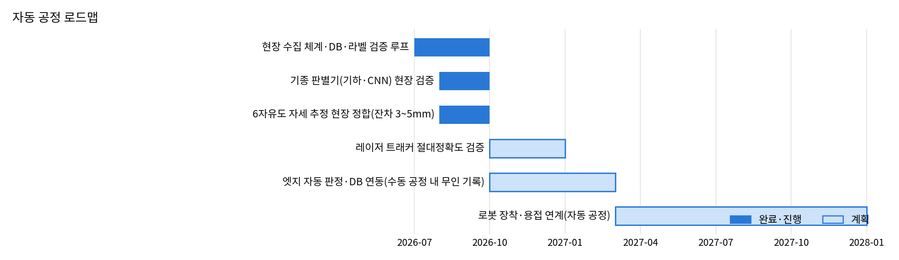

**그림 26 자동 공정 로드맵(계획 부분은 가안)**

### 5-2 국내외 관련 분야 환경변화(해당 시 작성합니다)

- ㅇ 당초 대비 특기할 환경 변화 없음. 다만 현장 기종 구성이 계획(8종)과 달리 신규 기종(E23)이 투입되는 등 생산 품목이 변동되므로, CAD 등록만으로 기종을 추가하는 판별 구조를 유지하고 기종 목록 변경 시 현장과의 정보 공유 절차를 둘 필요가 있음.

### 5-3 연구개발 추진전략

"당초계획 대비 변경사항 없음"

- ㅇ 주 판별기(기하)·보조 판별기(CNN)의 이중 구조와 세션 단위 평가 원칙을 유지하며, 현장 데이터 유입에 맞춰 평가·감시 루틴을 자동화함. 위치 추정은 레이저 트래커 실측으로 절대 정확도를 입증한 뒤 로봇 연계(3~4차년도)로 확장함.

### 5-4 연구개발 일정 및 기대 성과

"당초계획 대비 변경사항 없음"

- ㅇ 기대 성과: 현장 9종 전 기종 공식 인식률 확보, 자세 절대 오차 실측(±5mm/±1° 예산 내 확인), 엣지 자동 판정 루프 가동, 학술대회 발표 1건 이상.

### 5-5 연구개발비 사용 계획

> ※ 수정계획서에만 작성, 해당 표는 삭제하고 수정계획서 해당페이지를 기재 (예시: N차년도 수정계획서 p.10~13)

[공동연구개발기관 : 한국건설기계연구원] (단위 : 천원) 【1차년도 연차보고서 표 기준 — 3차년도(2단계 1차년도) 협약 금액 확인】

| 비목 | 항목 | 1단계 1차년도 | 1단계 2차년도 | 2단계 1차년도 | 2단계 2차년도 | 합계 |
|---|---|---|---|---|---|---|
| 인건비 | 내부인건비(A) 현금 | 94,000 | 94,000 | 94,000 | 94,000 | 376,000 |
|  | 소계(A+B+C) / 총 인건비(E1) / 수정인건비(E2) | 94,000 | 94,000 | 94,000 | 94,000 | 376,000 |
| 직접비 | 연구재료비(G) 현금 | 28,451 | 28,451 | 28,451 | 28,451 | 113,804 |
|  | 연구활동비(H) 현금 | 31,000 | 31,000 | 31,000 | 31,000 | 124,000 |
|  | 연구수당(I) [비율 I/E2 20.00%] | 18,800 | 18,800 | 18,800 | 18,800 | 75,200 |
|  | 직접비 소계(K) | 172,251 | 172,251 | 172,251 | 172,251 | 689,004 |
| 간접비 | 간접비(L) [비율 16.11%] | 27,749 | 27,749 | 27,749 | 27,749 | 110,996 |
|  | 연구개발비 총액(M=K+L) | 200,000 | 200,000 | 200,000 | 200,000 | 800,000 |

ㅇ 참여연구자 인건비 현황표(2단계-1차년도) ※ 다음연도 참여연구자 작성 【참여율·기간은 1차년도 보고서 값 — 3차년도 계획으로 갱신 필요】

| 인력구분 | 성명(국적) | 직위 | 내·외부 | 신규/기존 | 급여총액(A) | 참여기간(B, 개월) | 인건비계상률(C, %) | 현금 | 현물 | 계 |
|---|---|---|---|---|---|---|---|---|---|---|
| 참여연구자(기존) | 이민수(한국) | 책임 | 내부 | 기존 | 111,600 | 10 | 31.18 | 29,000 | 0 | 29,000 |
|  | 신영일(한국) | 책임 | 내부 | 기존 | 110,400 | 10 | 25.00 | 23,000 | 0 | 23,000 |
|  | 신희영(한국) | 선임 | 내부 | 기존 | 87,600 | 10 | 30.00 | 21,900 | 0 | 21,900 |
|  | 이진호(한국) | 선임 | 내부 | 기존 | 80,400 | 10 | 30.00 | 20,100 | 0 | 20,100 |
|  | 소계(D) |  |  |  |  |  |  | 94,000 |  | 94,000 |
|  | 총액(G=D+E+F) |  |  |  |  |  |  | 94,000 |  | 94,000 |

### 5-6. 사업화 추진 계획(해당 시 작성합니다)

"당초계획 대비 변경사항 없음"

### 5-7. 연구개발 성과의 활용방안 및 기대효과

"당초계획 대비 변경사항 없음"

- ㅇ 구축한 현장 수집·검증 체계와 판별·자세 추정 결과는 주관기관의 로봇 용접·검사 시스템에서 도어 기종 자동 판별과 픽업 자세 입력으로 활용되며, CAD가 있는 판금 부품이면 같은 방법론(치수 기반 판별, 홀 기반 자세)을 타 부품·라인으로 확장할 수 있음.

---

## 6. 자체보안관리진단(연구개발기관별 작성)

ㅇ 주관연구개발기관 : 【주관 작성】

ㅇ 공동연구개발기관 : 한국건설기계연구원 【점검·교육 일자는 2차년도 실시 일자로 갱신 필요】

| 구분 | 체크항목 | 결과 체크(√표) | 비고(미실시 사유) |
|---|---|---|---|
| 보안관리 체계 | ㅇ 기관 내 보안관리규정을 제정/적용하고 있다  - 기관의 규정명칭 기재 : 보안관리규정(개정 2023.10.26.) | O(√), X( ) |  |
|  | ㅇ 보안관리 조직이 있으며, 자체 보안점검실시 등 잘 운영되고 있다  - 보안담당자 부서 및 성명기재 : 운영지원팀장 유형민  - 자체 보안점검 실시 일자 기재 : 2025.12.05 【2026 일자 확인】 | O(√), X( ) |  |
|  | ㅇ 보안교육을 정기적(1회이상/연)으로 실시하고 있다  - 보안교육 실시 일자 기재 : 2025 하반기 【2026 일자 확인】 | O(√), X( ) |  |
|  | ㅇ 보안사고에 대한 방지대책 및 비상시 대응계획이 준비되어 있다  - 규정의 조문 또는 가이드 기재 : 보안관리규정 제6장 보안사고등에 대한 조치 | O(√), X( ) |  |
| 참여연구자 관리 | ㅇ 연구개발과제별로 참여연구자에 대하여 보안서약서를 징구하고 보안교육을 실시하고 있다 | O(√), X( ) |  |
|  | ㅇ 해외 출장 시 사전 보안교육과 귀국보고 실시를 하고 있다 | O(√), X( ) |  |
|  | ㅇ 퇴직예정자에 별도로 보안 서약서 징구, 반출자료 안전성 검토, 연구성과물 회수, 전산망 접속 차단 여부를 확인하고 있다 | O(√), X( ) |  |
|  | ㅇ 외국인 연구자가 연구개발과제에 참여하는 경우 영문보안서약서 작성, 출입지역 제한, 반출·반입 물품 제한, 특이 동향을 별도 관리하고 있다 |  | 외국인 연구자 미참여시 공란 |
| 연구개발 내용/결과 관리 | ㅇ 주요 연구자료 및 성과물의 무단유출 방지대책을 수립하고 있다 | O(√), X( ) |  |
|  | ㅇ 보안성 검토 방법 및 절차를 이행하고 있다 | O(√), X( ) |  |
|  | ㅇ 기술이전 관련 내부규정 및 절차를 준수하고 있다 | O(√), X( ) |  |
| 연구시설 관리 | ㅇ 연구시설 보안관련 내부규정 또는 지침을 이행하고 있으며, 연구시설 출입자에 대한 개인별 출입권한 차등을 부여 하고 있다 | O(√), X( ) |  |
|  | ㅇ 주요 시설에는 보안장비 설치와 보호구역이 지정되어 있다 | O(√), X( ) |  |
|  | ㅇ 외부 입주기관의 연구 시설 내부 출입통제 조치를 하고 있다 |  | 외부 입주기관 없는 경우 공란 |
| 정보통신망 관리 | ㅇ 정보통신망 보안관련 내부규정 또는 지침이 구비되어 있다 | O(√), X( ) |  |
|  | ㅇ 보안관리책임자의 승인 항목이 구분되어 있다 | O(√), X( ) |  |
|  | ㅇ 주요 데이터에 대해 백업을 실시하고 있다 | O(√), X( ) |  |
|  | ㅇ 개인용 정보통신장비(노트북, USB메모리)에 대하여 인가/관리중이다 | O(√), X( ) |  |
|  | ㅇ 전산망 보호를 위한 HW 및 SW 등을 도입하여 적용하고 있다 | O(√), X( ) |  |
|  | ㅇ 직책, 임무별 열람 권한을 차등화하여 부여하고 있다 | O(√), X( ) |  |

---

## 7. 안전관리 이행 현황

### 7-1. 연구실 안전 조치

ㅇ 주관연구개발기관 : 【주관 작성】

ㅇ 공동연구개발기관 : 한국건설기계연구원

| 구분 | 체크항목 | 결과 체크(√표) | 미실시 사유 |
|---|---|---|---|
| 안전관리 체계 | o 기관 내 안전관리 규정을 제정/적용하고 있다  - 기관의 규정명칭 기재 : 연구실 안전보건관리 지침 | O(√), X( ) |  |
|  | o 안전 책임자를 지정하고 있으며, 자체 안전 교육을 실시하고 있다  - 안전 책임자 부서 및 성명기재 : 운영지원팀장 유형민  - 자체 점검 실시 일자 기재 : 1회 이상/1년 | O(√), X( ) |  |
|  | o 안전사고에 발생 시 대처방안, 보고절차 및 방지대책 수립되어 있다  - 규정의 조문 또는 가이드 기재 : 안전보건관리지침 | O(√), X( ) |  |
|  | o 안전점검 및 안전진단을 정기적으로 실시하고 있다  - 안전점검 및 진단 일자 기재 : 일상점검 주1회 실시 | O(√), X( ) |  |
|  | o 안전교육을 정기적으로 실시하고 있다  - 안전교육 실시 일자 기재 : 정기교육 연1회 시행 | O(√), X( ) |  |
| 연구시설 안전 관리 | o 연구시설 및 장비 사용에 대한 안전관리 지침을 제정/적용하고 있다 | O(√), X( ) |  |
|  | o 연구시설 및 장비에 보호장비, 보호구 등이 설치되어 있다 | O(√), X( ) |  |

### 7-2. 안전관리형 과제 안전관리 현황(연구개발과제 특성이 안전관리형 과제 경우에 한함)

해당 없음

---

## [별첨자료] 세부 정량적 연구개발 성과에 대한 증빙 또는 추가제출 자료

| 번호 | 세부 정량적 연구개발 성과에 대한 증빙 또는 추가제출 현황 | 별첨 자료 |
|---|---|---|
| 1 | 학술대회 초록(2026 KSAE 추계) 【제출본 첨부】 | 1) 초록 사본 |
| 2 | 소프트웨어 저작권 등록증(1차년도) 【사본 첨부】 | 1) 등록증 사본 |
| 3 | 현장 평가 결과 기록(DB evaluation_results, 리포트 폴더 report/hole_analysis/) | 1) 평가 리포트 출력물 |
