# [연구 목표 및 내용] - 1차년도

**프로젝트명**: 굴착기 제조 공정 생산성 향상을 위한 AI 기반 부품 인식 및 위치 추정 시스템  
**수행기관**: 한국건설기계연구원  
**작성일**: 2026년 3월 28일  
**보고 구분**: 1차년도 연차보고서

---

## 목차

1. [굴착기 제조 공정 생산성 향상을 위한 공정 프로세스 기술 조사](#1-굴착기-제조-공정-생산성-향상을-위한-공정-프로세스-기술-조사)
2. [부품 인식 및 위치 추정 데이터 항목 정의 및 AI 모델 구축을 위한 기술조사](#2-부품-인식-및-위치-추정-데이터-항목-정의-및-ai-모델-구축을-위한-기술조사)
3. [학습 데이터 수집을 위한 하드웨어 장치 선정](#3-학습-데이터-수집을-위한-하드웨어-장치-선정)
4. [학습 데이터 수집을 위한 서버 및 DBMS 환경 구축](#4-학습-데이터-수집을-위한-서버-및-dbms-환경-구축)
5. [부품 인식 AI 학습용 기초 데이터셋 구축](#5-부품-인식-ai-학습용-기초-데이터셋-구축)
6. [부록: 산출물 목록](#6-부록-산출물-목록)
7. [1차년도 잔여기간 향후 계획](#7-1차년도-잔여기간-향후-계획)

---

## 1. 굴착기 제조 공정 생산성 향상을 위한 공정 프로세스 기술 조사

### 1.1 굴착기 제조 공정의 현장 환경 및 흐름 조사

> ※ 본 항목은 현장 조사 기반으로 작성 필요

<!-- TODO: 현장 조사 결과 내용 기입 -->
<!-- 예시 결과: -->
<!-- - 도어 조립 공정의 흐름도 (자재 입고 → 검수 → 조립 라인 배치 → 설치) -->
<!-- - 현재 부품 식별 방식: 작업자 육안 확인 + 부품 번호 대조 (오류율 약 N%) -->
<!-- - AI 기반 자동 인식 시스템 도입 시 기대 효과: 검수 시간 단축, 오장착 방지 -->

```
[예시 결과 형식]

┌─────────┐    ┌─────────┐    ┌─────────────┐    ┌─────────────┐
│ 자재 입고 │───►│ 부품 검수 │───►│ 조립 라인    │───►│ 최종 검사    │
│          │    │ (육안)   │    │ 배치·설치    │    │             │
└─────────┘    └─────────┘    └─────────────┘    └─────────────┘
                    │                                    │
                    ▼                                    ▼
            AI 카메라 인식으로              부품 일치 여부
            부품 종류 자동 판별             최종 확인
```

### 1.2 주요 부품의 제작 공정 프로세스 기술 분석

> ※ 본 항목은 현장 조사 기반으로 작성 필요

<!-- TODO: 공정 프로세스 분석 내용 기입 -->
<!-- 예시: 도어 부품의 제작 공정 (프레스 → 용접 → 도장 → 조립) 단계별 기술 분석 -->

---

## 2. 부품 인식 및 위치 추정 데이터 항목 정의 및 AI 모델 구축을 위한 기술조사

### 2.1 공정 흐름 기반의 부품 인식 및 위치 추정을 위한 데이터 항목 정의

#### 2.1.1 연구 배경 및 목적

굴착기 제조 공정에서 부품의 자동 인식 및 위치 추정은 생산성 향상의 핵심 기술이다. 이를 위해서는 카메라·센서로부터 획득되는 영상 데이터와 AI 모델이 요구하는 입·출력 데이터의 형식, 구조, 단위 등을 명확히 정의하는 것이 선행되어야 한다.

본 1차년도 연구에서는 **RGBD 4채널 (RGB + Depth)** 기반의 데이터 항목을 정의하였다. Depth 채널을 추가함으로써 부품의 외관 정보뿐만 아니라 3차원 형상 정보를 동시에 활용할 수 있게 되어, 형상이 유사한 부품 간의 분류 정확도를 향상시킬 수 있다.

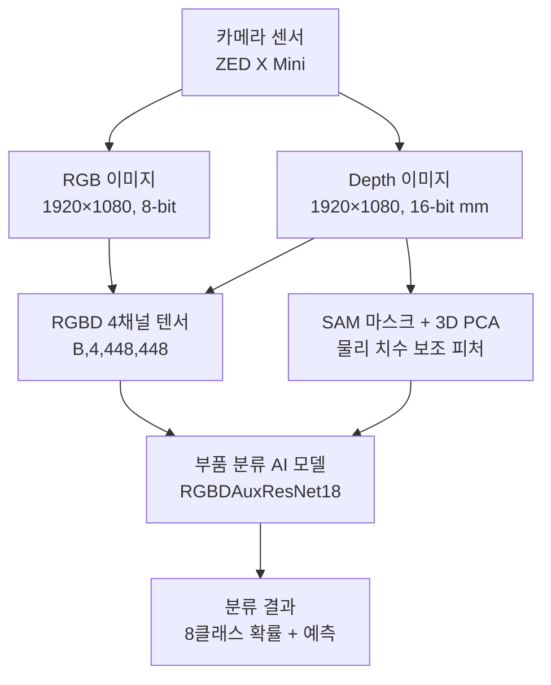

> **그림 2-0.** 전체 데이터 흐름 개요

#### 2.1.2 대상 부품 및 클래스 체계

1차년도에서는 굴착기 도어(Door) 부품을 대상으로 데이터 항목을 정의하였다. 굴착기 3개 모델(E25, E30, E38)의 도어 3종(door_RH, door_LH_FRT, door_LH_RR)을 조합하여 총 **8개 클래스**를 구성하였다. E30과 E38의 door_RH는 동일 부품이므로 `E30_E38_door_RH`로 통합하였다.

| 번호 | 클래스 식별자 | 굴착기 모델 | 부품 유형 | 크기(mm) | 비고 |
|------|-------------|-----------|----------|---------|------|
| 0 | E25_door_LH_FRT | E25 | 좌측 전방 도어 | 828×1140 | |
| 1 | E25_door_LH_RR | E25 | 좌측 후방 도어 | 1141×1140 | |
| 2 | E25_door_RH | E25 | 우측 도어 | 990×1140 | |
| 3 | E30_E38_door_RH | E30/E38 | 우측 도어 | 1191×1140 | E30/E38 동일 부품 통합 |
| 4 | E30_door_LH_FRT | E30 | 좌측 전방 도어 | 869×1140 | E25 대비 +41mm |
| 5 | E30_door_LH_RR | E30 | 좌측 후방 도어 | 1262×1140 | |
| 6 | E38_door_LH_FRT | E38 | 좌측 전방 도어 | 916×1140 | E30 대비 +47mm |
| 7 | E38_door_LH_RR | E38 | 좌측 후방 도어 | 1456×1140 | |

> **표 2-1.** 굴착기 도어 부품 8클래스 체계

<!-- 📷 [그림 삽입 필요] 8종 도어 CAD 렌더링 비교 이미지 (4×2 그리드) -->
<!-- 파일: datasets_cad/각 클래스의 대표 rgb_0000.png 8장을 그리드로 합성 -->

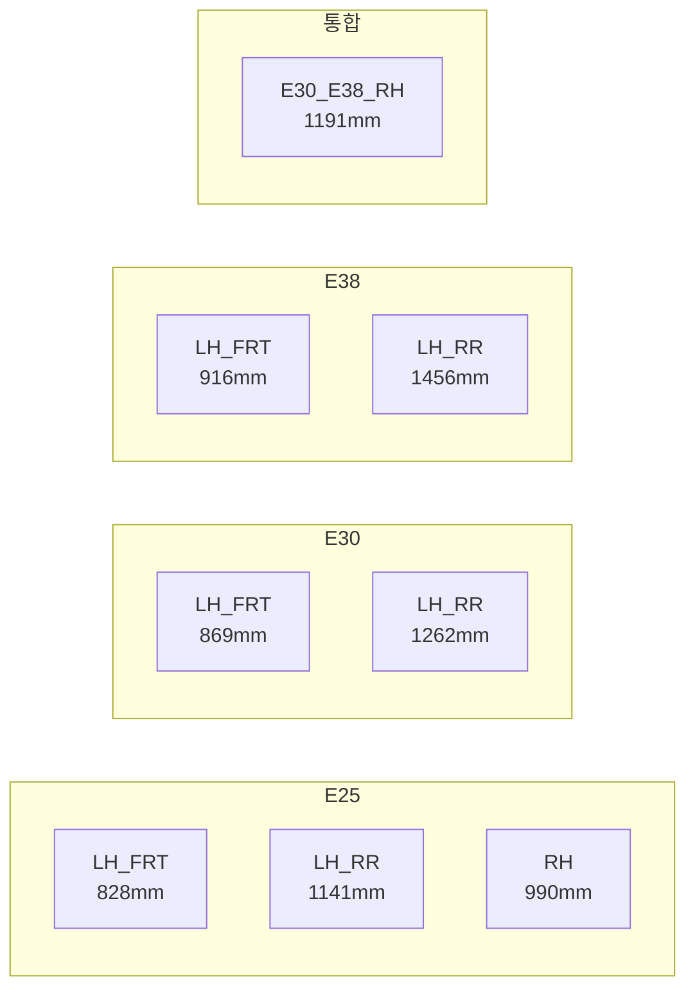

> **그림 2-1.** 도어 8클래스 구조 (굴착기 모델별 × 부품 유형별)

#### 2.1.3 부품 분류용 데이터 항목 정의

부품 분류 모델의 입·출력에 사용되는 데이터 항목을 다음과 같이 정의하였다.

**[입력 데이터 항목]**

| 데이터 항목 | 형식 | 크기 | 단위 | 설명 |
|------------|------|------|------|------|
| RGB 이미지 | 8-bit PNG | 1920×1080 | 픽셀 | ZED X Mini 카메라 촬영 컬러 이미지 |
| Depth 이미지 | 16-bit PNG | 1920×1080 | 밀리미터(mm) | Neural Depth 모드 깊이 맵 |
| RGBD 4채널 텐서 | Float32 Tensor | [B, 4, 448, 448] | 정규화 | 모델 입력용 RGB+Depth 결합 텐서 |
| 물리 치수 보조 피처 | Float32 Tensor | [B, 3] | mm/무차원 | SAM 마스크 + 3D PCA 기반 [width, height, aspect] |

> **표 2-2.** 부품 분류 입력 데이터 항목

**[출력 데이터 항목]**

| 데이터 항목 | 형식 | 단위 | 설명 |
|------------|------|------|------|
| 클래스 레이블 | Integer (0~7) | - | 8개 클래스 중 하나 |
| 분류 확률 | Float32 [8] | 0.0~1.0 | Softmax 확률 분포 |
| 예측 클래스명 | String | - | 클래스 식별자 문자열 |

> **표 2-3.** 부품 분류 출력 데이터 항목

#### 2.1.4 위치 추정용 데이터 항목 정의

부품의 3차원 위치 및 자세를 추정하기 위한 6DoF(6 Degrees of Freedom) 포즈 데이터 항목을 정의하였다.

| 데이터 항목 | 형식 | 단위 | 좌표계 | 설명 |
|------------|------|------|--------|------|
| 3D 위치 (Translation) | [x, y, z] | 미터(m) | 카메라 기준 | 카메라-부품 간 상대 위치 |
| 3D 자세 (Rotation) | [qx, qy, qz, qw] | 쿼터니언 | 카메라 기준 | 부품의 3D 회전 자세 |
| 2D 바운딩 박스 | [x_min, y_min, x_max, y_max] | 픽셀 | 이미지 좌표 | 부품 영역 좌표 |
| 카메라 내부 파라미터 | K 행렬 [3×3] | 픽셀 | - | fx, fy, cx, cy |
| 가림 비율 | Float | 0.0~1.0 | - | 0.0=완전 보임, 1.0=완전 가림 |

> **표 2-4.** 위치 추정 데이터 항목

**[좌표계 규약]**

본 시스템은 카메라 광학(optical) 좌표계를 기준으로 한다.
- X축: 오른쪽 (+)
- Y축: 아래쪽 (+)
- Z축: 전방 (+, 카메라가 바라보는 방향)

#### 2.1.5 메타데이터 관리 체계

데이터셋의 체계적 관리를 위해 2단계 계층적 JSON 메타데이터 구조를 설계하였다.

**[전체 데이터셋 메타데이터 (dataset_info.json)]**

```json
{
  "dataset_name": "Excavator Door Classification Dataset",
  "num_classes": 8,
  "classes": {
    "E25_door_LH_FRT": "E25_door_LH_FRT",
    "E30_door_LH_FRT": "E30_door_LH_FRT",
    "E38_door_LH_FRT": "E38_door_LH_FRT"
  },
  "data_source": "real_camera",
  "camera": "ZED X Mini",
  "depth_enabled": true,
  "created_at": "2026-03-27"
}
```

**[클래스별 메타데이터 (metadata.json)]**

```json
{
  "class_name": "E25_door_LH_FRT",
  "display_name": "E25 Door LH Front",
  "data_source": "real_camera",
  "camera": "ZED X Mini",
  "resolution": [1920, 1080],
  "num_images": 158,
  "capture_method": "video_frame_extraction",
  "frame_extraction_interval": 5,
  "quality_filter": true
}
```

#### 2.1.6 데이터셋 디렉토리 구조

데이터셋은 분류용과 6DoF 포즈용의 두 가지 유형으로 구분하여 관리하며, 각각의 목적에 맞는 어노테이션 형식을 설계하였다.

```
class_estimation/door/
├── datasets/                          # 실물 촬영 RGBD 데이터
│   ├── dataset_info.json              # 전체 메타데이터
│   ├── E25_door_LH_FRT/
│   │   ├── metadata.json              # 클래스 메타데이터
│   │   ├── rgb_0000.png               # RGB 이미지 (8-bit)
│   │   ├── depth_0000.png             # Depth 이미지 (16-bit, mm)
│   │   ├── mask_0000.png              # SAM2 전경 마스크
│   │   └── ...
│   ├── E30_door_LH_FRT/
│   └── ...  (8클래스)
│
├── datasets_cad/                      # CAD 합성 RGBD 데이터
│   ├── dataset_info.json
│   ├── E25_door_LH_FRT/  (500장)
│   └── ...  (8클래스 × 500장 = 4,000장)
│
├── sam_models/                        # SAM 세그멘테이션 모델
│   ├── mobile_sam.pt                  # MobileSAM (39MB)
│   └── sam2.1_hiera_small.pt          # SAM2.1 Small (176MB)
│
└── artifacts/                         # 학습 산출물
    ├── best_door_model_5090.pth       # PyTorch 모델 가중치
    ├── best_door_model_5090.onnx      # ONNX 변환 모델
    ├── class_names_door_5090.json     # 클래스 이름 목록
    └── evaluation_results_door_5090.* # 평가 결과
```

> **그림 2-2.** 데이터셋 디렉토리 구조

---

### 2.2 AI 모델 구축을 위한 하이퍼파라미터 및 학습 데이터 전처리 기법 조사

#### 2.2.1 모델 아키텍처 선정

부품 분류를 위한 기반 모델로 **ResNet18**을 선정하였다. ResNet18은 18개 레이어로 구성된 잔차 학습(Residual Learning) 기반의 합성곱 신경망으로, 약 1,100만 개의 파라미터를 가진 경량 모델이다. ImageNet 데이터셋(1,000개 클래스, 128만 장)으로 사전학습된 가중치를 활용한 **전이학습(Transfer Learning)** 방식을 채택하여, 소규모 데이터셋(수백 장 수준)에서도 안정적인 학습 수렴과 높은 분류 정확도를 확보하였다.

**[RGBD 4채널 입력 확장]**

기존 ResNet18은 RGB 3채널 입력을 전제로 설계되어 있으므로, RGBD 4채널 입력을 지원하기 위해 첫 번째 합성곱 레이어(conv1)를 수정하였다. 3채널 → 4채널로 확장된 새로운 Conv2d 레이어를 생성하고, 기존 ImageNet 사전학습 가중치의 RGB 3채널분은 그대로 복사하며, 추가된 Depth 채널(4번째)은 기존 RGB 3채널 가중치의 **평균값**으로 초기화하였다.

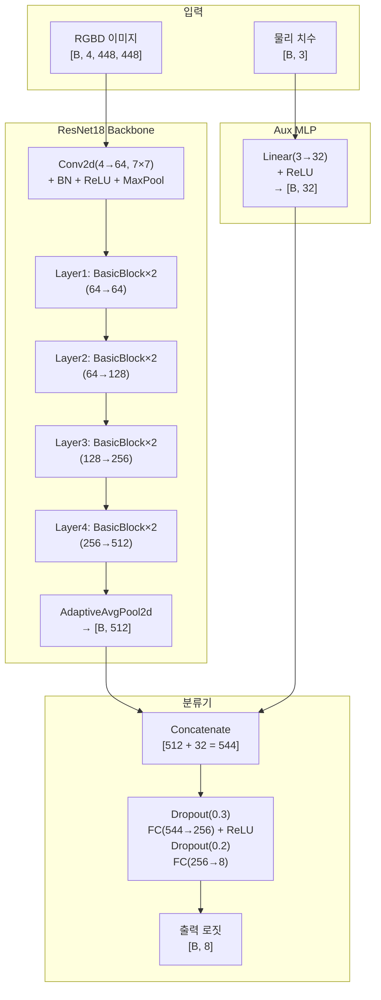

> **그림 2-3.** RGBDAuxResNet18 모델 아키텍처 (CNN 특징 512d + 물리 치수 보조 피처 32d = 544d)

#### 2.2.2 하이퍼파라미터 설정

모델 학습에 사용된 하이퍼파라미터는 사전 실험을 통해 최적값을 탐색하여 결정하였다.

| 하이퍼파라미터 | 설정값 | 선정 근거 |
|--------------|--------|---------|
| 옵티마이저 | Adam (lr=0.001) | 전체 파라미터 단일 학습률 적용 |
| 학습률 스케줄러 | ReduceLROnPlateau | 검증 손실 정체 시 자동 학습률 감소 (patience=3, factor=0.5) |
| 배치 크기 | 64 | RTX 5090 GPU(32GB VRAM) 메모리 기준 최적화, 자동 조정 지원 |
| 최대 에포크 | 60 | 과적합 방지를 위한 충분한 학습 기회 부여 |
| Early Stopping | patience=10 | 검증 정확도 10 에포크 연속 미개선 시 조기 종료 |
| 손실 함수 | CrossEntropyLoss | 다중 클래스 분류의 표준 손실 함수, 클래스 가중치 적용 |
| 클래스 가중치 | 역빈도 기반 | 클래스 불균형 보정 (이미지 수 적은 클래스에 높은 가중치) |
| 데이터 분할 | Train 80% / Test 20% | Stratified Split으로 클래스 비율 유지 (Train 1,004장, Test 252장) |
| Dropout | 0.3 / 0.2 | FC 레이어 과적합 방지 |

> **표 2-5.** 모델 학습 하이퍼파라미터 설정

**[학습 결과 (실물 8종 분류)]**

| 지표 | 값 |
|------|-----|
| 학습 데이터 | 1,256장 (8클래스, Train 1,004장 / Test 252장) |
| 학습 에포크 | 30 에포크에서 최고 정확도 달성 (40 에포크에서 Early Stopping) |
| 학습 시간 | 약 84분 (RTX 5090) |
| 최고 검증 정확도 | **100.00%** |
| 테스트 정확도 | **100.00%** (252/252장) |

> **표 2-6.** 실물 데이터 8종 분류 학습 결과

| 클래스 | 테스트 샘플 수 | 정확도 | Precision | Recall | F1-Score |
|--------|-------------|--------|-----------|--------|----------|
| E25_door_LH_FRT | 32 | 100.00% | 100.00% | 100.00% | 100.00% |
| E25_door_LH_RR | 31 | 100.00% | 100.00% | 100.00% | 100.00% |
| E25_door_RH | 31 | 100.00% | 100.00% | 100.00% | 100.00% |
| E30_E38_door_RH | 31 | 100.00% | 100.00% | 100.00% | 100.00% |
| E30_door_LH_FRT | 32 | 100.00% | 100.00% | 100.00% | 100.00% |
| E30_door_LH_RR | 32 | 100.00% | 100.00% | 100.00% | 100.00% |
| E38_door_LH_FRT | 31 | 100.00% | 100.00% | 100.00% | 100.00% |
| E38_door_LH_RR | 32 | 100.00% | 100.00% | 100.00% | 100.00% |
| **Macro Average** | **252** | **100.00%** | **100.00%** | **100.00%** | **100.00%** |

> **표 2-7.** 클래스별 분류 성능 상세 (8종)

<!-- 📷 [그림 삽입 필요] 학습 곡선 그래프 (Loss/Accuracy vs Epoch) -->
<!-- 파일: artifacts/training_curve_door_5090.png -->
<!-- 내용: 좌측 y축 train_loss (하강), 우측 y축 val_accuracy (상승), x축 epoch -->

<!-- 📷 [그림 삽입 필요] 혼동 행렬(Confusion Matrix) 이미지 -->
<!-- 파일: artifacts/evaluation_results_door_5090.png -->
<!-- 내용: 8×8 혼동 행렬, 대각선이 모두 100%인 완벽 분류 -->

#### 2.2.3 학습 데이터 전처리 기법

수집된 원시 이미지 데이터를 모델에 입력하기 위한 전처리 파이프라인을 설계·구현하였다. 굴착기 부품(도어 등)은 좌·우 방향 및 형상의 **종횡비(aspect ratio)가 분류의 핵심 특징**이므로, 기존의 CenterCrop 방식 대신 **Letterbox 방식**을 채택하였다. Letterbox 방식은 장변을 기준으로 이미지를 축소한 뒤, 단변 방향에 검정(0) 패딩을 추가하여 정사각형을 완성하므로, 원본 이미지의 종횡비가 완전히 보존된다.

**[입력 해상도 448×448 선정 근거]**

초기에는 ImageNet 표준인 224×224 해상도를 사용하였으나, 유사 형상 부품(E25/E30/E38 도어) 간 크기 차이가 40~50mm에 불과한 점이 문제가 되었다. 1920×1080 원본에서 224×224로 축소 시 약 8.6배 다운샘플링되어, 50mm 물리 차이가 약 6픽셀 미만으로 줄어들어 모델이 클래스를 구분하지 못하는 현상이 발생하였다. 이에 해상도를 **448×448**로 2배 증가시켜 유효 픽셀 차이를 약 12픽셀 이상으로 확보하였다.

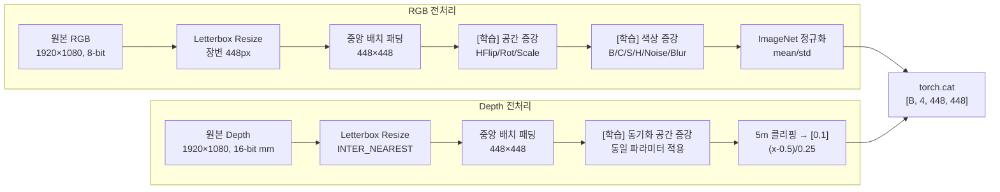

> **그림 2-4.** RGBD 전처리 파이프라인 (RGB·Depth 동기화 공간 변환, RGB 전용 색상 증강)

| 전처리 단계 | 적용 대상 | 방법 | 파라미터 | 비고 |
|------------|----------|------|---------|------|
| Letterbox Resize | RGB, Depth | 장변 기준 비례 축소 | 448px | 종횡비 완전 보존 |
| 중앙 배치 패딩 | RGB, Depth | 검정(0) 패딩으로 448×448 완성 | 448×448 | 동기화 적용 |
| ImageNet 정규화 | RGB | Channel-wise 표준화 | mean/std | ImageNet 통계값 |
| Depth 클리핑 | Depth | 최대 거리 제한 | 5,000mm (5m) | 원거리 노이즈 제거 |
| Depth 스케일링 | Depth | 선형 스케일링 | ÷5000 → [0, 1] | 값 범위 통일 |
| Depth 정규화 | Depth | Z-score 표준화 | (x-0.5)/0.25 | 분포 중심화 |
| 수평 반전 | RGB, Depth | 좌우 반전 (50% 확률) | - | 좌우 시점 다양성 확보 |
| 회전 | RGB, Depth | ±5° | 100% | 회전 불변성 확보 |
| 스케일 변환 | RGB, Depth | 0.9~1.1배 (50% 확률) | - | 카메라 거리 변화 시뮬레이션 |
| 색상 증강 | RGB만 | Brightness/Contrast/Saturation/Hue | 100% | 조명 변화 대응 |
| 가우시안 노이즈 | RGB만 | σ: 3~10 (30% 확률) | - | 센서 노이즈 대응 |
| 가우시안 블러 | RGB만 | kernel=3 (20% 확률) | - | 촬영 포커스 변화 대응 |
| 블러 필터링 | RGB | Laplacian Variance | threshold=100 | 흐릿한 이미지 제거 |

> **표 2-8.** 전처리 기법 상세

#### 2.2.4 SAM + 3D PCA 기반 물리 치수 보조 피처 (Auxiliary Features)

굴착기 도어 부품은 E25/E30/E38 모델 간 40~50mm의 미세한 크기 차이만 존재하여, 이미지 픽셀 정보만으로는 분류가 어렵다. 이를 해결하기 위해 **SAM(Segment Anything Model)** 기반 전경 분리와 **3D PCA(Principal Component Analysis)** 를 활용하여 **시점에 무관한 물리적 치수를 수치 피처로 직접 계산**하고, CNN 특징과 결합하는 방식을 도입하였다.

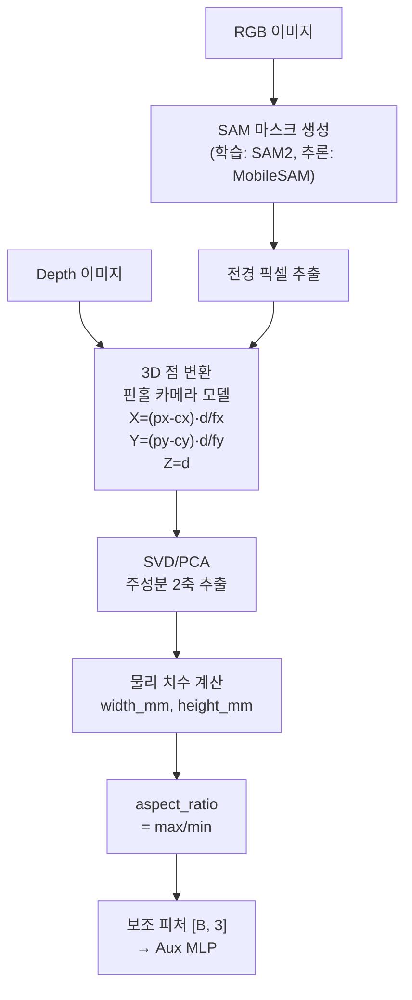

> **그림 2-5.** SAM + 3D PCA 기반 물리 치수 보조 피처 계산 과정

| 보조 피처 | 계산 방법 | 단위 | 의미 |
|----------|----------|------|------|
| physical_width_mm | 3D PCA PC1/PC2 중 큰 축 범위 | mm | 부품 긴 변 |
| physical_height_mm | 3D PCA PC1/PC2 중 작은 축 범위 | mm | 부품 짧은 변 |
| aspect_ratio | width / height | 무차원 | 종횡비 |

> **표 2-8b.** SAM + 3D PCA 기반 물리 치수 보조 피처 (NUM_AUX_FEATURES = 3)

**[SAM 적용 전후 AR 일관성 비교]**

| | SAM 마스크 AR std | Depth-only AR std | 개선 배율 |
|---|---|---|---|
| CAD 데이터 | 0.019~0.035 | 0.112~0.145 | 4~7배 |
| 실제 데이터 | 0.043~0.268 | 0.301~0.510 | 2~10배 |

> **표 2-8c.** SAM 적용 전후 AR 일관성 비교

---

### 2.3 데이터 증강 기법 및 모델 경량화 기술 조사

#### 2.3.1 데이터 증강 기법

실물 데이터셋(1,256장)의 한계를 극복하기 위해, 온라인(학습 시 실시간)과 오프라인(데이터 생성 시) 두 가지 방식의 데이터 증강 기법을 적용하였다.

**[온라인 증강 기법 (학습 시 실시간 적용)]**

| 증강 기법 | 적용 대상 | 파라미터 | 확률 | 목적 | RGBD 동기화 |
|----------|----------|---------|------|------|-----------|
| HorizontalFlip | RGB + Depth | 좌우 반전 | 50% | 좌우 시점 다양성 | 동일 반전 적용 |
| RandomRotation | RGB + Depth | ±5° | 100% | 회전 불변성 확보 | 동일 각도 적용 |
| RandomScale | RGB + Depth | 0.9~1.1배 | 50% | 카메라 거리 변화 대응 | 동일 스케일 적용 |
| AdjustBrightness | RGB만 | factor: 0.6~1.4 | 100% | 밝기 변화 대응 | Depth 미적용 |
| AdjustContrast | RGB만 | factor: 0.6~1.4 | 100% | 대비 변화 대응 | Depth 미적용 |
| AdjustSaturation | RGB만 | factor: 0.7~1.3 | 100% | 채도 변화 대응 | Depth 미적용 |
| AdjustHue | RGB만 | ±0.05 | 100% | 색조 변화 대응 | Depth 미적용 |
| GaussianNoise | RGB만 | σ: 3~10 | 30% | 센서 노이즈 대응 | Depth 미적용 |
| GaussianBlur | RGB만 | kernel: 3 | 20% | 촬영 포커스 변화 대응 | Depth 미적용 |

> **표 2-9.** 온라인 데이터 증강 기법

> **참고**: Depth 채널은 물리적 거리값이므로 색상·노이즈·블러 증강을 적용하면 실제 거리 정보가 왜곡된다. 따라서 이들 증강은 RGB 3채널에만 적용한다. 공간 변환 시 Depth에는 `INTER_NEAREST` 보간법을 사용하여 거리값의 보간에 의한 왜곡을 방지한다.

**[오프라인 증강 기법 (합성 데이터 생성 시 적용)]**

Isaac Sim의 Omni Replicator를 활용한 도메인 랜덤화(Domain Randomization)를 통해, 데이터 생성 단계에서 대규모 오프라인 증강을 수행하였다.

| 랜덤화 항목 | 랜덤화 범위 | 비율/분포 | 목적 |
|------------|-----------|----------|------|
| 배경 | 없음 / 단색 / 팩토리 배경 | 20% / 30% / 50% | 배경 의존성 제거 |
| 카메라 수평 각도 | ±45° | 균등 분포 | 다양한 수평 시점 |
| 카메라 수직 각도 | 15° ~ 75° | 균등 분포 | 다양한 수직 시점 |
| 카메라 거리 | 부품 대각선 기반 | fill 60%, ±8° | 적절한 프레이밍 |
| 조명 방향 | Dome Light 회전 | 연속 분포 | 다양한 그림자 패턴 |

> **표 2-10.** 도메인 랜덤화 항목

#### 2.3.2 모델 경량화 기술 조사

학습된 모델을 엣지 장비(NVIDIA Jetson Orin)에 배포하기 위한 경량화 기술을 조사·적용하였다.

| 기술 | 적용 여부 | 상세 | 효과 |
|------|----------|------|------|
| Transfer Learning | ✅ 적용 | ImageNet 사전학습 가중치 활용 | 학습 시간 단축, 소규모 데이터 대응 |
| ResNet18 경량 모델 | ✅ 적용 | 11M 파라미터 (ResNet50의 44%) | 추론 속도 향상 |
| ONNX 변환 | ✅ 적용 | opset 18, 43.13MB | 크로스 플랫폼 호환성 |
| TensorRT 변환 | ⚠️ 시도 | 출력 불일치 문제 발생 | 향후 재시도 예정 |
| 양자화 (INT8/FP16) | 🔲 미적용 | 1차년도 후반 적용 예정 | 추론 속도 2~4배 향상 예상 |

> **표 2-11.** 모델 경량화 기술 적용 현황

**[TensorRT 변환 시도 및 호환성 분석]**

ONNX 모델을 TensorRT 엔진으로 변환하여 GPU 가속 추론을 시도하였으나, **출력 불일치 문제**가 발생하였다.

| 검증 항목 | PyTorch | TensorRT | 비고 |
|----------|---------|----------|------|
| 입력 데이터 차이 | - | **0** (동일) | 입력은 정확히 일치 |
| 출력 값 차이 (최대) | - | **11.55** | 완전히 다른 출력 |
| 분류 정확도 | 98.53% | 32.35% | 66%p 하락 |

> **표 2-12.** PyTorch vs TensorRT 출력 비교

**[추론 속도 최적화 로드맵]**

| 순위 | 최적화 방법 | 예상 추론 시간 | 난이도 | 현황 |
|------|-----------|-------------|--------|------|
| 1 | Jetson GPU 추론 (PyTorch) | ~10ms/장 | 낮음 | Jetson PyTorch wheel 설치 후 1줄 수정 |
| 2 | FP16 반정밀도 양자화 | ~6ms/장 | 낮음 | GPU 추론과 함께 `model.half()` 적용 |
| 3 | ONNX Runtime (CPU) | ~40ms/장 | 중간 | ONNX 변환 완료, 추론 코드 수정 필요 |
| 4 | TensorRT (GPU) | ~3ms/장 | 높음 | 출력 불일치 문제 해결 필요 |
| 5 | INT8 양자화 | ~2ms/장 | 높음 | 캘리브레이션 데이터셋 및 정확도 검증 필요 |

> **표 2-13.** 추론 속도 최적화 로드맵

---

## 3. 학습 데이터 수집을 위한 하드웨어 장치 선정

### 3.1 부품 인식을 위한 카메라 및 센서 종류 분석

#### 3.1.1 분석 목적

굴착기 부품 인식 시스템에 적합한 센서를 선정하기 위해, 산업용 영상 센서를 유형별로 분류하고 각각의 특성, 장·단점, 적용 환경을 분석하였다.

#### 3.1.2 센서 유형별 분석

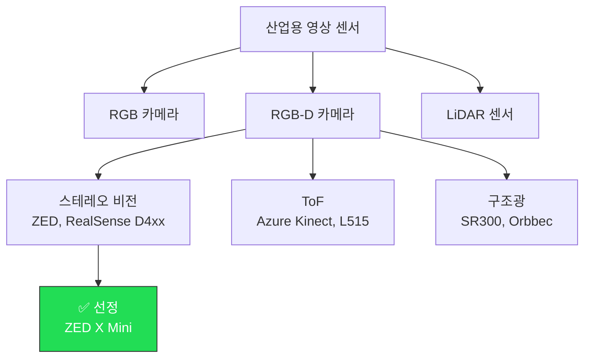

> **그림 3-0.** 센서 유형 분류 및 선정 결과

**[(1) RGB 카메라]**

| 항목 | 내용 |
|------|------|
| 장점 | 고해상도(4K 이상), 높은 FPS(120+), 저가 |
| 단점 | Depth 정보 미제공, 3D 위치 추정 불가 |
| 대표 제품 | FLIR Blackfly, Basler ace, Lucid Vision Triton |

> **표 3-1.** RGB 카메라 특성

**[(2) RGB-D 카메라 — 스테레오 비전 방식]**

| 항목 | 내용 |
|------|------|
| 측정 원리 | 좌/우 카메라 시차(disparity) → 삼각 측량 |
| 장점 | 원거리 측정 가능(15m+), 야외 사용 가능, AI 기반 깊이 보정 가능 |
| 단점 | 텍스처 없는 표면에서 정확도 저하 |
| 대표 제품 | **Stereolabs ZED 시리즈**, Intel RealSense D400 시리즈 |

> **표 3-2.** 스테레오 비전 방식 특성

**[(2) RGB-D 카메라 — ToF 방식]**

| 항목 | 내용 |
|------|------|
| 측정 원리 | IR 광 비행 시간 측정 |
| 장점 | 텍스처 무관, 균일한 깊이맵 |
| 단점 | 태양광 간섭에 취약, 해상도 상대적으로 낮음 |
| 대표 제품 | Microsoft Azure Kinect, Intel RealSense L515 |

> **표 3-3.** ToF 방식 특성

**[(3) LiDAR 센서]**

레이저 기반의 정밀 거리 측정이 가능하나, 단가가 높고 RGB 정보를 별도 카메라와 융합해야 하는 제약이 있다.

### 3.2 주요 제품 스펙 비교를 통한 최적 장비 선정

#### 3.2.1 RGB-D 카메라 제품 비교

| 비교 항목 | ZED X Mini | Intel RealSense D455 | Microsoft Azure Kinect |
|----------|-----------|---------------------|----------------------|
| **깊이 측정 방식** | 스테레오 비전 | 스테레오 비전 + IR | ToF + RGB |
| **RGB 해상도** | **1920×1200** | 1280×800 | 3840×2160 |
| **Depth 해상도** | **1920×1200** | 1280×720 | 640×576 |
| **Depth 범위** | **0.1 ~ 15m** | 0.6 ~ 6m | 0.25 ~ 5.46m |
| **FPS** | 30 / 60 | 30 / 90 | 30 |
| **인터페이스** | **GMSL2** | USB-C 3.1 | USB-C 3.0 |
| **AI 깊이 추정** | **Neural Depth 지원** | 미지원 | 미지원 |
| **방진방수** | **IP66** | 없음 | 없음 |
| **Jetson 호환** | **네이티브 지원** | 별도 드라이버 필요 | 미지원 |

> **표 3-5.** RGB-D 카메라 3종 스펙 비교

<!-- 📷 [그림 삽입 필요] 카메라 3종 제품 이미지 비교 -->

#### 3.2.2 선정 결과: Stereolabs ZED X Mini

| 순위 | 선정 근거 | 상세 설명 |
|------|---------|----------|
| 1 | GMSL2 인터페이스 | NVIDIA Jetson 플랫폼과 네이티브 연동, USB 대역폭 제한 없음 |
| 2 | Neural Depth 모드 | AI 기반 깊이 추정으로 텍스처 없는 금속면 한계 극복 |
| 3 | IP66 방진방수 | 제조 현장 환경(분진, 오일, 습기)에서 장기 운영 가능 |
| 4 | 높은 동시 해상도 | RGB·Depth 모두 1920×1200 |
| 5 | Python SDK (pyzed) | 빠른 프로토타이핑 및 Flask 웹 서버 연동 |

> **표 3-6.** ZED X Mini 선정 근거

#### 3.2.3 컴퓨팅 장비 선정

| 용도 | 장비 | 주요 사양 | 역할 |
|------|------|---------|------|
| 학습 서버 | GPU 워크스테이션 | NVIDIA RTX 5090 (32GB VRAM), CUDA 12.4 | 대규모 데이터셋 고속 학습 |
| 추론 장비 | NVIDIA Jetson Orin + ZED Box Mini | Jetson Orin (ARM), ZED X Mini 카메라 내장 | 현장 실시간 추론 (86ms/장) |
| 시뮬레이션 서버 | GPU 워크스테이션 | NVIDIA GPU, Isaac Sim 구동 | CAD 합성 데이터 생성 |

> **표 3-7.** 컴퓨팅 장비 선정

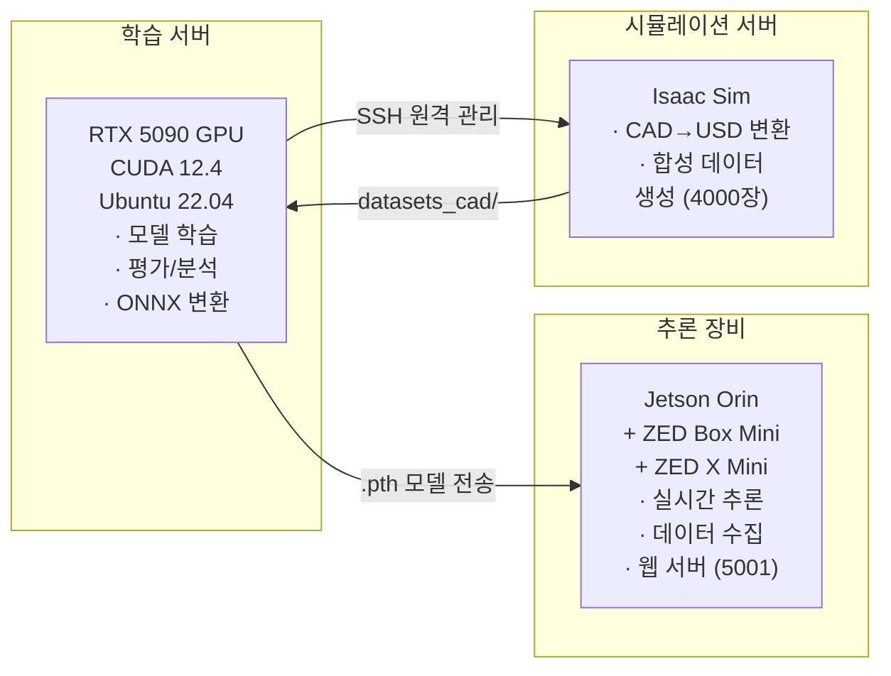

> **그림 3-1.** 하드웨어 시스템 구성도

---

## 4. 학습 데이터 수집을 위한 서버 및 DBMS 환경 구축

### 4.1 카메라/센서 연동을 위한 신호처리 소프트웨어 설계

#### 4.1.1 설계 목적

ZED X Mini 카메라로부터 RGB+Depth 영상 신호를 실시간으로 수집·처리·저장하기 위한 소프트웨어 시스템을 설계·구현하였다. 제조 현장에서 비전문 작업자도 웹 브라우저를 통해 데이터를 수집할 수 있도록 Flask 기반 웹 인터페이스를 제공한다.

#### 4.1.2 시스템 아키텍처

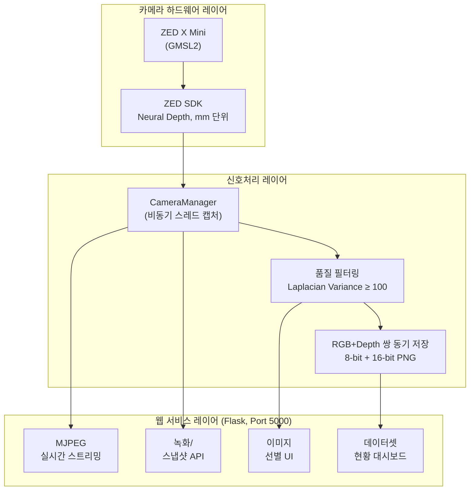

> **그림 4-1.** 데이터 수집 시스템 3계층 아키텍처

<!-- 📷 [그림 삽입 필요] 데이터 수집 웹 UI 스크린샷 -->
<!-- http://localhost:5000 접속 화면 캡처: MJPEG 스트리밍 + 클래스 선택 + 녹화 버튼 -->

#### 4.1.3 핵심 모듈 상세

**[CameraManager 모듈]**

| 기능 | 메서드 | 설명 |
|------|--------|------|
| 초기화 | `__init__()` | ZED SDK 초기화 (HD1080, 30fps, Neural Depth), OpenCV 폴백 |
| 프레임 캡처 | `_capture_loop()` | 백그라운드 스레드에서 RGB+Depth 동기화 캡처 |
| 프레임 획득 | `get_frame()` / `get_depth()` | 최신 RGB/Depth 프레임 반환 (thread-safe) |
| 녹화 시작 | `start_recording()` | N 프레임 간격 자동 추출, 블러 필터링 적용 |
| 녹화 종료 | `stop_recording()` | 추출 결과 통계 반환 |
| 수동 캡처 | `snapshot()` | 현재 프레임 1장 즉시 저장 |

> **표 4-1.** CameraManager 주요 기능

**[신호처리 흐름]**

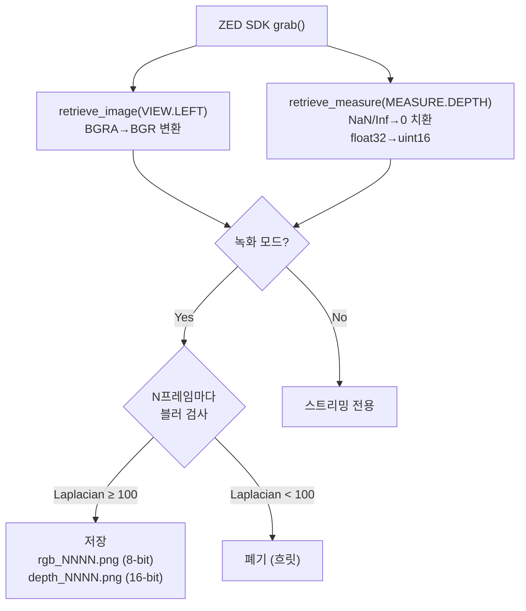

> **그림 4-2.** 신호처리 흐름도

#### 4.1.4 웹 제어 인터페이스 (RESTful API)

| 엔드포인트 | 메서드 | 설명 |
|-----------|--------|------|
| `/` | GET | 메인 UI 페이지 |
| `/video_feed` | GET | MJPEG 실시간 스트리밍 |
| `/api/start_recording` | POST | 녹화 시작 (class_name, interval) |
| `/api/stop_recording` | POST | 녹화 정지 및 추출 결과 반환 |
| `/api/snapshot` | POST | 수동 1장 캡처 |
| `/api/save_selected` | POST | 선별 이미지 저장 |
| `/api/dataset_status` | GET | 클래스별 이미지 수집 현황 |

> **표 4-3.** RESTful API 설계

#### 4.1.5 OpenCV 폴백 지원

ZED SDK가 설치되지 않은 개발 환경에서도 OpenCV 웹캠 기반 폴백(fallback)을 구현하였다. 폴백 모드에서는 RGB 프레임만 제공되며 Depth는 None을 반환한다.

---

### 4.2 수집된 신호 데이터의 효율적 저장/관리를 위한 DBMS 스키마 설계

#### 4.2.1 설계 배경 및 목적

대용량 이미지 바이너리 파일은 파일시스템에 저장하고, 메타데이터·학습 이력·평가 결과는 관계형 데이터베이스(RDBMS)로 관리하는 **하이브리드 저장 구조**를 설계하였다.

#### 4.2.2 설계 원칙

| 원칙 | 설명 |
|------|------|
| 하이브리드 저장 | 이미지는 파일시스템, 메타데이터는 RDBMS |
| 이력 관리 | 촬영 세션 → 이미지 → 학습 → 평가의 전체 생애주기 추적 |
| 확장성 | 새로운 부품 클래스, 센서, 모델 추가 시 스키마 변경 최소화 |
| 데이터 무결성 | 외래 키 제약 및 CHECK 제약 |

> **표 4-4.** DBMS 스키마 설계 원칙

#### 4.2.3 ER 다이어그램

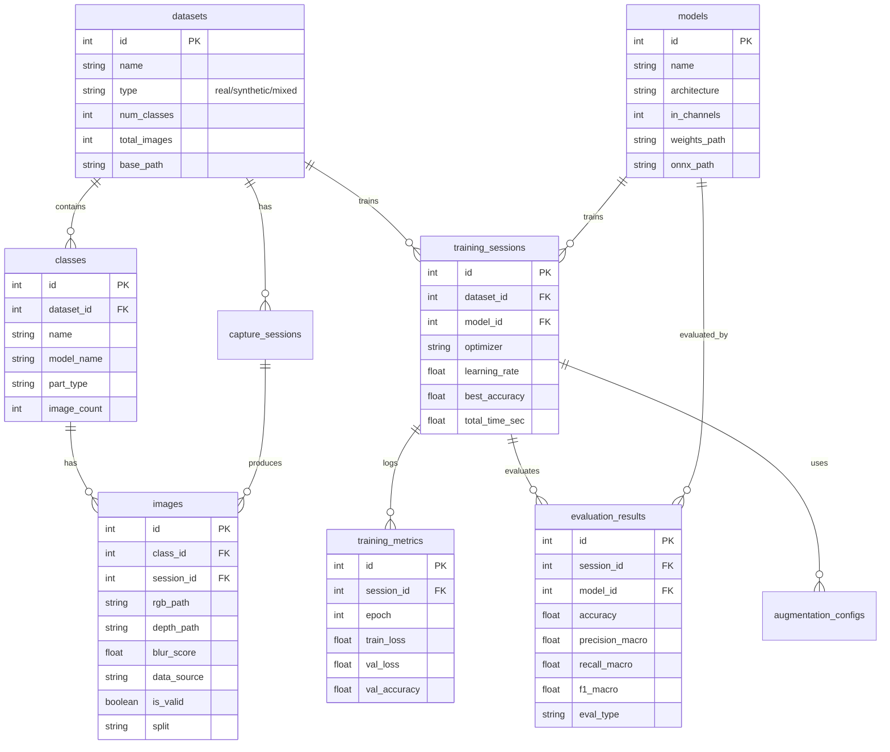

> **그림 4-3.** 데이터베이스 ER 다이어그램 (9개 테이블)

#### 4.2.4 테이블 구성 상세

**[핵심 데이터 테이블 (3개)]**

| 테이블 | 역할 | 주요 컬럼 | 레코드 규모 |
|--------|------|---------|-----------|
| `datasets` | 데이터셋 단위 관리 | name, type, num_classes, base_path | ~10건 |
| `classes` | 클래스 정보 관리 | name, model_name, part_type, cad_available | ~30건 |
| `images` | 개별 이미지 메타데이터 | rgb_path, depth_path, blur_score, data_source, split | ~10,000건 |

> **표 4-5.** 핵심 데이터 테이블

**[이력 관리 테이블 (4개)]**

| 테이블 | 역할 | 레코드 규모 |
|--------|------|-----------|
| `capture_sessions` | 촬영 세션 이력 | ~50건 |
| `training_sessions` | 학습 세션 이력 | ~30건 |
| `training_metrics` | 에포크별 학습 지표 | ~2,000건 |
| `evaluation_results` | 평가 결과 | ~50건 |

> **표 4-6.** 이력 관리 테이블

#### 4.2.5 마이그레이션 로드맵

| 단계 | 내용 | 대상 DBMS | 시기 |
|------|------|---------|------|
| 1단계 | SQLite 기반 메타데이터 DB 구축 | SQLite 3 | 1차년도 잔여기간 |
| 2단계 | Flask 웹 서버에 DB 연동 | SQLite 3 | 1차년도 잔여기간 |
| 3단계 | 학습·평가 스크립트에 DB 로깅 통합 | SQLite 3 | 후속 연구 |
| 4단계 | PostgreSQL 전환 | PostgreSQL 15+ | 후속 연구 |

> **표 4-9.** DBMS 마이그레이션 로드맵

> **참고**: 상세 DDL(전체 9개 테이블), ER 다이어그램, 인덱스 설계, 활용 쿼리 예시, 마이그레이션 스크립트 구조는 별도 문서 **`DBMS_SCHEMA_DESIGN.md`** 에 기술하였다.

---

## 5. 부품 인식 AI 학습용 기초 데이터셋 구축

### 5.1 부품 인식 학습을 위한 모사 시험 환경 구축

#### 5.1.1 구축 배경

굴착기 도어 부품은 실물 확보가 제한적이며(종류당 1장), 다양한 시점·조명·배경 조건의 학습 데이터를 대량으로 확보하기 어렵다. 이를 극복하기 위해, **NVIDIA Isaac Sim** 기반의 디지털 트윈 모사 시험 환경을 구축하였다.

#### 5.1.2 CAD 모델 변환 파이프라인

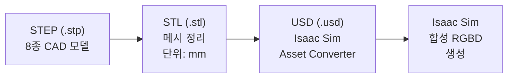

> **그림 5-1.** CAD 모델 변환 파이프라인 (STEP → STL → USD)

#### 5.1.2-1 USD 기반 부품 물리 치수 분석

도어 8종 USD 파일의 바운딩 박스를 분석하여 각 부품의 정확한 물리 치수를 측정하였다.

| 클래스 | 가로(X) mm | 세로(Y) mm | 높이(Z) mm | AR (높이/가로) |
|--------|:---------:|:---------:|:---------:|:----------:|
| E25_door_LH_FRT | 828.0 | 72.7 | 1,140.0 | 1.3768 |
| E25_door_LH_RR | 1,141.0 | 72.0 | 1,140.0 | 0.9991 |
| E25_door_RH | 990.0 | 72.0 | 1,140.0 | 1.1515 |
| E30_door_LH_FRT | **869.0** | 71.3 | 1,140.0 | **1.3119** |
| E30_door_LH_RR | 1,262.0 | 72.0 | 1,140.0 | 0.9033 |
| E30_E38_door_RH | 1,191.0 | 72.0 | 1,140.0 | 0.9572 |
| E38_door_LH_FRT | **916.0** | 71.3 | 1,140.0 | **1.2445** |
| E38_door_LH_RR | 1,456.0 | 72.0 | 1,140.0 | 0.7830 |

> **표 5-1-1.** USD 바운딩 박스 기반 도어 8종 물리 치수

주요 발견:
- **세로(Y)와 높이(Z)는 전 클래스에서 거의 동일** — 차이는 오직 **가로(X)** 에만 존재
- **E30_door_LH_FRT(869mm)와 E38_door_LH_FRT(916mm)** 의 가로폭 차이는 **47mm (5.4%)** 로 매우 미세

#### 5.1.3 가상 촬영 환경 구성

| 환경 구성 요소 | 설정값 | 설명 |
|-------------|-------|------|
| 렌더링 엔진 | Isaac Sim Replicator (RTX 기반 PBR) | 물리 기반 고품질 렌더링 |
| 카메라 해상도 | 1024×1024 픽셀 | RGB + Depth 동시 생성 |
| FOV (시야각) | 60° | 표준 시야각 |
| 카메라 배치 | 구면 좌표계 기반 랜덤 | 수평 ±45°, 수직 15~75° |
| 카메라 거리 | 부품 대각선 기반 동적 계산 | fill 60%, ±8° 구도 |
| 클래스당 이미지 수 | 500장 | 총 8클래스 × 500 = 4,000장 |

> **표 5-2.** 가상 촬영 환경 설정

<!-- 📷 [그림 삽입 필요] Isaac Sim 가상 촬영 환경 스크린샷 -->
<!-- 내용: Isaac Sim에서 도어 USD 모델이 로드된 화면, 카메라 배치, 배경 종류별 렌더링 비교 -->

#### 5.1.4 도메인 랜덤화 (Domain Randomization)

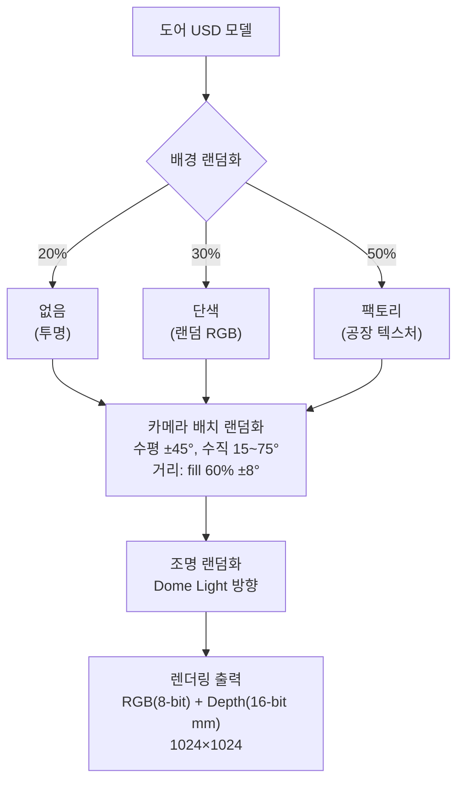

> **그림 5-2.** 도메인 랜덤화 적용 요소

<!-- 📷 [그림 삽입 필요] 도메인 랜덤화 적용 예시 이미지 (동일 도어의 배경 없음/단색/팩토리 비교, 3장 나란히) -->
<!-- 파일: datasets_cad/E25_door_LH_FRT/ 에서 서로 다른 배경의 샘플 3장 선정 -->

---

### 5.2 다양한 조건을 반영한 다중 형태 데이터 수집 및 전처리

#### 5.2.1 데이터 수집 전략

본 연구에서는 **실물 촬영(Track A)** 과 **CAD 합성(Track B)** 의 두 가지 경로로 다중 형태 RGBD 데이터를 수집하였다.

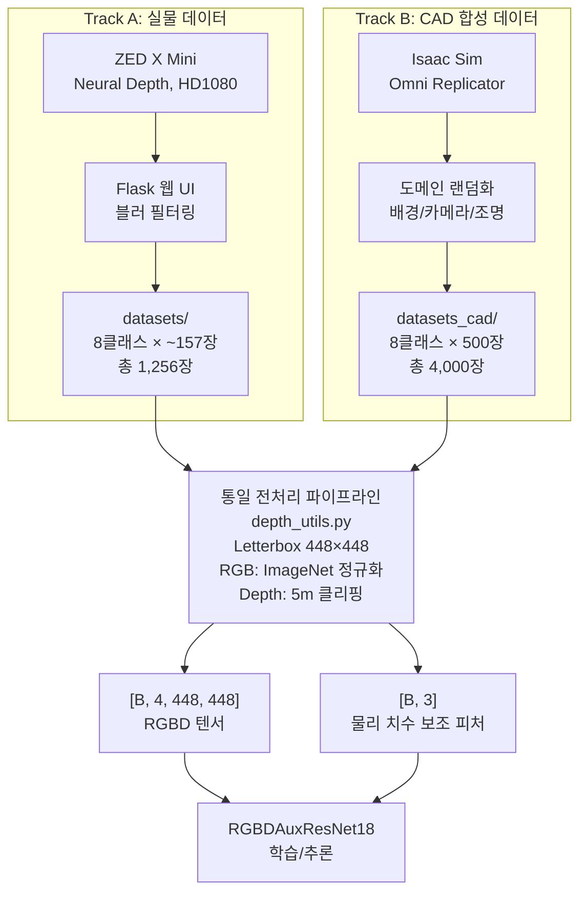

> **그림 5-3.** 이중 경로 데이터 수집 및 통합 전략

#### 5.2.2 실물 RGBD 데이터 수집 (Track A)

| 항목 | 설정 |
|------|------|
| 카메라 | ZED X Mini (GMSL2) |
| Depth 모드 | Neural Depth (AI 기반, mm 단위) |
| 해상도 | 1920×1080 (HD1080), 30fps |
| 수집 방식 | 비디오 스트리밍 + 프레임 추출 (하이브리드) |
| 블러 필터링 | Laplacian Variance, threshold=100 |

> **표 5-3.** 실물 데이터 수집 환경

**[수집 현황]**

| 클래스 | 이미지 수 | 해상도 | 비고 |
|--------|-----------|--------|------|
| E25_door_LH_FRT | 158장 | 1920×1080 | 촬영 완료 |
| E25_door_LH_RR | 155장 | 1920×1080 | 촬영 완료 |
| E25_door_RH | 155장 | 1920×1080 | 촬영 완료 |
| E30_door_LH_FRT | 161장 | 1920×1080 | 촬영 완료 |
| E30_door_LH_RR | 159장 | 1920×1080 | 촬영 완료 |
| E30_E38_door_RH | 154장 | 1920×1080 | 촬영 완료 |
| E38_door_LH_FRT | 154장 | 1920×1080 | 촬영 완료 |
| E38_door_LH_RR | 160장 | 1920×1080 | 촬영 완료 |
| **총합** | **1,256장** | | **8클래스 전체 촬영 완료** |

> **표 5-5.** 실물 데이터 수집 현황

<!-- 📷 [그림 삽입 필요] 실물 촬영 데이터 샘플 이미지 (8종 RGB+Depth 쌍 비교, 4×4 그리드) -->
<!-- 각 클래스의 대표 rgb_0000.png + depth_0000.png를 가로 2열로 배치 -->

#### 5.2.3 CAD 합성 RGBD 데이터 생성 (Track B)

| 항목 | 설정 |
|------|------|
| 생성 도구 | NVIDIA Isaac Sim + Omni Replicator |
| 클래스당 이미지 수 | 500장 |
| 총 생성량 | **4,000장** RGBD 쌍 |
| RGB/Depth 형식 | 8-bit / 16-bit PNG (1024×1024, mm 단위) |
| 도메인 랜덤화 | 배경, 카메라 위치/각도/거리, 조명 방향 |

> **표 5-6.** CAD 합성 데이터 생성 설정

<!-- 📷 [그림 삽입 필요] CAD 합성 데이터 샘플 이미지 (배경별 비교: 없음/단색/팩토리, 각 3장) -->
<!-- 📷 [그림 삽입 필요] 실물 vs 합성 데이터 비교 (동일 클래스의 실물/합성 나란히 배치) -->

---

### 5.3 데이터 증강(Data Augmentation) 기법 적용을 통한 학습용 데이터 다양성 확보

#### 5.3.1 증강 전략 개요

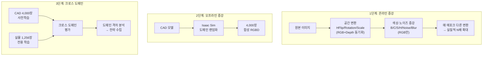

> **그림 5-4.** 3단계 데이터 증강 전략

#### 5.3.2 크로스 도메인 전략 (Domain Adaptation) 실험 결과

CAD 합성 데이터와 실물 데이터 간의 도메인 격차(domain gap)를 정량적으로 분석하였다.

| 평가 방향 | 모델 학습 데이터 | 평가 데이터 | 정확도 | Macro F1 | 오류 패턴 |
|----------|---------------|-----------|--------|----------|----------|
| CAD → Real | CAD 4,000장 | 실물 1,256장 | **14.17%** | 5.44% | 대부분 E30_door_LH_FRT로 편향 |
| Real → CAD | 실물 1,256장 | CAD 4,000장 | **23.35%** | 16.62% | 대부분 E30_E38_door_RH로 편향 |

> **표 5-10b.** 양방향 크로스 도메인 평가 결과

두 방향 모두 랜덤 수준(12.5%) 부근의 극히 낮은 정확도를 보였으며, **실물 촬영 환경과 CAD 렌더링 환경이 근본적으로 다르기 때문**으로 분석된다. 따라서 현 단계에서는 **실물 데이터 직접 학습이 가장 효과적**인 것으로 확인되었다.

#### 5.3.3 증강 효과 검증

**[실물 8종 분류 최종 성능]**

| 지표 | 값 | 비고 |
|------|-----|------|
| 학습 데이터 | 1,004장 (8클래스) | Train 80% |
| 테스트 데이터 | 252장 (8클래스) | Test 20% |
| 테스트 정확도 | **100.00%** (252/252) | 30 에포크 최고, 40 에포크 Early Stopping |
| Precision / Recall / F1 (Macro) | 100.00% / 100.00% / 100.00% | |
| 학습 시간 | 84.06분 | RTX 5090 (32GB VRAM) |

> **표 5-11.** 실물 8종 분류 최종 성능

**[실시간 추론 파이프라인 검증]**

| 지표 | 값 | 비고 |
|------|-----|------|
| 오프라인 평가 정확도 | **100.00%** (252/252) | PyTorch GPU (RTX 5090) |
| CPU 추론 시간 | **86 ms/장** | Jetson Orin 환경 |
| GPU 추론 시간 (예상) | **~10 ms/장** | Jetson GPU 전환 시 |

> **표 5-12.** 실시간 추론 파이프라인 검증

#### 5.3.4 모델 일반화 실험 (Generalization vs Memorization)

모델이 부품의 **형상적 특징(shape)**을 학습했는지, 아니면 특정 개체의 **표면 패턴**을 암기했는지 검증하기 위한 체계적 실험을 수행하였다.

**[실험 1: 극단적 RGB 증강 (Extreme)]**

RGB 이미지에 극단적 증강을 적용하여 표면 질감을 무력화한 뒤 평가하였다. Depth와 Mask는 원본 유지.

| 증강 항목 | 파라미터 | 목적 |
|----------|---------|------|
| Brightness | factor 0.2~3.0 | 밝기 극단 변화 |
| Contrast | factor 0.2~3.0 | 대비 극단 변화 |
| Saturation | factor 0.0~3.0 | 채도 완전 제거~과포화 |
| Hue | ±90° | 색상 완전 변경 |
| Gaussian Noise | sigma 30~60 | 강한 센서 노이즈 |
| Gaussian Blur | kernel 7~15 | 표면 디테일 제거 |

> **표 5-12b.** 극단적 RGB 증강 파라미터

| 클래스 | 원본 정확도 | extreme 증강 후 | 하락폭 |
|--------|:----------:|:----------:|:------:|
| E25_door_LH_FRT | 100.00% | 31.01% | -68.99%p |
| E25_door_LH_RR | 100.00% | 12.90% | -87.10%p |
| E25_door_RH | 100.00% | 29.68% | -70.32%p |
| E30_E38_door_RH | 100.00% | 53.25% | -46.75%p |
| E30_door_LH_FRT | 100.00% | 69.57% | -30.43%p |
| E30_door_LH_RR | 100.00% | 24.53% | -75.47%p |
| E38_door_LH_FRT | 100.00% | 44.16% | -55.84%p |
| E38_door_LH_RR | 100.00% | 15.00% | -85.00%p |
| **전체** | **100.00%** | **35.03%** | **-64.97%p** |

> **표 5-12c.** 극단적 RGB 증강 후 분류 성능

<!-- 📷 [그림 삽입 필요] 극단적 증강 샘플 비교 이미지 (원본 vs extreme 증강, 4장 쌍) -->
<!-- 파일: datasets/와 datasets_aug/ 동일 파일명의 RGB 비교 -->

**[실험 2: 완화 증강 (Moderate) — 마스크 기반 전경 전용 vs 전체 이미지]**

| 증강 항목 | extreme (35%) | moderate 조정 |
|----------|:-------------:|:------------:|
| Brightness | 0.2~3.0 | **0.5~1.8** |
| Contrast | 0.2~3.0 | **0.5~1.8** |
| Saturation | 0.0~3.0 | **0.2~2.0** |
| Hue | ±90° | **±40°** |
| Noise sigma | 30~60 | **15~30** |
| Blur kernel | 7~15 | **3~9** |

> **표 5-12d.** Moderate 증강 파라미터 비교

| 실험 조건 | 증강 범위 | 증강 강도 | 전체 정확도 | Macro F1 |
|----------|----------|----------|:---------:|:--------:|
| 원본 (datasets) | 없음 | 없음 | **100.00%** | 100.00% |
| datasets_aug | 전경만 (mask_only) | moderate | **94.51%** (1187/1256) | 94.56% |
| datasets_aug2 | 전체 이미지 | moderate | **93.39%** (1173/1256) | 93.48% |
| 이전 extreme | 전체 이미지 | extreme | **35.03%** (440/1256) | 29.16% |

> **표 5-12e.** 증강 강도 및 범위별 정확도 비교

| 클래스 | 원본 | moderate 전경만 | moderate 전체 | extreme 전체 |
|--------|:----:|:--------------:|:------------:|:------------:|
| E25_door_LH_FRT | 100% | 96.20% | 90.51% | 31.01% |
| E25_door_LH_RR | 100% | 86.45% | 85.16% | 12.90% |
| E25_door_RH | 100% | 99.35% | 98.06% | 29.68% |
| E30_E38_door_RH | 100% | 97.40% | 97.40% | 53.25% |
| E30_door_LH_FRT | 100% | 99.38% | 99.38% | 69.57% |
| E30_door_LH_RR | 100% | 95.60% | 88.05% | 24.53% |
| E38_door_LH_FRT | 100% | 92.86% | 96.75% | 44.16% |
| E38_door_LH_RR | 100% | 88.75% | 91.88% | 15.00% |

> **표 5-12f.** 클래스별 증강 조건 비교 상세

<!-- 📷 [그림 삽입 필요] 증강 조건별 정확도 비교 막대 그래프 -->
<!-- 내용: 4가지 조건(원본/mask_only/전체moderate/extreme) × 8클래스 그룹 바 차트 -->

**[일반화 실험 종합 분석]**

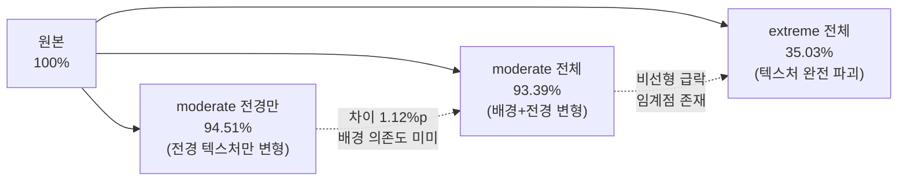

> **그림 5-5.** 증강 강도별 정확도 변화 및 핵심 발견

1. **모델이 RGB 텍스처에 강하게 의존**: extreme 증강 시 65%p 하락
2. **부분적 형상 인식 존재**: 랜덤(12.5%)보다 약 3배 높은 35% 유지 — Depth/Aux 기여
3. **배경 의존도 미미**: mask_only(94.51%) vs 전체(93.39%) 차이 1.12%p
4. **moderate → extreme 사이에 임계점**: 중간 수준 변형에는 견고하나 극단적 변형에 취약
5. **취약 클래스 일관성**: E25_door_LH_RR, E38_door_LH_RR은 모든 조건에서 상대적 저성능

#### 5.3.5 2단계 계층적 분류 전략 실험 및 폐기

8개 클래스를 한 번에 분류하는 대신, 3개 모양 그룹으로 먼저 분류(Step 1) 후 기종 세분류(Step 2)를 시도하였으나, Step 2의 정확도가 매우 낮아 **폐기**하였다.

| 단계 | 정확도 | 비고 |
|------|--------|------|
| Step 1 (모양 분류) | **100.0%** | 형상 차이 뚜렷 |
| Step 2 LH_FRT (기종 분류) | **33.3%** | 랜덤 수준, 실패 |
| Cascade 최종 | **67.2%** | 실용 불가 |

> **표 5-8c.** 2단계 계층적 분류 실험 결과

**교훈**: 유사 형상 부품의 크기 차이는 CNN 픽셀이 아닌 **Depth 기반 물리 치수 보조 피처**로 구별하는 것이 유효함을 확인.

#### 5.3.6 MobileSAM 통합 실시간 추론

실시간 추론 서버(`04_door_realtime_inference.py`)에 MobileSAM을 통합하여, 추론 시에도 SAM 기반 전경 분리 + 3D PCA 물리 치수 계산을 수행한다.

| 항목 | 설정 |
|------|------|
| SAM 모델 | MobileSAM (40.7MB) |
| SAM 추론 시간 | GPU ~10ms |
| SAM 비활성화 | `--no_sam` 옵션 |
| 폴백 | SAM 실패 시 Depth Otsu 이진화 자동 적용 |

> **표 5-13.** MobileSAM 통합 실시간 추론 설정

<!-- 📷 [그림 삽입 필요] 실시간 추론 웹 UI 스크린샷 -->
<!-- http://localhost:5001 접속 화면: 카메라 영상 + 분류 결과 오버레이 + SAM 마스크 시각화 -->

#### 5.3.7 실행 파이프라인 종합

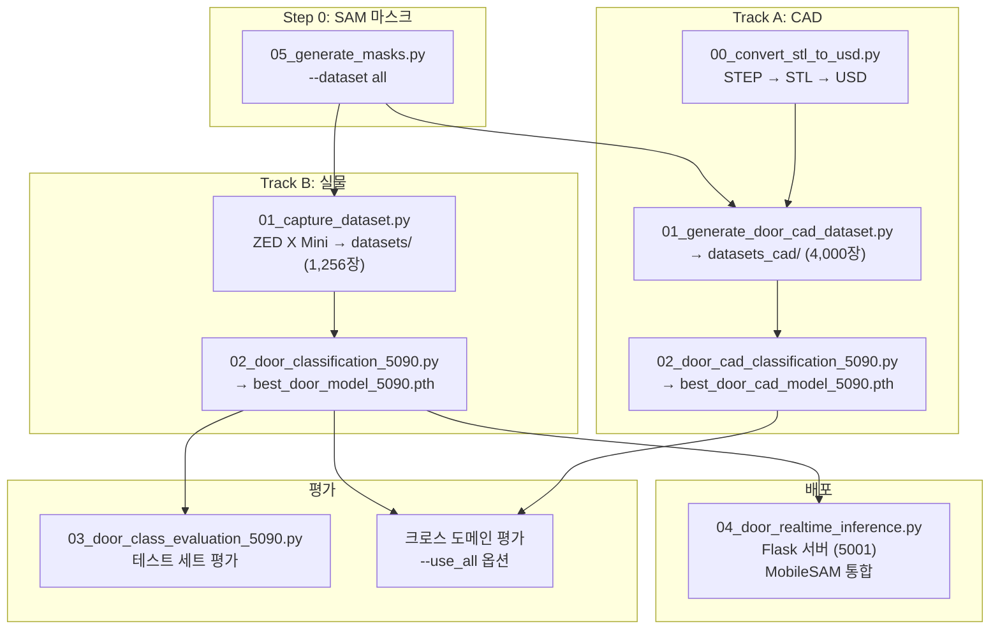

> **그림 5-6.** 전체 실행 파이프라인

---

## 6. 부록: 산출물 목록

### A. 코드 산출물

| 번호 | 파일 | 역할 | 비고 |
|------|------|------|------|
| 0 | `depth_utils.py` | RGBD 공통 유틸리티 (전처리, 모델, SAM+PCA 물리 치수, Dataset) | 모든 스크립트에서 공유 |
| 0 | `camera_utils.py` | ZED X Mini RGB+Depth 캡처 모듈 | OpenCV 폴백 지원 |
| 1 | `00_convert_stl_to_usd.py` | CAD STL → USD 변환 자동화 | Isaac Sim Asset Converter |
| 2 | `01_generate_door_cad_dataset.py` | Isaac Sim CAD 합성 RGBD 데이터 생성 | 클래스당 500장 |
| 0b | `05_generate_masks.py` | SAM2 기반 전경 마스크 일괄 생성 | `--dataset cad/real/all` |
| 3 | `01_capture_dataset.py` | Flask 웹 UI 기반 실물 RGBD 데이터 수집 | 포트 5000 |
| 4 | `02_door_cad_classification_5090.py` | CAD 합성 데이터 RGBD 모델 학습 | RTX 5090 |
| 5 | `02_door_classification_5090.py` | 실물 데이터 RGBD 모델 학습 | RTX 5090 |
| 6 | `03_door_cad_evaluation_5090.py` | CAD 모델 평가 + 크로스 도메인 평가 | `--use_all` 옵션 |
| 7 | `03_door_class_evaluation_5090.py` | 실물 모델 평가 | 혼동 행렬, F1 |
| 8 | `06_generate_augmented_dataset.py` | RGB 증강 데이터셋 생성 (일반화 실험) | `--mask_only` 옵션 |
| 9 | `04_door_realtime_inference.py` | 실시간 RGBD 추론 서버 | MobileSAM 통합, 포트 5001 |
| 10 | `99_dimension_measurement.py` | MobileSAM + ZED 실시간 치수 측정 | 포트 5002 |

> **표 A-1.** 코드 산출물 목록

### B. 모델 산출물

| 파일 | 크기 | 설명 |
|------|------|------|
| `best_door_model_5090.pth` | 44MB | 실물 8종 학습 모델 (100% 정확도) |
| `best_door_model_5090.onnx` | 43MB | ONNX 변환 모델 (opset 18) |
| `best_door_cad_model_5090.pth` | 44MB | CAD 8종 학습 모델 (99.88%) |
| `sam_models/mobile_sam.pt` | 39MB | MobileSAM 실시간 세그멘테이션 |
| `sam_models/sam2.1_hiera_small.pt` | 176MB | SAM2.1 오프라인 마스크 생성 |
| `class_names_door_5090.json` | 1KB | 클래스 이름 목록 |
| `evaluation_results_door_5090.json` | 3KB | 평가 결과 JSON |

> **표 B-1.** 모델 산출물 목록

### C. 데이터셋 산출물

| 데이터셋 | 경로 | 이미지 수 | 형식 |
|---------|------|----------|------|
| 실물 RGBD (8종) | `datasets/` | 1,256장 | RGB(8-bit) + Depth(16-bit) PNG |
| CAD 합성 RGBD (8종) | `datasets_cad/` | 4,000장 | RGB(8-bit) + Depth(16-bit) PNG |
| SAM 전경 마스크 | `datasets/*/mask_*.png` | 5,256장 | 8-bit 이진 마스크 |
| **RGBD 총합** | | **5,256장** | |

> **표 C-1.** 데이터셋 산출물

### D. 문서 산출물

| 문서 | 경로 | 설명 |
|------|------|------|
| DBMS 스키마 설계 | `report/DBMS_SCHEMA_DESIGN.md` | 9개 테이블 DDL, ER 다이어그램 |
| 데이터셋 명세서 | `DATASET_SPECIFICATION.md` | Isaac Sim 데이터셋 형식 정의 |
| 분류 가이드 | `CLASS_ESTIMATION_GUIDE.md` | 분류 파이프라인 사용 매뉴얼 |

> **표 D-1.** 문서 산출물

---

## 7. 1차년도 잔여기간 향후 계획

### 7.1 모델 일반화 성능 검증

| 우선순위 | 항목 | 설명 | 예상 난이도 |
|---------|------|------|-----------|
| 1 | 동일 종류 다른 개체 검증 | 같은 클래스의 **다른 실물 부품**에 대한 추론 정확도 검증 (현재 각 클래스당 1개 개체에서 촬영) | 중 |
| 2 | 촬영 환경 변동 검증 | 조명, 배경, 카메라 거리/각도가 크게 다른 환경에서의 강건성 테스트 | 중 |
| 3 | 시간 경과 후 재검증 | 부품 표면 상태 변화(산화, 오염 등)에 따른 정확도 변화 모니터링 | 낮 |

### 7.2 모델 성능 개선

| 우선순위 | 항목 | 설명 | 예상 난이도 |
|---------|------|------|-----------|
| 1 | E30/E38 LH_FRT 구분 강화 | 47mm(5.4%) 미세 차이 → 표면 디테일 활용 방안 연구 | 높 |
| 2 | 데이터 증강 고도화 | CutMix, MixUp, Style Transfer 등 고급 증강 기법 적용 | 중 |
| 3 | 크로스 도메인 적응 | CAD-Real 도메인 격차 해소 (DANN, MMD Loss 등) | 높 |
| 4 | Depth 채널 활용도 향상 | 일반화 실험에서 확인된 RGB 의존도(65%)를 줄이고 Depth/Shape 활용 증대 | 중 |

### 7.3 배포 및 운영

| 우선순위 | 항목 | 설명 | 예상 난이도 |
|---------|------|------|-----------|
| 1 | Jetson GPU 추론 전환 | CPU 86ms → GPU ~10ms 개선 | 낮 |
| 2 | FP16 양자화 적용 | `model.half()` 적용 (~6ms) | 낮 |
| 3 | TensorRT 변환 문제 해결 | ONNX → TensorRT 출력 불일치 해결 | 높 |
| 4 | DBMS 마이그레이션 1단계 | 파일시스템 → SQLite 전환 | 중 |

### 7.4 데이터셋 확장

| 우선순위 | 항목 | 설명 | 예상 난이도 |
|---------|------|------|-----------|
| 1 | 다중 개체 데이터 수집 | 각 클래스별 2~3개 이상의 서로 다른 실물 부품 촬영 | 중 |
| 2 | 혼합 학습 데이터셋 | CAD + Real 데이터를 효과적으로 결합하는 학습 전략 개발 | 높 |

### 7.5 위치 추정 모듈 개발

| 우선순위 | 항목 | 설명 | 예상 난이도 |
|---------|------|------|-----------|
| 1 | 6DoF 포즈 추정 모델 학습 | Depth 기반 포즈 추정 모델 v4 학습 및 평가 | 높 |
| 2 | 분류-위치 통합 파이프라인 | 분류 결과 기반 부품 3D 위치/자세 추정 연동 | 높 |

> **참고**: 위치 추정 모듈은 `pos_estimation/` 디렉토리에서 별도 개발 중이며, Isaac Sim 기반 4클래스(arm_link_25/30, boom_link_25/30) 6DoF 포즈 데이터셋(8,000장)을 구축하여 Depth 기반 포즈 추정 모델(v1~v4)의 실험을 진행하고 있다. 상세 내용은 향후 보고서에서 다룰 예정이다.

---

**문서 작성일**: 2026년 3월 28일  
**최종 수정일**: 2026년 3월 28일 09:30
