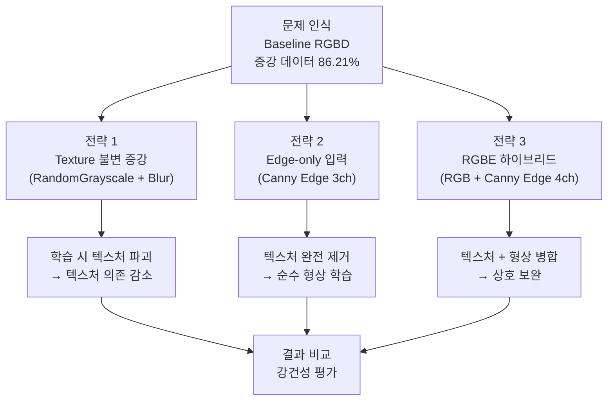
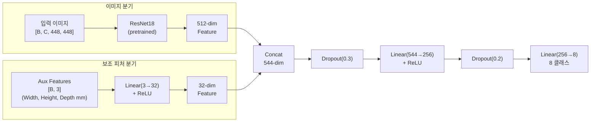
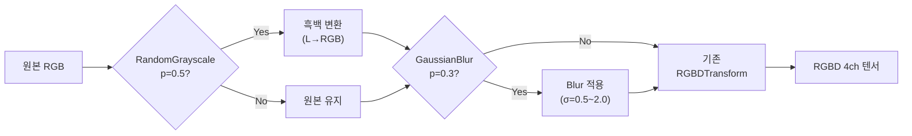
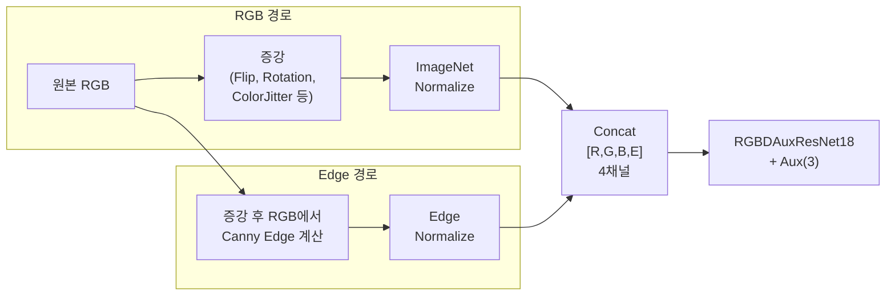
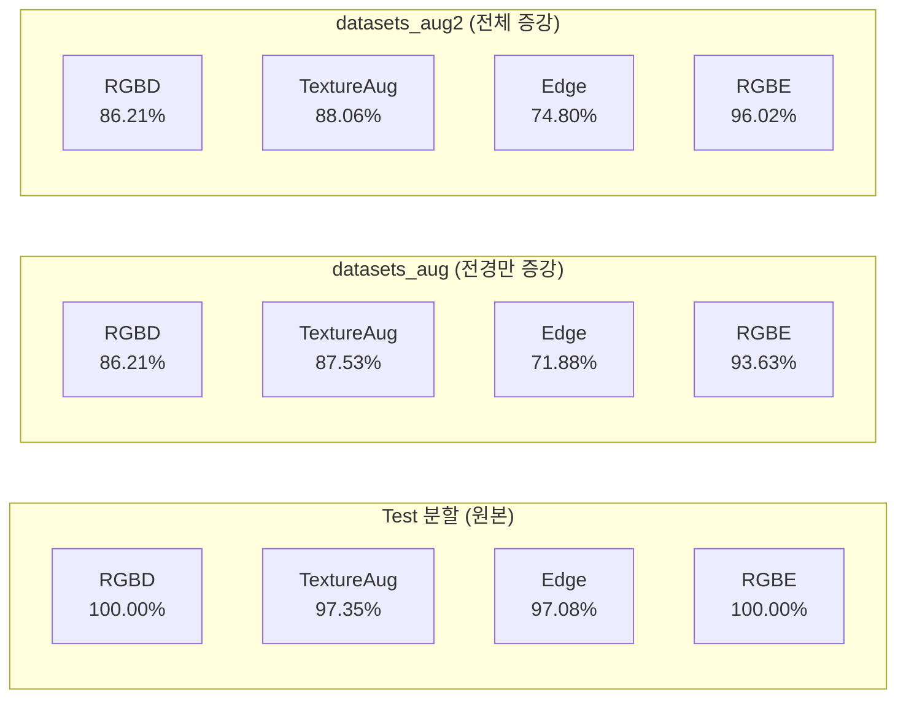
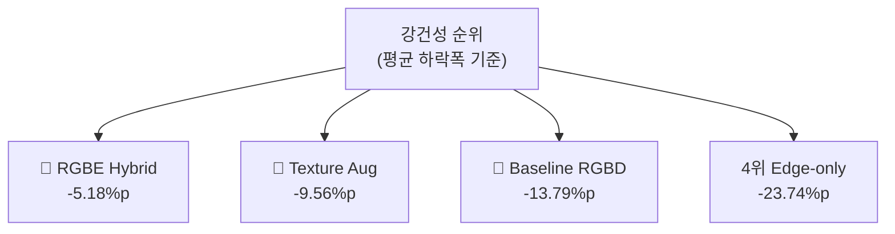
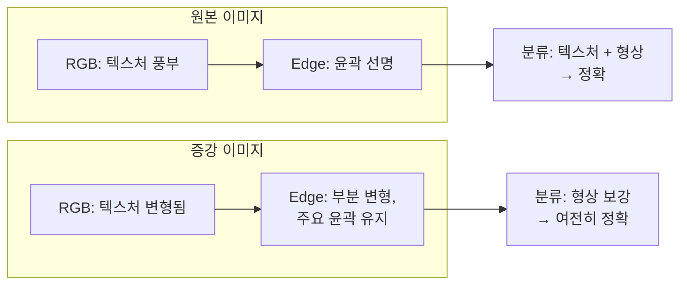

# 굴착기 도어 부품 분류 모델 강건성 개선 실험 보고서

**과제명**: 건설장비 부품인식 및 위치추정 기술 개발  
**연구 기간**: 1차년도  
**작성일**: 2026년 3월 31일  
**작성자**: 한국건설기계연구원 스마트건설장비연구실

---

## 1. 연구 배경 및 문제 인식

### 1.1 기존 모델의 한계

1차년도 연구에서 개발한 **Baseline RGBD 모델**(`02_door_classification_5090.py`)은 실물 도어 8종 분류에서 Test 분할(377장) 기준 **100.00%** 정확도를 달성하였다. 그러나 오프라인 증강 데이터셋(`datasets_aug`, `datasets_aug2`)을 통한 일반화 실험에서 정확도가 **86.21%**로 약 14%p 하락하는 현상이 관측되었다.

이 결과는 모델이 부품의 **구조적 형상(shape)**보다 촬영 환경에 종속적인 **표면 텍스처(RGB texture)**에 과도하게 의존하고 있음을 시사한다. 실제 현장에서는 조명 조건, 부품 표면 상태(오염, 마모, 도장), 카메라 노출 등이 학습 데이터와 다를 수 있으므로, 텍스처 변형에 대한 강건성(robustness) 확보가 필수적이다.

### 1.2 개선 목표

| 목표 | 설명 |
|------|------|
| 텍스처 불변성 향상 | RGB 색상/질감 변형에도 안정적으로 분류 |
| 구조적 특징 활용 극대화 | 부품의 윤곽·형상 정보를 명시적으로 활용 |
| 실무 적용 가능성 유지 | Test 분할 정확도 95% 이상 유지 |

### 1.3 개선 전략 개요

> **그림 1.** 모델 강건성 개선 전략 흐름도

---

## 2. 실험 환경 및 공통 설정

### 2.1 하드웨어·소프트웨어 환경

| 항목 | 사양 |
|------|------|
| GPU | NVIDIA GeForce RTX 5090 (32GB VRAM) |
| OS | Ubuntu 24.04.4 LTS (Linux 6.17.0) |
| 프레임워크 | PyTorch 2.11.0+cu130 |
| CUDA | 13.0 |
| Python | 3.x (Miniconda isaac311 환경) |
| 보조 라이브러리 | scikit-learn 1.8.0, OpenCV, torchvision 0.24.1 |

### 2.2 공통 학습 설정

| 항목 | 값 |
|------|-----|
| 데이터셋 | 실물 도어 8종 × ~157장/종 = 1,256장 (RGBD + SAM 마스크) |
| 데이터 분할 | Train 70% (879장) / Test 30% (377장), stratified |
| 랜덤 시드 | 42 (재현성 보장) |
| 입력 크기 | 448×448 |
| 배치 사이즈 | 64 (RTX 5090 자동 최적화) |
| 옵티마이저 | Adam (lr=0.001) |
| 스케줄러 | ReduceLROnPlateau (patience=3, factor=0.5) |
| 조기 종료 | patience=10 |
| 최대 에폭 | 60 |
| 손실 함수 | CrossEntropyLoss (클래스 가중치 적용) |

### 2.3 평가 데이터셋

| 데이터셋 | 설명 | 평가 이미지 수 |
|----------|------|:-----------:|
| datasets (Test 분할) | 원본 이미지의 Test 분할 | 377장 |
| datasets_aug | SAM 마스크 기반 **전경만** moderate 증강 | 377장 (Test 분할 기준) |
| datasets_aug2 | **전체 이미지** moderate 증강 | 377장 (Test 분할 기준) |

> **표 2-1.** 평가 데이터셋 구성

데이터 누출(data leakage) 방지를 위해, 학습 시 사용된 Test 분할에 해당하는 이미지만 증강 데이터셋에서 추출하여 평가하였다.

### 2.4 대상 클래스 (8종)

| 클래스 | 설명 | Train | Test |
|--------|------|:-----:|:----:|
| E25_door_LH_FRT | 2.5톤 좌측 전면 도어 | 111 | 47 |
| E25_door_LH_RR | 2.5톤 좌측 후면 도어 | 108 | 47 |
| E25_door_RH | 2.5톤 우측 도어 | 108 | 47 |
| E30_E38_door_RH | 3.0/3.8톤 공용 우측 도어 | 108 | 46 |
| E30_door_LH_FRT | 3.0톤 좌측 전면 도어 | 113 | 48 |
| E30_door_LH_RR | 3.0톤 좌측 후면 도어 | 111 | 48 |
| E38_door_LH_FRT | 3.8톤 좌측 전면 도어 | 108 | 46 |
| E38_door_LH_RR | 3.8톤 좌측 후면 도어 | 112 | 48 |

---

## 3. 모델 아키텍처

### 3.1 공통 구조: Aux-ResNet18

모든 모델은 **ResNet18 백본 + 물리 치수 보조 피처(Aux) MLP**의 2-branch 아키텍처를 공유한다. 이미지 입력 채널 구성만 모델별로 다르다.

> **그림 2.** Aux-ResNet18 공통 아키텍처

**보조 피처(Aux Features)**는 Depth 맵과 SAM 마스크를 활용한 3D PCA 기반 물리 치수(Width, Height, Depth)로, 유사 형상 부품(E25/E30/E38 LH_FRT 등)의 **크기 차이**를 보완하는 역할을 한다. 이 피처는 모든 모델에서 동일하게 Depth 맵에서 계산된다.

### 3.2 모델별 입력 채널 구성

| 모델 | 입력 채널 | 채널 구성 | ImageNet 활용 | 스크립트 |
|------|:--------:|----------|:----------:|---------|
| Baseline RGBD | 4ch | R, G, B, D | RGB 3ch 전이 + D 평균 초기화 | `02_door_classification_5090.py` |
| Texture Aug RGBD | 4ch | R, G, B, D | RGB 3ch 전이 + D 평균 초기화 | `02_door_classification_texture_aug_5090.py` |
| Edge-only | 3ch | E, E, E | 3ch 그대로 전이 | `02_door_classification_edge_5090.py` |
| RGBE Hybrid | 4ch | R, G, B, E | RGB 3ch 전이 + E 평균 초기화 | `02_door_classification_rgbe_5090.py` |

> **표 3-1.** 모델별 입력 채널 구성

---

## 4. 개선 전략 상세

### 4.1 전략 1: Texture 불변 증강 (Texture-Invariant Augmentation)

#### 4.1.1 개념 및 동기

모델 아키텍처를 변경하지 않고, **학습 단계의 데이터 증강을 강화**하여 텍스처 의존도를 낮추는 전략이다. 기존 온라인 증강(RGBDTransform)에 추가로 RGB 텍스처를 적극적으로 파괴하는 증강을 적용한다.

#### 4.1.2 TextureInvariantRGBDTransform

기존 `RGBDTransform`을 래핑하여 다음 2가지 증강을 추가:

| 증강 | 확률 | 파라미터 | 목적 |
|------|:----:|---------|------|
| **RandomGrayscale** | 50% | RGB → L → RGB | 색상 정보 완전 제거, 명도 기반 학습 유도 |
| **GaussianBlur** | 30% | sigma 0.5~2.0 | 미세 표면 텍스처(스크래치, 도장 패턴) 제거 |

> **표 4-1.** Texture 불변 증강 설정

> **그림 3.** Texture 불변 증강 파이프라인

**핵심 원리**: 학습 이미지의 50%가 흑백으로 변환되면, 모델은 색상(Hue, Saturation)에 의존할 수 없게 되어 **형상/윤곽 기반 피처**를 학습하도록 유도된다. Depth 채널과 Aux 피처는 변경하지 않아 물리적 형상 정보를 보존한다.

#### 4.1.3 학습 결과

| 항목 | 값 |
|------|-----|
| 최고 Val Accuracy | **97.35%** |
| 조기 종료 에폭 | 48 |
| 학습 시간 | 62.84분 |
| 모델 파라미터 | 11,321,352 |

> **표 4-2.** Texture 불변 증강 모델 학습 결과

**학습 수렴 과정 분석**:

| 에폭 | Train Acc | Val Acc | 비고 |
|:----:|:---------:|:-------:|------|
| 1 | 12.74% | 21.22% | 학습 초기, 흑백 증강으로 수렴 느림 |
| 10 | 58.48% | 64.72% | Baseline 대비 지연 수렴 |
| 20 | 77.36% | 62.07% | Val 변동 큼 (증강 강도 높음) |
| 30 | 83.96% | 86.47% | 안정화 시작 |
| 38 | - | **97.35%** | 최고 성능 달성 |
| 48 | - | - | Early Stopping |

> **표 4-3.** Texture 불변 증강 모델 학습 과정

Baseline RGBD(25 에폭 100%)에 비해 수렴이 느리고 Val Accuracy 변동폭이 크지만, 이는 **강한 증강이 모델의 단순 암기를 방지**하여 더 일반적인 피처를 학습하도록 유도한 결과로 해석된다.

### 4.2 전략 2: Edge-only 입력 (Canny Edge)

#### 4.2.1 개념 및 동기

RGB 텍스처에 대한 의존을 **근본적으로 차단**하기 위해, 입력 이미지를 Canny Edge 검출 결과로 대체하는 전략이다. 부품의 윤곽선(edge)과 구조적 형태만으로 분류 가능한지 검증한다.

#### 4.2.2 EdgeAuxResNet18 아키텍처

| 항목 | 설명 |
|------|------|
| 모델 클래스 | `EdgeAuxResNet18` (`edge_utils.py`) |
| 입력 채널 | 3ch (E, E, E) — Canny Edge를 3채널 복제 |
| Backbone | ResNet18 (ImageNet pretrained, 3ch 그대로 사용) |
| 보조 피처 | 동일 (3개, Depth 기반 물리 치수) |
| 파라미터 수 | 11,321,352 (기존 대비 동일) |

> **표 4-4.** Edge-only 모델 아키텍처

**Canny Edge 3채널 복제의 근거**: ImageNet pretrained 가중치는 RGB 3채널 입력을 전제한다. Edge 이미지를 (E, E, E)로 3채널 복제하면 pretrained 가중치의 **저수준 피처 추출기**(에지 검출, 그래디언트 방향 등)를 그대로 활용할 수 있다.

> **그림 4.** Edge-only 입력 전처리 파이프라인

#### 4.2.3 EdgeTransform 증강 전략

Edge-only 모델에서는 **색상 증강이 무의미**하므로, 공간 변환만 적용한다:

| 증강 | Train | Val |
|------|:-----:|:---:|
| Rotation | ±15° | 없음 |
| Scale | 90~110% (p=0.5) | 없음 |
| Canny Threshold | Low 60~100, High 160~240 (랜덤) | Low 80, High 200 (고정) |
| ColorJitter | **없음** | 없음 |

> **표 4-5.** Edge-only 증강 설정

학습 시 Canny Threshold를 랜덤화하여 **에지 검출 결과의 변동에 대한 강건성**을 부여한다.

#### 4.2.4 학습 결과

| 항목 | 값 |
|------|-----|
| 최고 Val Accuracy | **97.08%** |
| 조기 종료 에폭 | 49 |
| 학습 시간 | 66.35분 |

> **표 4-6.** Edge-only 모델 학습 결과

| 에폭 | Train Acc | Val Acc | 비고 |
|:----:|:---------:|:-------:|------|
| 1 | 14.33% | 26.79% | Edge 정보만으로 초기 학습 |
| 10 | 57.45% | 69.50% | 형상 패턴 학습 시작 |
| 20 | 79.75% | 85.41% | |
| 35 | 93.97% | **97.08%** | 최고 성능 달성 |
| 49 | - | - | Early Stopping |

> **표 4-7.** Edge-only 모델 학습 과정

Test 분할 97.08% 달성으로 **순수 형상 정보만으로도 높은 분류 성능**이 가능함을 확인하였다. 다만 E30_door_LH_RR(85.42%) 클래스에서 상대적으로 낮은 정확도를 보였다.

### 4.3 전략 3: RGBE 하이브리드 (RGB + Canny Edge)

#### 4.3.1 개념 및 동기

Edge-only 모델이 원본 테스트에서 높은 성능(97.08%)을 보였으나, 텍스처 정보를 완전히 배제함으로써 **보완적인 시각 단서(surface detail)**를 잃을 수 있다. 따라서 RGB의 풍부한 시각 정보와 Edge의 구조적 정보를 **동시에 활용**하는 하이브리드 접근을 시도한다.

#### 4.3.2 RGBE 입력 구성

Depth(D) 채널 대신 **Canny Edge(E) 채널**을 사용하는 4채널 입력이다:

| 채널 | 인덱스 | 설명 | 정규화 |
|------|:------:|------|--------|
| R | 0 | 적색 | ImageNet (μ=0.485, σ=0.229) |
| G | 1 | 녹색 | ImageNet (μ=0.456, σ=0.224) |
| B | 2 | 청색 | ImageNet (μ=0.406, σ=0.225) |
| E | 3 | Canny Edge | (x - 0.5) / 0.25 |

> **표 4-8.** RGBE 4채널 구성

`RGBDAuxResNet18` 모델 클래스를 그대로 재사용한다. 기존 D 채널 자리에 E 채널을 넣는 구조로, ResNet18의 conv1 레이어에서 4채널 입력을 처리한다 (RGB 3ch → ImageNet 전이, E 1ch → RGB 채널 평균값으로 초기화).

> **그림 5.** RGBE 하이브리드 입력 파이프라인

#### 4.3.3 RGBETransform 증강 전략

**핵심 설계**: Edge 채널은 증강이 적용된 RGB에서 계산되므로, RGB 증강과 Edge가 자연스럽게 **공간적 일관성**을 유지한다.

| 증강 | 파라미터 | 비고 |
|------|---------|------|
| Horizontal Flip | p=0.5 | RGB에 적용 → Edge 자동 반영 |
| Rotation | ±15° | RGB에 적용 → Edge 자동 반영 |
| Scale | 90~110% (p=0.5) | RGB에 적용 → Edge 자동 반영 |
| Brightness | 0.6~1.4 | RGB에만 영향 |
| Contrast | 0.6~1.4 | RGB에만 영향, Edge에 간접 영향 |
| Saturation | 0.7~1.3 | RGB에만 영향 |
| Hue | ±0.05 | RGB에만 영향 |
| Gaussian Noise | σ=3~10 (p=0.3) | RGB에만 적용 |
| Gaussian Blur | kernel=3 (p=0.2) | RGB에 적용, Edge 세밀도에 영향 |
| Canny Threshold | Low 60~100, High 160~240 | Edge 변동성 부여 |

> **표 4-9.** RGBE 하이브리드 증강 설정

#### 4.3.4 Depth 활용 방식

RGBE 모델에서 Depth는 **모델 입력에는 사용되지 않지만**, 보조 피처(Aux) 계산에는 여전히 활용된다:

| Depth 활용 | RGBD (Baseline) | RGBE (Hybrid) |
|-----------|:------:|:------:|
| 모델 입력 (4th 채널) | Depth (정규화) | Canny Edge |
| Aux 피처 (물리 치수) | Depth → 3D PCA | Depth → 3D PCA |

> **표 4-10.** Depth 활용 방식 비교

#### 4.3.5 학습 결과

| 항목 | 값 |
|------|-----|
| 최고 Val Accuracy | **100.00%** |
| 조기 종료 에폭 | 43 |
| 학습 시간 | 58.53분 |
| 모델 파라미터 | 11,321,352 |

> **표 4-11.** RGBE 하이브리드 모델 학습 결과

| 에폭 | Train Acc | Val Acc | 비고 |
|:----:|:---------:|:-------:|------|
| 1 | 13.20% | 23.61% | 학습 초기 |
| 10 | 56.54% | 66.31% | |
| 15 | 70.31% | 80.90% | |
| 24 | - | **97.61%** | |
| 29 | - | **99.20%** | |
| 33 | - | **100.00%** | 최고 성능 달성 |
| 43 | - | - | Early Stopping |

> **표 4-12.** RGBE 하이브리드 모델 학습 과정

Baseline RGBD와 동일한 100.00% Test 정확도를 달성하면서, 학습 수렴 과정도 유사한 패턴을 보였다.

---

## 5. 강건성 평가 결과

### 5.1 전체 정확도 비교

| 모델 | Test 분할 (377장) | datasets_aug (전경만 증강) | datasets_aug2 (전체 증강) |
|------|:---------:|:---------:|:---------:|
| **Baseline RGBD** | **100.00%** (377/377) | 86.21% (325/377) | 86.21% (325/377) |
| **Texture Aug RGBD** | 97.35% (367/377) | 87.53% (330/377) | 88.06% (332/377) |
| **Edge-only** | 97.08% (366/377) | 71.88% (271/377) | 74.80% (282/377) |
| **RGBE Hybrid** | **100.00%** (377/377) | **93.63%** (353/377) | **96.02%** (362/377) |

> **표 5-1.** 모델별 전체 정확도 비교

> **그림 6.** 모델별 정확도 비교 개요

### 5.2 Macro F1-Score 비교

| 모델 | Test 분할 | datasets_aug | datasets_aug2 |
|------|:---------:|:---------:|:---------:|
| Baseline RGBD | 100.00% | 86.73% | 86.65% |
| Texture Aug RGBD | 97.38% | 87.84% | 88.34% |
| Edge-only | 97.07% | 72.32% | 75.08% |
| **RGBE Hybrid** | **100.00%** | **93.66%** | **96.05%** |

> **표 5-2.** 모델별 Macro F1-Score 비교

### 5.3 클래스별 상세 성능 (datasets_aug — 전경만 증강)

| 클래스 | Baseline RGBD | Texture Aug | Edge-only | RGBE Hybrid |
|--------|:-----------:|:----------:|:---------:|:----------:|
| E25_door_LH_FRT | 95.74% | 80.85% | 70.21% | 97.87% |
| E25_door_LH_RR | 63.83% | 89.36% | 57.45% | 95.74% |
| E25_door_RH | 80.85% | 89.36% | 72.34% | 97.87% |
| E30_E38_door_RH | 93.48% | 100.00% | 100.00% | 93.48% |
| E30_door_LH_FRT | 95.83% | 87.50% | 77.08% | 81.25% |
| E30_door_LH_RR | 97.92% | 87.50% | 56.25% | 93.75% |
| E38_door_LH_FRT | 86.96% | 76.09% | 86.96% | 95.65% |
| E38_door_LH_RR | 75.00% | 89.58% | 56.25% | 93.75% |

> **표 5-3.** 클래스별 정확도 (datasets_aug)

### 5.4 클래스별 상세 성능 (datasets_aug2 — 전체 증강)

| 클래스 | Baseline RGBD | Texture Aug | Edge-only | RGBE Hybrid |
|--------|:-----------:|:----------:|:---------:|:----------:|
| E25_door_LH_FRT | 95.74% | 72.34% | 61.70% | 93.62% |
| E25_door_LH_RR | 65.96% | 89.36% | 65.96% | 93.62% |
| E25_door_RH | 89.36% | 87.23% | 85.11% | 97.87% |
| E30_E38_door_RH | 100.00% | 97.83% | 100.00% | 97.83% |
| E30_door_LH_FRT | 93.75% | 85.42% | 79.17% | 95.83% |
| E30_door_LH_RR | 93.75% | 100.00% | 62.50% | 100.00% |
| E38_door_LH_FRT | 84.78% | 78.26% | 93.48% | 93.48% |
| E38_door_LH_RR | 66.67% | 93.75% | 52.08% | 95.83% |

> **표 5-4.** 클래스별 정확도 (datasets_aug2)

### 5.5 강건성 지표 (정확도 하락폭)

Test 분할 대비 증강 데이터에서의 정확도 하락폭(Δ)을 비교한다. 하락폭이 작을수록 강건성이 높다.

| 모델 | Δ(datasets_aug) | Δ(datasets_aug2) | 평균 Δ |
|------|:----------:|:----------:|:------:|
| Baseline RGBD | -13.79%p | -13.79%p | -13.79%p |
| Texture Aug RGBD | -9.82%p | -9.29%p | -9.56%p |
| Edge-only | -25.20%p | -22.28%p | -23.74%p |
| **RGBE Hybrid** | **-6.37%p** | **-3.98%p** | **-5.18%p** |

> **표 5-5.** 모델별 강건성 비교 (Test 분할 대비 정확도 하락폭)

> **그림 7.** 모델별 강건성 순위

---

## 6. 분석 및 고찰

### 6.1 Baseline RGBD의 한계

- Test 분할에서 100% 달성하였으나, 텍스처 변형 시 14%p 하락
- **E25_door_LH_RR**(63.83%) 클래스가 가장 취약: E30_door_LH_RR과의 혼동이 심각
- 모델이 부품 고유의 스크래치, 도장 패턴, 라벨 등 **인스턴스 고유 텍스처를 암기**한 것으로 판단

### 6.2 Texture 불변 증강의 효과와 한계

- Test 분할 정확도가 97.35%로 Baseline(100%) 대비 2.65%p 하락
  - RandomGrayscale(50%)로 인해 색상 정보 손실이 학습 자체를 어렵게 만듦
- 증강 데이터 강건성은 Baseline 대비 **약 4%p 향상** (86.21% → 87.53~88.06%)
- **E25_door_LH_RR** 클래스에서 현저한 개선: 63.83% → 89.36% (+25.53%p)
- 한계: 텍스처를 학습 시에만 파괴하므로, 추론 시에는 여전히 텍스처에 일부 의존

### 6.3 Edge-only의 실패 분석

- Test 분할에서 97.08% 달성으로 **형상만으로도 높은 분류 가능성** 확인
- 그러나 증강 데이터에서 **71.88~74.80%**로 급격히 하락하여 **가장 취약**한 모델
- **원인 분석**:
  1. 오프라인 증강(ColorJitter, Noise, Blur)이 RGB에 적용된 후 Edge가 재계산됨
  2. Edge 결과가 **원본과 크게 달라짐** (노이즈 → 위양성 에지, 블러 → 에지 소실)
  3. 학습 시에는 Canny threshold 변동만 적용했지만, 실제 증강은 이미지 자체를 변형
- **교훈**: 순수 Edge 기반 접근은 **입력 이미지 품질에 매우 민감**하며, 실무 환경에서의 노이즈/블러에 취약

### 6.4 RGBE 하이브리드의 우수성

- Test 분할 **100.00%** + 증강 데이터 **93.63~96.02%** = 최고의 균형
- 평균 하락폭 **-5.18%p**로 모든 모델 중 가장 강건
- **성공 요인**:
  1. RGB 채널이 **텍스처 기반 세밀한 구분**을 담당
  2. Edge 채널이 **형상/윤곽 기반 구조적 정보**를 보강
  3. 증강 시 Edge가 증강된 RGB에서 계산되어 **자연스러운 일관성** 유지
  4. 두 정보 소스가 상호 보완하여, 하나가 변형되어도 다른 하나가 보상

> **그림 8.** RGBE 하이브리드의 텍스처 변형 대응 메커니즘

### 6.5 클래스별 취약점 분석

모든 모델에서 공통적으로 취약한 클래스 쌍:

| 혼동 쌍 | 물리적 원인 | RGBE에서의 개선 |
|---------|-----------|:-----------:|
| E25_door_LH_RR ↔ E30_door_LH_RR | 좌측 후면 도어 간 형상 유사 | 95.74% (Baseline 63.83%) |
| E38_door_LH_RR ↔ E30_door_LH_RR | 후면 도어 38/30톤 유사 | 93.75% (Baseline 75.00%) |
| E25/E30/E38 LH_FRT 상호 혼동 | 좌측 전면 도어 크기 차이 미미 (5.4%) | 81.25~95.65% |

> **표 6-1.** 공통 취약 클래스 쌍 및 RGBE 개선 효과

---

## 7. 종합 결론

### 7.1 모델 비교 종합

| 평가 항목 | Baseline RGBD | Texture Aug | Edge-only | RGBE Hybrid |
|----------|:------:|:------:|:------:|:------:|
| Test 정확도 | ★★★★★ | ★★★★☆ | ★★★★☆ | ★★★★★ |
| 증강 강건성 | ★★☆☆☆ | ★★★☆☆ | ★☆☆☆☆ | ★★★★☆ |
| 학습 안정성 | ★★★★★ | ★★★☆☆ | ★★★★☆ | ★★★★★ |
| 실무 적용성 | ★★★☆☆ | ★★★☆☆ | ★★☆☆☆ | ★★★★★ |

> **표 7-1.** 모델 종합 평가

### 7.2 핵심 발견

1. **RGBE 하이브리드가 최적 모델**: Test 분할 100.00%를 유지하면서 증강 데이터 강건성이 가장 높음 (평균 하락 -5.18%p)
2. **텍스처와 형상의 상호 보완 효과**: RGB(텍스처)와 Edge(형상)를 동시에 입력하면, 단일 정보원 대비 강건성이 크게 향상
3. **Edge-only 접근의 한계**: 텍스처를 완전히 제거하면 오히려 노이즈에 취약해짐 — 형상 정보는 보조적으로 활용하는 것이 효과적
4. **Texture 불변 증강의 부분적 효과**: 학습 시 증강 강화만으로는 추론 시 텍스처 의존을 충분히 제거하지 못함

### 7.3 향후 계획

| 항목 | 내용 |
|------|------|
| RGBE 모델 배포 | Jetson Orin 환경 ONNX/TensorRT 최적화 및 실시간 추론 서버 적용 |
| 추가 데이터 수집 | 동일 기종의 **다른 개체** 도어를 추가 촬영하여 인스턴스 간 일반화 검증 |
| 혼합 증강 학습 | RGBE 아키텍처에 Texture 불변 증강까지 결합하여 추가 강건성 확보 |
| 현장 실증 | 실제 굴착기 정비 현장에서의 조명/환경 변화에 대한 실증 평가 |

---

## 부록 A. 스크립트 및 산출물 목록

| 파일 | 역할 | 입력 | 산출물 |
|------|------|------|--------|
| `depth_utils.py` | RGBD 공통 유틸리티 | - | RGBDAuxResNet18, RGBDTransform |
| `edge_utils.py` | Edge-only 유틸리티 | - | EdgeAuxResNet18, EdgeTransform |
| `rgbe_utils.py` | RGBE 유틸리티 | - | RGBETransform, RGBEDataset |
| `02_door_classification_5090.py` | Baseline RGBD 학습 | datasets/ | best_door_model_5090.pth |
| `02_door_classification_texture_aug_5090.py` | Texture Aug 학습 | datasets/ | best_door_texture_aug_model_5090.pth |
| `02_door_classification_edge_5090.py` | Edge-only 학습 | datasets/ | best_door_edge_model_5090.pth |
| `02_door_classification_rgbe_5090.py` | RGBE 학습 | datasets/ | best_door_rgbe_model_5090.pth |
| `03_door_class_evaluation_5090.py` | RGBD/Texture Aug 평가 | artifacts/*.pth | 혼동 행렬, F1 |
| `03_door_class_evaluation_edge_5090.py` | Edge-only 평가 | artifacts/*.pth | 혼동 행렬, F1 |
| `03_door_class_evaluation_rgbe_5090.py` | RGBE 평가 | artifacts/*.pth | 혼동 행렬, F1 |
| `06_generate_augmented_dataset.py` | 오프라인 증강 생성 | datasets/ | datasets_aug/, datasets_aug2/ |

> **표 A-1.** 스크립트 및 산출물 목록

## 부록 B. 학습 로그 참조

| 모델 | 학습 로그 | 날짜 |
|------|----------|------|
| Baseline RGBD | `02_door_classification_5090_20260329_161305.log` | 2026-03-29 |
| Texture Aug | `02_door_classification_texture_aug_5090_20260331_143322.log` | 2026-03-31 |
| Edge-only | `02_door_classification_edge_5090_20260331_155134.log` | 2026-03-31 |
| RGBE Hybrid | `02_door_classification_rgbe_5090_20260331_171846.log` | 2026-03-31 |

| 모델 | 평가 로그 (Test) | 평가 로그 (aug) | 평가 로그 (aug2) |
|------|:---:|:---:|:---:|
| Baseline RGBD | `03_door_evaluation_5090_20260329_170706` | `03_door_evaluation_5090_20260329_191329` | `03_door_evaluation_5090_20260329_191452` |
| Texture Aug | `03_door_evaluation_5090_20260331_195154` | `03_door_evaluation_5090_20260331_194914` | `03_door_evaluation_5090_20260331_195035` |
| Edge-only | `03_door_evaluation_edge_5090_20260331_170359` | `03_door_evaluation_edge_5090_20260331_170547` | `03_door_evaluation_edge_5090_20260331_170747` |
| RGBE Hybrid | `03_door_evaluation_rgbe_5090_20260331_194002` | `03_door_evaluation_rgbe_5090_20260331_194140` | `03_door_evaluation_rgbe_5090_20260331_194311` |

> **표 B-1.** 학습 및 평가 로그 목록

---

**최종 수정일**: 2026년 3월 31일 20:00
