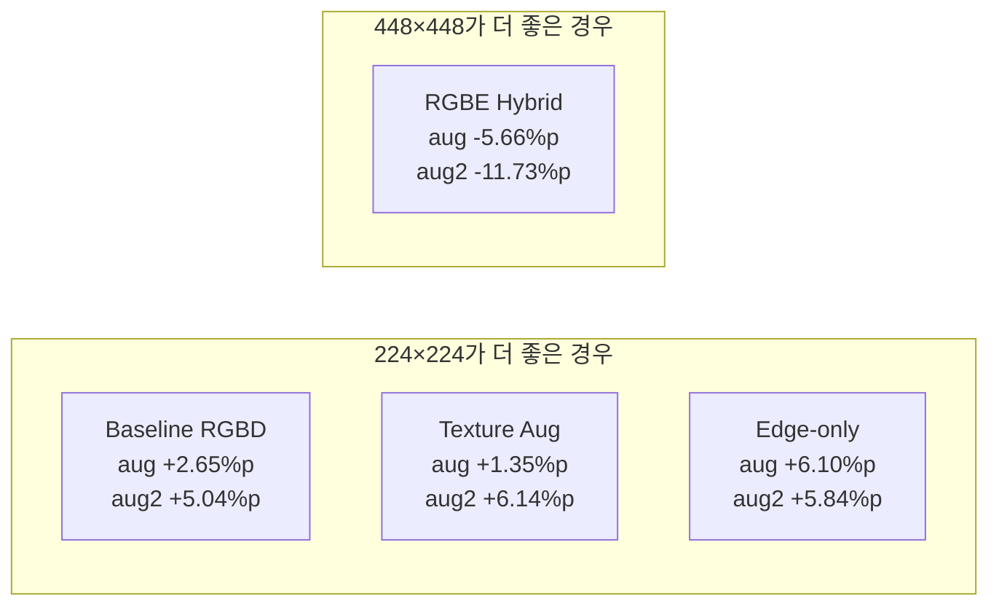

# 입력 해상도별 도어 부품 분류 모델 성능 비교 보고서

**과제명**: 건설장비 부품인식 및 위치추정 기술 개발  
**연구 기간**: 1차년도  
**작성일**: 2026년 4월 1일  
**작성자**: 한국건설기계연구원 스마트건설장비연구실

---

## 1. 실험 목적

본 실험은 도어 부품 분류 모델의 **입력 해상도(448×448 vs 224×224)**에 따른 성능 차이를 비교 분석한다. 224×224 해상도는 실시간 추론 및 엣지 디바이스(ZED Box Mini) 배포 시 연산량과 메모리를 절감할 수 있으므로, 정확도 대비 효율성 트레이드오프를 정량적으로 평가하는 것이 목적이다.

---

## 2. 실험 설정

### 2.1 공통 조건

| 항목 | 값 |
|------|-----|
| 데이터셋 | 실물 도어 8종 × ~157장/종 = 1,256장 |
| 데이터 분할 | Train 70% (879장) / Test 30% (377장), stratified |
| 랜덤 시드 | 42 (448과 동일한 분할 보장) |
| 옵티마이저 | Adam (lr=0.001) |
| 스케줄러 | ReduceLROnPlateau (patience=3, factor=0.5) |
| 조기 종료 | patience=10 |
| 최대 에폭 | 60 |
| 손실 함수 | CrossEntropyLoss (클래스 가중치 적용) |

### 2.2 해상도별 차이

| 항목 | 448×448 | 224×224 |
|------|:-------:|:-------:|
| 입력 크기 | 448×448 | 224×224 |
| 배치 사이즈 | 64 | 128 |
| GPU 메모리 사용 | ~2.7GB | ~4.9GB |
| DataLoader 워커 | 8 (persistent) | 4 (non-persistent) |
| 에폭당 소요 시간 | ~48초 | ~80초 |
| 전체 학습 시간 | ~20분 | ~45분 |

> 224×224는 이미지 면적이 1/4이므로 배치 사이즈를 2배로 늘려 GPU 활용도를 개선하였다. 단, DataLoader의 `persistent_workers` 옵션이 대용량 이미지(1920×1080) 로딩 시 교착 상태를 유발하여 비활성화하였고, 이로 인해 에폭당 시간은 오히려 증가하였다.

---

## 3. 모델별 성능 비교

### 3.1 전체 정확도 (Accuracy)

| 모델 | 해상도 | Test 분할 | datasets_aug | datasets_aug2 |
|------|:------:|:---------:|:-----------:|:------------:|
| **Baseline RGBD** | 448 | **100.00%** | 86.21% | 86.21% |
| | 224 | **100.00%** | 88.86% (+2.65) | 91.25% (+5.04) |
| **Texture Aug RGBD** | 448 | 97.35% | 87.53% | 88.06% |
| | 224 | 99.20% (+1.85) | 88.88% (+1.35) | 94.20% (+6.14) |
| **Edge-only** | 448 | 97.08% | 71.88% | 74.80% |
| | 224 | 96.29% (-0.79) | 77.98% (+6.10) | 80.64% (+5.84) |
| **RGBE Hybrid** | 448 | **100.00%** | **93.63%** | **96.02%** |
| | 224 | **100.00%** | 87.97% (-5.66) | 84.29% (-11.73) |

> **표 3-1.** 해상도별 전체 정확도 비교 (괄호: 448 대비 변화량)

### 3.2 Macro F1-Score

| 모델 | 해상도 | Test 분할 | datasets_aug | datasets_aug2 |
|------|:------:|:---------:|:-----------:|:------------:|
| **Baseline RGBD** | 448 | 100.00% | 86.38% | 86.36% |
| | 224 | 100.00% | 89.11% (+2.73) | 91.44% (+5.08) |
| **Texture Aug RGBD** | 448 | 97.38% | 87.84% | 88.34% |
| | 224 | 99.20% (+1.82) | 88.96% (+1.12) | 94.21% (+5.87) |
| **Edge-only** | 448 | 97.07% | 72.32% | 75.08% |
| | 224 | 96.32% (-0.75) | 78.09% (+5.77) | 80.65% (+5.57) |
| **RGBE Hybrid** | 448 | **100.00%** | **93.66%** | **96.05%** |
| | 224 | **100.00%** | 87.98% (-5.68) | 84.39% (-11.66) |

> **표 3-2.** 해상도별 Macro F1-Score 비교

---

## 4. 분석

### 4.1 해상도 변경의 영향 요약

### 4.2 모델별 분석

#### Baseline RGBD (224가 우수)
- Test 분할: 448과 동일하게 **100.00%** 유지
- 증강 데이터: 224가 **+2.65~5.04%p** 향상
- 해석: 224로 다운스케일할 때 고주파 텍스처 노이즈가 자연스럽게 제거되어, 결과적으로 구조적 특징에 더 집중하게 됨
- 일종의 **암묵적 정규화(implicit regularization)** 효과

#### Texture Aug RGBD (224가 우수)
- Test 분할: 97.35% → 99.20% (+1.85%p)
- 증강 데이터: aug2에서 88.06% → 94.20% (+6.14%p)로 큰 폭 개선
- 해석: 텍스처 불변 증강 + 저해상도의 텍스처 제거 효과가 상승 작용

#### Edge-only (224가 증강에서 우수, Test에서 소폭 하락)
- Test 분할: 97.08% → 96.29% (-0.79%p, 미미한 차이)
- 증강 데이터: **+5.84~6.10%p** 향상
- 해석: 224에서 Canny Edge 계산 시 세부 엣지가 단순화되어 오히려 노이즈에 덜 민감해짐

#### RGBE Hybrid (448이 현저히 우수)
- Test 분할: 동일하게 100.00%
- 증강 데이터: aug에서 -5.66%p, aug2에서 **-11.73%p** 하락
- 해석: RGBE는 RGB 3채널 + Edge 1채널의 4채널 입력인데, 448 해상도에서는 Edge 채널의 풍부한 디테일이 RGB의 텍스처 의존성을 효과적으로 보완함. 224로 축소하면 Edge 채널의 정보량이 급감하여 보완 효과가 약화됨

### 4.3 핵심 발견

1. **다수 모델에서 224가 증강 데이터 강건성 향상**: 저해상도가 암묵적 정규화 역할을 하여 텍스처 과적합을 줄임
2. **RGBE Hybrid는 예외**: 고해상도 Edge 정보가 핵심 경쟁력이므로, 해상도 축소 시 성능 급락
3. **Test 분할 정확도는 대부분 유지**: 4개 모델 모두 96% 이상으로 실무 적용 기준 충족

---

## 5. 결론 및 권장 사항

### 5.1 해상도별 최적 모델 선택

| 사용 시나리오 | 권장 해상도 | 권장 모델 | 근거 |
|------------|:---------:|:--------:|------|
| **실시간 추론** (ZED Box Mini) | 224×224 | **Texture Aug RGBD** | Test 99.20% + aug2 94.20% 최고 균형 |
| **최고 강건성** 우선 | 448×448 | **RGBE Hybrid** | aug 93.63% + aug2 96.02% 최고 성능 |
| **최고 정확도** 우선 (원본 데이터) | 448 또는 224 | **Baseline RGBD** 또는 **RGBE Hybrid** | Test 100.00% |

### 5.2 224×224 배포 시 기대 효과

| 항목 | 448×448 | 224×224 | 개선률 |
|------|:-------:|:-------:|:------:|
| 입력 텐서 크기 | 4×448×448 = 802K | 4×224×224 = 201K | **4× 축소** |
| ONNX 추론 속도 (예상) | 기준 | ~2.5× 빠름 | |
| GPU 메모리 | ~2.7GB | ~1.2GB | **56% 절감** |

### 5.3 종합 평가

224×224 해상도에서 **Texture Aug RGBD** 모델은 Test 99.20%, 증강 데이터 88.88~94.20%의 우수한 성능을 보이며, 실시간 추론 환경에서 **최적의 정확도-속도 트레이드오프**를 제공한다. 다만 최고 수준의 강건성이 필요한 경우, 448×448 해상도의 **RGBE Hybrid** 모델(aug2 96.02%)이 여전히 최선의 선택이다.

---

## 부록: 학습 시간 비교

| 모델 | 448×448 학습 시간 | 224×224 학습 시간 |
|------|:----------------:|:----------------:|
| Baseline RGBD | ~20분 | 43.42분 |
| Texture Aug RGBD | ~20분 | 43.15분 |
| Edge-only | ~20분 | 63.55분 |
| RGBE Hybrid | ~20분 | 48.93분 |

> 224×224에서 학습 시간이 오히려 증가한 것은 DataLoader `persistent_workers` 비활성화로 인한 데이터 로딩 오버헤드 때문이다. 향후 aux_features 사전 계산 캐싱을 통해 개선 가능하다.
